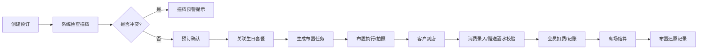
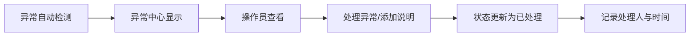

## 1. 产品概述
KTV门店生日套餐与包厢布置管理工具，专注状态追踪与异常预警，解决包厢撞档、酒水赠送口径混乱、会员账务不清三大核心问题。一线操作与管理回看基于同一份数据，所有操作均可追溯。

- 目标用户：KTV门店前台、店长、财务人员
- 核心价值：状态清晰、异常提前预警、操作全链路可追溯、离线可用

## 2. 核心功能

### 2.1 用户角色
| 角色 | 登录方式 | 核心权限 |
|------|----------|----------|
| 前台操作员 | 本地选择角色 | 预订录入、套餐处理、布置记录、异常上报 |
| 店长/管理 | 本地选择角色 | 数据回看、异常处理、报表查看、配置管理 |

### 2.2 功能模块
1. **包厢预订看板**：时间轴视图、撞档预警、预订状态流转
2. **生日套餐处理**：套餐配置、订单处理、酒水赠送记录、口径校验
3. **包厢布置管理**：布置任务、状态追踪、布置回看、照片记录
4. **会员账务**：会员信息、充值记录、消费明细、余额校验
5. **异常中心**：撞档预警、酒水赠送异常、账务不平、处理记录
6. **操作追溯**：全链路操作日志、变更历史、数据审计

### 2.3 页面详情
| 页面名称 | 模块名称 | 功能描述 |
|-----------|-------------|---------------------|
| 首页/控制台 | 异常预警面板 | 展示当日撞档风险、酒水异常、账务预警数量，点击跳转详情 |
| 首页/控制台 | 今日概览 | 预订数、到店数、套餐数、布置任务数关键指标 |
| 包厢预订 | 时间轴看板 | 按包厢展示时间段预订，冲突时段红色高亮 |
| 包厢预订 | 预订详情 | 预订信息、客户信息、套餐关联、状态变更历史 |
| 生日套餐 | 套餐列表 | 可用套餐、价格、包含内容、赠送酒水明细 |
| 生日套餐 | 订单处理 | 套餐选择、赠送酒水校验、消费录入、状态流转 |
| 包厢布置 | 布置任务看板 | 待布置、布置中、已完成任务列表 |
| 包厢布置 | 布置回看 | 布置前后照片、布置人员、用时、备注 |
| 会员中心 | 会员列表 | 会员信息、余额、累计消费、充值记录 |
| 会员中心 | 账务明细 | 每笔充值/消费的时间、金额、操作员、关联订单 |
| 异常中心 | 异常列表 | 撞档、赠送异常、账务不平的列表与处理状态 |
| 操作追溯 | 日志查询 | 按时间/操作员/类型筛选操作记录，查看变更详情 |

## 3. 核心流程

### 3.1 预订到离场流程

### 3.2 异常处理流程

## 4. 用户界面设计

### 4.1 设计风格
- **主色调**：深蓝色系（#1e3a5f）代表专业与可靠
- **强调色**：橙色（#f59e0b）用于预警、红色（#ef4444）用于严重异常、绿色（#10b981）用于正常状态
- **中性色**：深灰背景（#0f172a）、浅灰文字（#94a3b8）、白色主文字（#f1f5f9）
- **按钮风格**：直角、轻微阴影、悬停时亮度变化
- **字体**：系统无衬线字体，等宽字体用于数字和表格
- **布局风格**：密集信息展示、表格优先、最小装饰、突出状态标识
- **图标**：Lucide 线性图标，简洁清晰

### 4.2 页面设计概览
| 页面名称 | 模块名称 | UI元素 |
|-----------|-------------|-------------|
| 首页/控制台 | 异常预警面板 | 卡片式布局，异常类型用颜色区分，数字醒目 |
| 包厢预订 | 时间轴看板 | 横向时间轴，包厢为行，预订块用不同颜色表示状态 |
| 生日套餐 | 订单处理 | 表单布局，左侧套餐选择，右侧赠送酒水明细与校验 |
| 包厢布置 | 布置回看 | 网格照片墙，时间线展示布置过程 |
| 异常中心 | 异常列表 | 密集表格，每行可展开查看详情与处理记录 |

### 4.3 响应式
- 桌面优先设计，适配 1280px 以上宽度
- 表格支持横向滚动，保证信息密度
- 触摸优化：按钮最小高度 40px

### 4.4 数据持久化与离线
- 使用 localStorage 存储所有业务数据
- 支持数据导出为 JSON 备份
- 无网络时完全可用，数据保存在本地
- 角色切换为本地选择，不涉及真实账号体系
