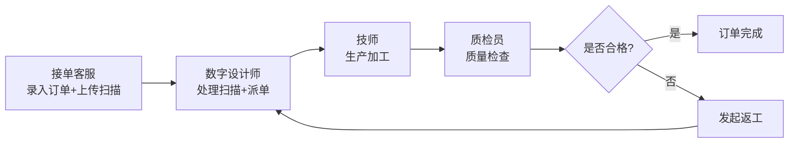

## 1. 产品概述

义齿加工厂扫描文件与技师派单系统，解决传统人工模式下色号返工、模型漏收、交付日期反复追问等核心痛点。通过接单客服、数字设计师、质检员三角色接力协作，实现扫描文件备注跨环节传递、派单流程与扫描处理深度融合。

## 2. 核心功能

### 2.1 用户角色

| 角色 | 登录方式 | 核心权限 |
|------|----------|----------|
| 接单客服 | 账号登录 | 订单录入、扫描文件上传、填写色号/备注、查看订单状态 |
| 数字设计师 | 账号登录 | 处理扫描文件、创建技师派单（备注自动继承）、查看派单状态 |
| 质检员 | 账号登录 | 质量检查、状态确认、返工处理、审计日志查看 |
| 管理员 | 账号登录 | 全功能访问、技师管理、系统配置 |

### 2.2 功能模块

1. **订单管理**：订单录入、列表展示、分页筛选、详情查看
2. **扫描文件处理**：文件上传、预览、备注填写、状态流转
3. **技师派单**：从扫描文件直接派单、备注自动继承、派单回看
4. **质检流程**：质量检查、返工处理、状态确认
5. **审计日志**：全流程操作记录、状态变更追溯
6. **系统集成点说明**：未实现的外部系统对接标注

### 2.3 页面详情

| 页面名称 | 模块名称 | 功能描述 |
|---------|---------|----------|
| 角色入口页 | 角色选择 | 展示四个角色入口卡片，点击进入对应工作台 |
| 客服工作台 | 订单列表 | 分页展示订单，支持按日期/状态/客户筛选 |
| 客服工作台 | 订单录入 | 录入客户信息、义齿类型、色号、交付日期 |
| 客服工作台 | 扫描上传 | 上传口扫文件，填写处理备注（自动传递到派单） |
| 设计师工作台 | 待处理扫描 | 展示待处理扫描文件列表，查看客服备注 |
| 设计师工作台 | 扫描处理 | 处理扫描文件，填写设计备注（自动传递到派单） |
| 设计师工作台 | 技师派单 | 选择技师、填写派单备注（继承前置备注）、提交派单 |
| 设计师工作台 | 派单回看 | 查看历史派单，关联订单/扫描文件信息 |
| 质检工作台 | 待质检列表 | 展示待质检产品，支持分页筛选 |
| 质检工作台 | 质检处理 | 质量检查、填写质检结果、确认完成或发起返工 |
| 审计日志页 | 操作记录 | 全流程操作日志，按时间/角色/订单筛选 |

## 3. 核心流程

接单客服录入订单并上传扫描文件 → 数字设计师处理扫描文件并直接派单给技师（备注全程传递）→ 质检员工序检查并确认状态 → 完成交付。

**备注传递机制**：客服备注 → 设计师可见并追加 → 派单备注自动合并（客服备注+设计备注）→ 技师可见全部备注 → 质检员可见完整备注链

**状态约束**：
- 扫描文件未上传 → 不可进入派单环节
- 派单未提交 → 不可进入质检环节
- 质检未通过 → 订单不可标记完成
- 返工状态 → 自动回退到设计师环节

## 4. 用户界面设计

### 4.1 设计风格
- **主色调**：深海军蓝 #0F3460（专业、可信赖）
- **辅助色**：翡翠绿 #16C79A（成功/完成）、珊瑚橙 #FF6B6B（警告/返工）、金色 #E8B923（待处理）
- **背景色**：浅灰蓝 #F5F7FA，深色模式支持
- **按钮风格**：微圆角 6px，悬停微上浮，渐变填充
- **字体**：标题使用 Noto Serif SC（专业稳重），正文使用 Inter（清晰易读）
- **布局风格**：卡片式布局，左侧导航 + 右侧内容区，流程时间轴贯穿各环节
- **图标风格**：线性图标 + 状态色块标识，关键信息高亮

### 4.2 页面设计概览

| 页面名称 | 模块名称 | UI 元素 |
|---------|---------|---------|
| 角色入口页 | 角色卡片 | 四张角色卡片，不同主色调区分，悬停放大动画 |
| 客服工作台 | 订单列表 | 表格+卡片混合视图，状态标签色码标识，分页器 |
| 客服工作台 | 扫描上传 | 拖拽上传区，文件预览，备注输入框（标注"备注将传递至派单"） |
| 设计师工作台 | 扫描处理 | 扫描文件预览，备注链展示（客服备注+当前设计备注） |
| 设计师工作台 | 技师派单 | 嵌入扫描处理页底部，非独立菜单，技师选择器，备注自动填充 |
| 设计师工作台 | 派单回看 | 时间轴展示派单历史，可点击查看关联订单详情 |
| 质检工作台 | 质检处理 | 备注链完整展示，合格/返工按钮，返工原因输入 |
| 审计日志页 | 日志列表 | 操作时间线，角色标签，状态变更高亮 |

### 4.3 响应式设计
- Desktop-first 设计，最小支持宽度 1280px
- 侧边栏在窄屏可折叠
- 表格在移动端转为卡片列表

### 4.4 动效设计
- 页面加载：内容区淡入 + 卡片依次上浮
- 状态变更：状态标签颜色过渡动画
- 流程节点：当前环节脉冲高亮
- 备注传递：新备注添加时滑入动画
