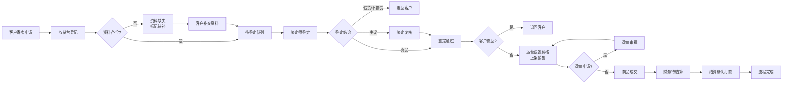

## 1. 产品概述

二手奢品寄卖内部工作台，解决多岗位流转协同问题。收货、鉴定、拍照、上架、改价、结算由不同人员处理，客户询问进度时客服无需跨岗位追问，通过统一工作台即可追踪全链路状态。

- 核心目标：实现奢侈品寄卖业务全流程可视化、可追踪、可追溯
- 目标用户：收货员、鉴定师、运营专员、财务人员、客服
- 市场价值：提升内部协作效率，减少信息断层，提高客户满意度

## 2. 核心特性

### 2.1 用户角色与权限

| 角色 | 登录方式 | 核心权限 |
|------|----------|----------|
| 收货员 | 工号登录 | 收货登记、资料检查、标记资料缺失、提交鉴定 |
| 鉴定师 | 工号登录 | 查看待鉴定、记录真假结论、瑕疵登记、标记鉴定争议 |
| 运营专员 | 工号登录 | 商品上架、价格调整、处理客户撤回申请 |
| 财务人员 | 工号登录 | 查看成交订单、结算确认、结算记录查询 |
| 客服 | 工号登录 | 全链路进度查询、客户可见摘要生成 |

### 2.2 功能模块

1. **收货台**：待鉴定列表、资料缺失列表、收货登记
2. **鉴定区**：待鉴定商品、鉴定结果录入、瑕疵记录、争议标记
3. **运营区**：待上架商品、已上架商品、改价申请、客户撤回处理
4. **财务区**：待结算列表、已结算列表、结算确认
5. **商品详情**：完整状态时间线、客户可见进度摘要、操作历史

### 2.3 页面详情

| 页面名称 | 模块名称 | 功能描述 |
|---------|----------|----------|
| 收货台 | 待办概览卡片 | 显示今日待办数量、异常数量、已处理数量 |
| 收货台 | 待鉴定列表 | 展示已收货等待鉴定的商品，支持筛选和搜索 |
| 收货台 | 资料缺失列表 | 展示缺少证书、发票等资料的商品，标记补全状态 |
| 收货台 | 收货登记表单 | 录入商品基本信息、客户信息、寄卖协议 |
| 鉴定区 | 待鉴定队列 | 按优先级展示待鉴定商品，显示预估鉴定时长 |
| 鉴定区 | 鉴定结果录入 | 真假结论选择、瑕疵描述、图片上传、鉴定师签名 |
| 鉴定区 | 争议处理 | 标记鉴定争议、记录争议原因、提交复核申请 |
| 运营区 | 待上架列表 | 鉴定通过待上架商品，设置售价、上架时间 |
| 运营区 | 已上架管理 | 查看已上架商品、发起改价申请、处理撤回 |
| 运营区 | 改价审批 | 改价申请审核、历史价格对比 |
| 财务区 | 待结算列表 | 已成交待结算商品，显示佣金、结算金额 |
| 财务区 | 结算确认 | 确认打款、生成结算凭证、标记结算完成 |
| 财务区 | 结算记录 | 历史结算查询、导出功能 |
| 商品详情 | 状态时间线 | 可视化展示商品从收货到结算的完整时间线 |
| 商品详情 | 客户可见摘要 | 自动生成可发送给客户的进度摘要 |
| 商品详情 | 操作历史 | 记录所有操作人、操作时间、操作内容 |

## 3. 核心流程

商品从客户寄卖到最终结算的完整流转链路：

**关键异常场景：**
1. **证书缺失**：收货时发现缺少鉴定证书，标记资料缺失，联系客户补交
2. **鉴定争议**：鉴定师对真伪存疑，标记争议，由资深鉴定师复核
3. **客户要求撤回**：商品上架前客户要求撤回，终止流程退回商品
4. **成交后结算待确认**：商品已售出，财务确认后打款给客户

## 4. 用户界面设计

### 4.1 设计风格

采用**高端奢侈品行业+企业级工作台**的设计语言：

- **主色调**：深墨绿色 `#1A3A3A`（代表专业、信任、高端）
- **辅助色**：香槟金 `#C9A961`（代表奢华、品质）、珊瑚红 `#E07A5F`（异常提醒）、翡翠绿 `#81B29A`（正常状态）
- **中性色**：象牙白 `#F4F1E9`、深灰 `#2D2D2D`、中灰 `#6B6B6B`
- **字体**：标题使用 "Playfair Display"（衬线字体，奢华感），正文使用 "Inter"（现代无衬线，易读性）
- **按钮风格**：微圆角（4px）、悬停有轻微阴影和色彩加深、主按钮采用香槟金配深墨绿文字
- **卡片风格**：白色卡片配极细边框、轻微投影、左上角色条标识状态
- **图标风格**：线性图标，粗细1.5px，与香槟金主色调呼应
- **动效**：页面切换采用淡入淡出，数据加载采用骨架屏，状态变更有微动画反馈

### 4.2 页面设计要点

| 页面名称 | 模块名称 | UI 关键元素 |
|---------|----------|-------------|
| 收货台 | 顶部状态区 | 三栏统计卡片：待办数（金）、异常数（红）、已完成（绿） |
| 收货台 | 待鉴定列表 | 每行显示商品缩略图、名称、客户、收货时间、紧急度标签 |
| 收货台 | 资料缺失列表 | 红色角标、缺失项醒目显示、补全按钮 |
| 鉴定区 | 鉴定队列 | 卡片式布局，优先级高的卡片放大显示 |
| 鉴定区 | 鉴定录入 | 左右分栏：左侧商品信息，右侧鉴定表单 |
| 鉴定区 | 瑕疵记录 | 可标注图片瑕疵位置、多图上传、严重程度选择 |
| 运营区 | 价格管理 | 价格历史折线图、当前价、建议价对比 |
| 运营区 | 撤回处理 | 黄色警告边框、确认对话框、原因记录 |
| 财务区 | 结算列表 | 金额突出显示、佣金比例、打款状态标签 |
| 财务区 | 结算确认 | 二次确认弹窗、结算凭证预览 |
| 商品详情 | 时间线 | 垂直时间线，节点用不同颜色标识状态，鼠标悬停显示详情 |
| 商品详情 | 客户摘要 | 卡片式布局、一键复制、可分享链接按钮 |

### 4.3 响应式设计

- **桌面端优先**：1440px 及以上为标准设计尺寸
- **侧边导航**：固定宽度240px，可折叠为80px图标模式
- **内容区**：最小宽度1024px，采用栅格布局（12列）
- **平板适配**：1024px ~ 1280px 调整为两列布局
- **不支持移动端**：内部工作台系统，仅面向桌面端使用

### 4.4 数据可视化

- **状态时间线**：垂直时间轴，彩色节点标识不同阶段
- **价格走势图**：面积图展示商品价格变动历史
- **待办分布饼图**：各岗位待办数量分布
- **处理时效柱状图**：各环节平均处理时长
