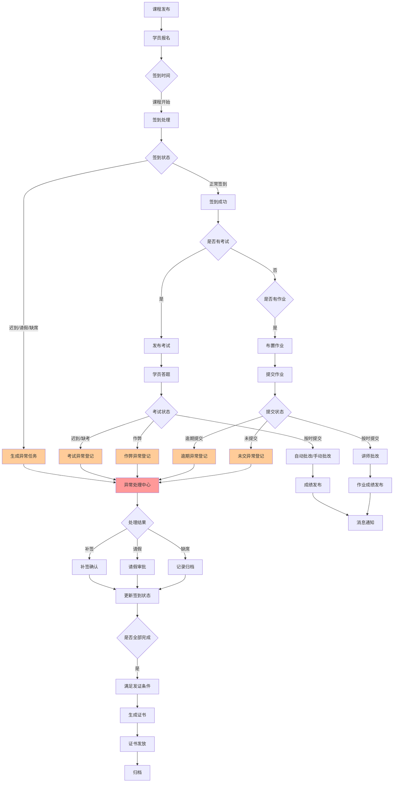
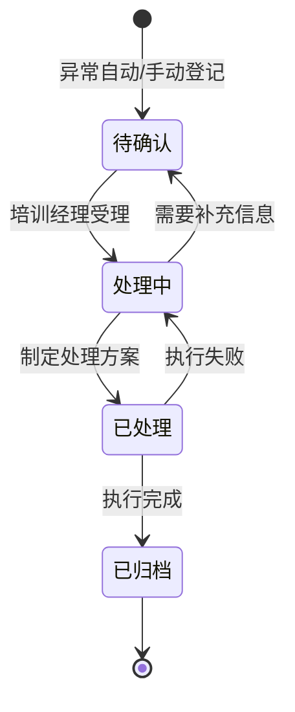
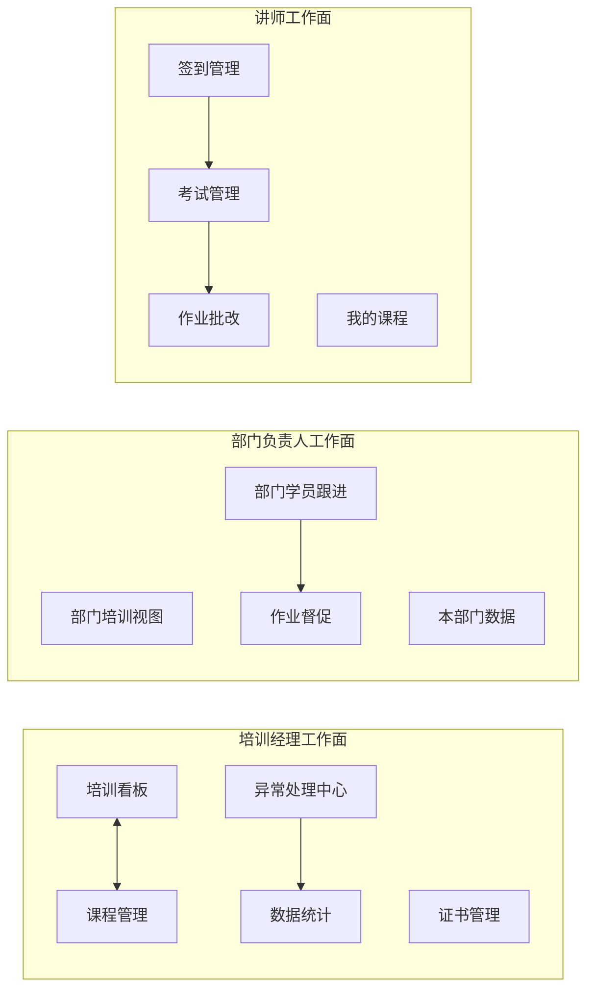

# 企业内训部-签到考试与作业回收系统

## 1. 产品概述

企业内训部的签到、考试与作业回收全栈管理系统，解决传统培训管理中结果记录与过程追踪脱节的问题。通过为培训经理、部门负责人、讲师分别设计独立的工作面，实现签到异常溯源、作业回收追踪、考试处理可追溯的连续工作流。

**核心价值：**
- 打破共用大表导致的责任不清、数据混乱
- 将"报名后不来"、"作业无人收"等异常情况纳入可追踪的管理流程
- 为不同角色提供聚焦的工作视图和历史回看能力

## 2. 用户角色与权限设计

### 2.1 角色定义

| 角色 | 核心职责 | 主要工作面 |
|------|---------|-----------|
| 培训经理 | 全局统筹：课程发布、讲师协调、异常处理、证书发放 | 培训看板、异常处理中心、证书管理 |
| 部门负责人 | 部门培训需求提报、本部门学员跟进、作业督促 | 部门培训视图、作业回收待办 |
| 讲师 | 课程交付：签到确认、考试组织、作业批改 | 签到管理、考试管理、作业批改 |

### 2.2 角色权限矩阵

| 功能模块 | 培训经理 | 部门负责人 | 讲师 |
|---------|---------|-----------|------|
| 课程发布/编辑 | ✓ | ✗ | ✗ |
| 学员报名管理 | ✓ | 本部门 | ✗ |
| 签到确认 | ✗ | ✗ | ✓ |
| 签到异常处理 | ✓ | ✓ | ✗ |
| 考试发布/批改 | ✗ | ✗ | ✓ |
| 考试异常处理 | ✓ | ✗ | ✗ |
| 作业回收查看 | ✓ | ✓ | ✓ |
| 作业批改 | ✗ | ✗ | ✓ |
| 证书生成/发放 | ✓ | ✗ | ✗ |
| 数据导出 | ✓ | 本部门 | ✗ |
| 消息通知 | ✓ | ✓ | ✓ |

## 3. 核心功能模块

### 3.1 功能架构图

```
企业内训管理系统
├── 工作台（首页仪表盘）
│   ├── 培训经理工作台：本周课程、待处理异常、签到率趋势
│   ├── 部门负责人工作台：部门培训计划、作业回收进度
│   └── 讲师工作台：今日课程、待批改作业、待确认签到
│
├── 课程管理
│   ├── 课程列表（支持按状态、日期、讲师筛选）
│   ├── 课程详情
│   │   ├── 基本信息（名称、时间、地点、讲师、学员名单）
│   │   ├── 时间线（所有操作记录）
│   │   ├── 附件管理（课件、资料下载）
│   │   └── 相关操作（编辑、取消、延期）
│   └── 新建/编辑课程
│
├── 签到管理（可连续处理的工作面）
│   ├── 签到任务列表（按课程/日期分组）
│   ├── 签到处理
│   │   ├── 批量扫码签到
│   │   ├── 手动添加签到
│   │   └── 签到状态标记（已到/迟到/请假/缺席）
│   ├── 签到详情页
│   │   ├── 签到统计（应到/实到/请假/缺席）
│   │   ├── 未签到学员列表
│   │   ├── 时间线（每次签到操作记录）
│   │   └── 异常处理入口
│   └── 异常处理抽屉
│       ├── 异常类型：迟到、请假、缺席
│       ├── 异常原因记录（学员自填+管理员补充）
│       ├── 处理状态（待确认→已处理→已归档）
│       └── 后续跟进（补签、补课安排）
│
├── 考试管理
│   ├── 考试列表（按课程/状态筛选）
│   ├── 考试处理工作面
│   │   ├── 考试发布（设置时间、题目、及格线）
│   │   ├── 答题监控（实时查看提交状态）
│   │   ├── 自动批改（客观题）
│   │   ├── 手动批改（主观题）
│   │   └── 成绩录入/修改
│   ├── 考试详情页
│   │   ├── 考试统计（参与率、平均分、通过率）
│   │   ├── 学员成绩列表
│   │   ├── 时间线（发布→进行中→批改→发布成绩）
│   │   └── 异常处理（迟到、作弊、缺考）
│   └── 成绩导出
│
├── 作业管理
│   ├── 作业列表（按课程/状态筛选）
│   ├── 作业回收工作面
│   │   ├── 作业布置（描述、截止时间、附件要求）
│   │   ├── 提交监控（实时查看提交状态）
│   │   ├── 批量下载附件
│   │   └── 作业批改（评分+评语）
│   ├── 作业回收回看
│   │   ├── 提交记录时间线
│   │   ├── 附件预览/下载
│   │   ├── 批改历史
│   │   └── 版本对比（如支持多次提交）
│   ├── 作业详情页
│   │   ├── 回收统计（已提交/待提交/逾期未交）
│   │   ├── 学员作业列表
│   │   ├── 时间线（布置→首次提交→批改→成绩发布）
│   │   └── 导出功能
│   └── 逾期提醒（自动消息通知）
│
├── 异常处理中心（培训经理专用）
│   ├── 异常任务看板（卡片式展示各类异常）
│   ├── 异常分类
│   │   ├── 签到异常：迟到、请假、缺席
│   │   ├── 考试异常：迟到、作弊、缺考
│   │   ├── 作业异常：逾期未交、抄袭投诉
│   │   └── 其他异常：课程取消、学员调岗
│   ├── 异常处理流程
│   │   ├── 异常登记（自动+手动）
│   │   ├── 原因分析
│   │   ├── 处理方案（补签、缓考、补交作业等）
│   │   └── 结果记录
│   └── 异常统计报表
│
├── 证书管理
│   ├── 证书生成规则配置
│   ├── 证书生成（基于成绩、签到率等条件自动触发）
│   ├── 证书列表与预览
│   ├── 证书发放记录
│   └── 证书导出（PDF格式）
│
├── 消息通知中心
│   ├── 通知类型
│   │   ├── 课程提醒（提前1天、当天）
│   │   ├── 签到提醒
│   │   ├── 作业截止提醒
│   │   ├── 考试提醒
│   │   ├── 成绩发布通知
│   │   └── 异常处理通知
│   ├── 通知渠道
│   │   ├── 系统站内信（必须）
│   │   ├── 邮件通知（可选配置）
│   │   └── 企业微信/钉钉（可选配置）
│   └── 通知记录与撤回
│
└── 数据统计与导出
    ├── 培训完成率统计
    ├── 签到率统计
    ├── 作业回收率统计
    ├── 考试成绩分析
    ├── 多维度导出（Excel格式）
    └── 自定义报表

```

### 3.2 核心页面清单

| 序号 | 页面名称 | 模块组成 | 核心功能描述 |
|------|---------|---------|------------|
| 1 | 首页工作台 | 角色化仪表盘 | 根据用户角色展示不同数据卡片、待办任务、快速入口 |
| 2 | 课程列表 | 筛选区、课程卡片 | 支持多条件筛选、批量操作、状态标签 |
| 3 | 课程详情 | 信息区、时间线、附件、操作区 | 完整课程信息、操作历史可追溯、附件管理 |
| 4 | 签到任务列表 | 签到任务卡片 | 按课程/日期分组、签到状态概览、快速跳转 |
| 5 | 签到处理工作面 | 扫码区、手动区、实时统计 | 支持扫码和手动签到、实时更新统计 |
| 6 | 签到详情页 | 统计面板、未签到列表、时间线 | 签到数据统计、异常人员标记、历史可查 |
| 7 | 异常处理抽屉 | 异常类型、原因表单、处理方案 | 侧滑抽屉、异常全流程记录 |
| 8 | 考试列表 | 考试任务卡片 | 按课程/状态筛选、快捷操作 |
| 9 | 考试处理工作面 | 题库选择、设置区、监控面板 | 考试全流程管理、实时状态监控 |
| 10 | 考试详情页 | 成绩统计、学员列表、时间线 | 考试数据分析、异常标记、历史追溯 |
| 11 | 作业列表 | 作业任务卡片 | 按课程/状态筛选、提交进度展示 |
| 12 | 作业回收工作面 | 布置区、监控区、批改区 | 作业全流程管理、附件批量处理 |
| 13 | 作业回收回看 | 提交记录、附件预览、批改历史 | 完整作业追踪、多版本对比 |
| 14 | 异常处理中心 | 看板、卡片列表 | 异常分类管理、处理流程追踪 |
| 15 | 证书管理 | 证书列表、预览、发放记录 | 证书生成、发放、归档 |
| 16 | 消息通知 | 通知列表、配置 | 通知记录、渠道配置 |
| 17 | 数据导出 | 报表配置、导出 | 多维度数据导出 |

## 4. 核心业务流程

### 4.1 签到考试作业完整工作流



### 4.2 异常处理流程



### 4.3 多角色工作面分离



## 5. 用户界面设计

### 5.1 设计风格定位

**设计理念：专业高效、清晰可追溯、现代企业级**

- **主色调：** 深蓝色系（#1e40af 蓝色为主色，#3b82f6 亮蓝为辅助）传达专业、信任
- **强调色：** 橙色（#f97316）用于待办、异常、催促等需要关注的元素
- **成功色：** 绿色（#22c55e）用于已完成、正常状态
- **警告色：** 黄色（#eab308）用于逾期、即将到期
- **危险色：** 红色（#ef4444）用于缺席、作弊、紧急异常
- **中性色：** 灰色系用于背景、边框、文字辅助

**字体选择：**
- 标题：思源黑体（Noto Sans SC）或系统默认黑体，字重 600-700
- 正文：思源黑体（Noto Sans SC）或系统默认，字重 400
- 数据：Roboto Mono 或等宽字体用于数字、代码

**布局风格：**
- 左侧固定导航 + 右侧内容区
- 卡片式信息展示
- 表格列表支持排序、筛选、分页
- 侧滑抽屉用于详情查看和快速操作
- 模态框用于新建、编辑等聚焦操作

**动效设计：**
- 页面切换：淡入淡出，200ms
- 卡片悬停：轻微上浮 + 阴影加深
- 抽屉滑入：从右向左滑入，300ms ease-out
- 按钮点击：轻微缩放反馈
- 加载状态：骨架屏 + 脉冲动画

**图标风格：**
- 使用 Lucide Icons 或 Feather Icons
- 统一线条粗细，2px
- 颜色与文字配合，强调色用于状态指示

### 5.2 核心页面UI元素

#### 5.2.1 首页工作台（培训经理视角）

| 模块 | UI元素 | 交互行为 |
|------|--------|---------|
| 统计卡片区 | 4个数据卡片：本周课程数、待处理异常、整体签到率、待发证书 | 点击跳转对应详情 |
| 待办任务列表 | 任务卡片：类型图标 + 标题 + 紧急程度 + 到期时间 | 点击进入处理页面 |
| 异常概览 | 异常分类统计（签到/考试/作业） | 点击跳转异常中心筛选 |
| 签到率趋势图 | 折线图，近30天趋势 | 悬停显示具体数值 |
| 快捷操作 | 按钮组：新建课程、导入数据、发送通知 | 点击执行或跳转 |

#### 5.2.2 签到处理工作面

| 模块 | UI元素 | 交互行为 |
|------|--------|---------|
| 扫码签到区 | 大型二维码扫描按钮 + 摄像头预览框 | 点击启动扫码，识别成功后自动标记 |
| 手动签到区 | 学员搜索框 + 快速选择列表 | 输入姓名/工号筛选，点击添加 |
| 签到状态标签 | 四种状态按钮：已到/迟到/请假/缺席 | 点击切换学员状态 |
| 实时统计面板 | 环形图：应到/已到/请假/缺席 | 数据实时更新 |
| 未签到学员列表 | 头像 + 姓名 + 部门 + 签到状态 | 点击可标记异常或手动签到 |
| 时间线记录 | 操作记录列表：时间 + 操作人 + 操作内容 | 仅展示，不可编辑 |

#### 5.2.3 异常处理抽屉

| 模块 | UI元素 | 交互行为 |
|------|--------|---------|
| 异常类型选择 | 单选按钮组 + 图标 | 选择后显示对应表单 |
| 学员信息 | 头像 + 姓名 + 工号 + 部门 | 不可编辑 |
| 异常原因 | 多行文本框（学员自填） | 必填，限制500字 |
| 管理员补充 | 多行文本框 | 选填，可上传附件 |
| 处理方案 | 下拉选择 + 自定义输入 | 补签/缓考/补交作业/其他 |
| 附件上传 | 上传按钮 + 文件列表 | 支持图片、文档 |
| 处理状态 | 状态标签 + 时间 | 仅展示 |
| 操作按钮 | 确认处理、取消 | 点击执行 |

#### 5.2.4 作业回收回看

| 模块 | UI元素 | 交互行为 |
|------|--------|---------|
| 作业信息卡 | 作业标题 + 截止时间 + 提交状态 | 仅展示 |
| 提交记录时间线 | 时间轴：提交时间 + 版本号 + 状态 | 点击展开详情 |
| 附件预览区 | 文档预览器/图片画廊 | 支持在线预览、下载 |
| 批改记录 | 评分 + 评语 + 批改时间 | 展示历史批改 |
| 操作按钮 | 重新批改、导出、打印 | 点击执行 |

#### 5.2.5 考试处理工作面

| 模块 | UI元素 | 交互行为 |
|------|--------|---------|
| 考试设置区 | 考试时间、时长、及格线、题目配置 | 表单输入 + 保存 |
| 答题监控面板 | 实时学员状态：未开始/答题中/已提交 | 颜色区分状态 |
| 成绩统计卡 | 参与率、平均分、及格率、最高/最低分 | 数据实时更新 |
| 成绩列表 | 表格：姓名 + 部门 + 成绩 + 状态 | 支持排序、筛选、导出 |
| 异常标记 | 异常类型下拉 + 异常学员列表 | 标记后可进入异常处理 |
| 操作按钮 | 发布成绩、导出成绩、批量处理 | 点击执行 |

### 5.3 响应式设计

- **桌面端（≥1280px）：** 标准布局，左侧导航240px，右侧内容区自适应
- **平板端（768px-1279px）：** 可折叠导航，内容区双列布局
- **移动端（<768px）：** 底部导航，内容区单列，表格转为卡片列表

**触摸优化：**
- 按钮最小点击区域 44x44px
- 列表项支持左滑快捷操作
- 支持手势：下拉刷新、上拉加载更多

## 6. 数据管理

### 6.1 核心数据实体

```
课程（Course）
├── id, title, description, start_time, end_time, location
├── instructor_id, status (draft/published/ongoing/completed/cancelled)
├── created_by, created_at, updated_at
└── attachments[]

学员（User）
├── id, name, employee_id, email, phone, department_id
├── role (trainer_manager/department_head/instructor/trainee)
├── created_at, updated_at
└── status (active/inactive)

报名（Enrollment）
├── id, course_id, user_id
├── enrollment_time, attendance_status (pending/signed/late/absent/leave)
├── certificate_status (none/pending/issued)
└── notes

签到记录（Attendance）
├── id, enrollment_id, course_id, user_id
├── sign_in_time, status, exception_id (nullable)
├── operated_by, operated_at
└── notes

异常（Exception）
├── id, type (attendance/exam/homework/other)
├── related_type (course/exam/homework), related_id
├── user_id, description, admin_notes
├── status (pending/processing/processed/archived)
├── solution, attachments[]
├── created_at, processed_at, archived_at
└── operated_by

考试（Exam）
├── id, course_id, title, duration, passing_score
├── start_time, end_time, total_score
├── question_ids[], status (draft/published/ongoing/grading/published/archived)
└── created_by, created_at

考试成绩（ExamScore）
├── id, exam_id, user_id
├── score, status (pending/grading/graded/published)
├── answer_sheet_url, graded_by, graded_at
└── notes

作业（Homework）
├── id, course_id, title, description, deadline
├── attachments[], total_score, status (draft/published/closed)
└── created_by, created_at

作业提交（HomeworkSubmission）
├── id, homework_id, user_id
├── submitted_at, score, status (pending/submitted/late/graded)
├── attachments[], graded_by, graded_at
├── grade_notes, version_number
└── is_latest (boolean)

证书（Certificate）
├── id, enrollment_id, course_id, user_id
├── certificate_number, issue_date
├── status (generated/issued/invalid)
└── pdf_url

消息通知（Notification）
├── id, user_id, type, title, content
├── channel (in_app/email/wechat/dingtalk)
├── status (pending/sent/read)
├── sent_at, read_at
└── metadata (JSON)

操作日志（OperationLog）
├── id, user_id, module, action
├── related_type, related_id
├── details (JSON), ip_address
└── created_at
```

### 6.2 时间线数据结构

所有主要实体的详情页都需要展示时间线，记录所有操作：

```typescript
interface TimelineItem {
  id: string;
  timestamp: Date;
  operator: {
    id: string;
    name: string;
    role: string;
  };
  action: string; // 例如："签到确认"、"修改成绩"、"提交作业"
  details: string; // 详细描述
  before?: any; // 修改前的值
  after?: any; // 修改后的值
  attachments?: string[]; // 相关附件
}
```

## 7. 技术实现要点

### 7.1 前端技术选型

- **框架：** React 18 + TypeScript
- **构建工具：** Vite
- **样式方案：** Tailwind CSS + 自定义CSS变量
- **状态管理：** React Context + useReducer（简单场景）/ Redux Toolkit（复杂场景）
- **路由：** React Router v6
- **HTTP客户端：** Axios
- **UI组件库：** 基于 Headless UI 的自定义组件
- **图表：** Recharts 或 Apache ECharts
- **图标：** Lucide React
- **日期处理：** Day.js
- **表单验证：** React Hook Form + Zod
- **测试：** Vitest + React Testing Library

### 7.2 后端技术选型

- **运行环境：** Node.js 18+
- **框架：** Express.js 或 NestJS（可选）
- **数据库：** SQLite（本地开发）/ PostgreSQL（生产）
- **ORM：** Prisma
- **认证：** JWT
- **文件存储：** 本地文件系统（演示）/ 云存储（生产）
- **消息队列：** 可选（用于异步通知）

### 7.3 接口设计原则

1. **RESTful风格：** 资源命名 + HTTP方法
2. **统一响应格式：** `{ code, data, message }`
3. **分页支持：** `GET /api/courses?page=1&limit=20`
4. **过滤和排序：** `GET /api/attendance?courseId=1&status=late&sortBy=signInTime`
5. **文件上传：** Multipart form-data
6. **实时更新：** 轮询或WebSocket（可选）

### 7.4 真实数据接口示例

#### 签到处理接口
```typescript
// POST /api/attendance/sign-in
interface SignInRequest {
  enrollmentId: string;
  courseId: string;
  status: 'signed' | 'late' | 'leave' | 'absent';
  signInTime?: string; // 手动签到时可指定时间
  notes?: string;
}

// GET /api/attendance/:courseId
interface AttendanceResponse {
  courseId: string;
  courseName: string;
  scheduledTime: string;
  stats: {
    total: number;
    signed: number;
    late: number;
    leave: number;
    absent: number;
  };
  attendees: Array<{
    enrollmentId: string;
    userId: string;
    name: string;
    department: string;
    status: string;
    signInTime?: string;
    hasException: boolean;
  }>;
  timeline: TimelineItem[];
}
```

#### 异常处理接口
```typescript
// POST /api/exceptions
interface CreateExceptionRequest {
  type: 'attendance' | 'exam' | 'homework' | 'other';
  relatedType: 'course' | 'exam' | 'homework';
  relatedId: string;
  userId: string;
  description: string;
  adminNotes?: string;
  attachments?: string[];
}

// PUT /api/exceptions/:id/process
interface ProcessExceptionRequest {
  solution: string;
  status: 'processed';
  attachments?: string[];
}
```

#### 作业回收接口
```typescript
// POST /api/homework/:id/submissions
interface SubmitHomeworkRequest {
  userId: string;
  attachments: string[];
  notes?: string;
}

// GET /api/homework/:id/submissions
interface HomeworkSubmissionsResponse {
  homeworkId: string;
  homeworkTitle: string;
  deadline: string;
  stats: {
    total: number;
    submitted: number;
    late: number;
    pending: number;
    graded: number;
  };
  submissions: Array<{
    submissionId: string;
    userId: string;
    name: string;
    department: string;
    status: string;
    submittedAt?: string;
    score?: number;
    isLatest: boolean;
    gradedAt?: string;
  }>;
  timeline: TimelineItem[];
}
```

### 7.5 导出功能设计

```typescript
// POST /api/export/attendance
interface ExportAttendanceRequest {
  courseId: string;
  format: 'xlsx' | 'csv';
  fields?: string[]; // 可选字段
}

// POST /api/export/homework
interface ExportHomeworkRequest {
  homeworkId: string;
  format: 'xlsx' | 'csv' | 'zip'; // zip包含附件
  includeAttachments: boolean;
}

// POST /api/export/exam
interface ExportExamRequest {
  examId: string;
  format: 'xlsx' | 'csv' | 'pdf';
  includeAnswers: boolean; // 是否包含正确答案
}
```

### 7.6 消息通知设计

```typescript
interface NotificationConfig {
  type: 'course_reminder' | 'attendance_reminder' | 'homework_due' | 'exam_reminder' | 'grade_published' | 'exception_processed';
  channels: ('in_app' | 'email' | 'wechat' | 'dingtalk')[];
  template: string;
  triggerCondition: any;
}

// 通知服务
class NotificationService {
  async send(notification: NotificationConfig): Promise<void>;
  async batchSend(notifications: NotificationConfig[]): Promise<void>;
  async markAsRead(userId: string, notificationId: string): Promise<void>;
}
```

## 8. 验收标准

### 8.1 功能验收

- [ ] 培训经理可以创建、编辑、发布课程
- [ ] 讲师可以为自己的课程进行签到确认
- [ ] 签到状态支持：已到、迟到、请假、缺席四种状态
- [ ] 签到异常可以生成异常任务并进入处理流程
- [ ] 异常处理支持：原因记录、处理方案、附件上传、状态流转
- [ ] 考试支持发布、答题、批改、成绩发布全流程
- [ ] 作业支持布置、提交、批改、成绩发布全流程
- [ ] 作业提交记录支持历史版本回看
- [ ] 所有详情页都有完整的时间线记录
- [ ] 支持签到数据、作业数据、考试成绩的导出
- [ ] 支持附件上传和下载
- [ ] 消息通知支持站内信发送

### 8.2 技术验收

- [ ] 前端可以在本地通过 npm run dev 启动
- [ ] 后端可以在本地通过 npm run server 启动
- [ ] 前端页面加载时间 < 3秒
- [ ] 所有表单提交有客户端验证
- [ ] 所有接口调用有错误处理和用户提示
- [ ] 响应式布局适配桌面端和平板端

### 8.3 体验验收

- [ ] 页面风格统一、专业
- [ ] 交互反馈及时、明确
- [ ] 异常状态有明显的视觉区分
- [ ] 关键操作有确认提示
- [ ] 加载状态有骨架屏或loading动画
