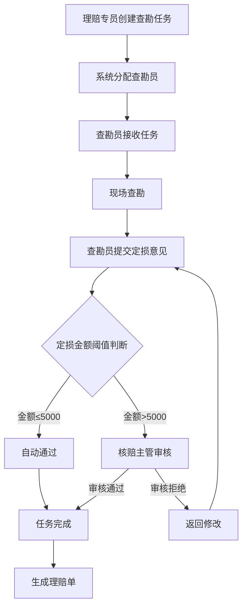
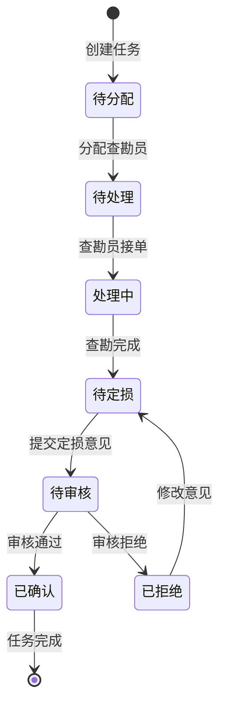

# 保险理赔中心 - 查勘任务与定损意见管理系统

## 1. 产品概述

**项目目标：** 为保险理赔中心建立完整的查勘任务与定损意见管理流程，实现业务操作的全流程追溯，确保理赔专员、查勘员、核赔主管之间的协作有据可查。

**核心价值：**
- 取代传统的口头解释和纸质台账，实现数字化流程管理
- 明确责任边界，所有操作留痕可查
- 减少材料补交和定损争议，提高理赔效率
- 缩短赔付进度查询响应时间

**目标用户：** 保险理赔中心全体人员（理赔专员、查勘员、核赔主管）

## 2. 核心功能模块

### 2.1 用户角色

| 角色 | 职责 | 核心权限 |
|------|------|---------|
| 理赔专员 | 创建查勘任务、跟踪进度、联系客户 | 创建任务、查看进度、发起申诉 |
| 查勘员 | 接收查勘任务、现场查勘、提交定损意见 | 处理任务、填写意见、上传证据 |
| 核赔主管 | 审核定损意见、最终审批、争议处理 | 审核意见、最终审批、重新分配 |

### 2.2 功能模块划分

1. **查勘任务管理** - 查勘任务的创建、分配、处理和完成
2. **定损意见管理** - 定损意见的填写、修改、审核和确认
3. **流程追溯中心** - 全流程状态变更记录和操作日志
4. **任务详情查询** - 查勘任务和定损意见的详细信息查看
5. **消息通知中心** - 任务分配、状态变更、待办提醒

## 3. 核心业务流程

### 3.1 主流程：查勘任务与定损



### 3.2 状态变更流程



## 4. 页面功能设计

### 4.1 页面清单

| 页面名称 | 模块名称 | 功能描述 |
|---------|---------|---------|
| 首页/仪表盘 | 数据概览 | 今日任务统计、待办事项、流程效率指标 |
| 查勘任务列表 | 任务管理 | 任务列表展示、筛选、搜索、状态标签 |
| 查勘任务详情 | 任务详情 | 任务信息、现场记录、证据材料、时间线 |
| 创建查勘任务 | 任务创建 | 表单填写、任务分配、现场要求备注 |
| 定损意见填写 | 定损管理 | 定损明细、损失照片、维修方案、预估金额 |
| 定损意见审核 | 审核管理 | 审核表单、审核历史、通过/拒绝操作 |
| 流程追溯中心 | 日志中心 | 操作日志、状态变更记录、完整时间线 |
| 人员管理 | 系统管理 | 查勘员列表、角色配置、联系方式 |

### 4.2 核心页面功能

#### 4.2.1 首页/仪表盘
- **任务统计卡片**：今日新增、待处理、处理中、已完成
- **待办事项列表**：按优先级和紧急程度排序
- **流程效率图表**：平均处理时长、任务完成率趋势
- **快速操作入口**：创建任务、查看待办、流程追溯

#### 4.2.2 查勘任务列表
- **筛选条件**：状态、查勘员、创建时间、紧急程度
- **列表展示**：任务编号、车牌号、查勘员、状态、创建时间、更新时间
- **批量操作**：批量分配、批量导出
- **状态标签**：待分配(灰)、待处理(蓝)、处理中(黄)、已完成(绿)、异常(红)

#### 4.2.3 查勘任务详情
- **基础信息**：报案号、保单号、车辆信息、报案时间、报案人
- **任务分配**：分配给哪位查勘员、分配时间、要求完成时间
- **现场查勘记录**：查勘时间、查勘地点、现场照片、现场描述
- **定损意见摘要**：定损金额、维修方案、配件清单
- **流程时间线**：所有状态变更、操作人、操作时间、备注

#### 4.2.4 定损意见填写
- **损失明细表**：部位、损失类型、损失程度、维修方式、预估费用
- **配件清单**：配件名称、型号、数量、单价、总价
- **现场照片上传**：损失部位照片、维修前后对比
- **维修方案说明**：维修工艺、特殊说明、工时费
- **费用汇总**：配件费、工时费、辅料费、总金额

#### 4.2.5 流程追溯中心
- **操作日志列表**：按任务、操作人、时间范围筛选
- **状态变更记录**：展示完整的状态流转路径
- **操作详情**：每一步操作的操作人、时间、变更前后状态、备注说明
- **导出功能**：支持导出Excel格式的操作日志

## 5. 数据结构设计（核心要求）

### 5.1 查勘任务表 (SurveyTask)

| 字段 | 类型 | 说明 | 必填 |
|------|------|------|------|
| task_id | VARCHAR(32) | 任务ID，主键 | 是 |
| task_no | VARCHAR(20) | 任务编号，唯一 | 是 |
| claim_no | VARCHAR(32) | 报案号 | 是 |
| policy_no | VARCHAR(32) | 保单号 | 否 |
| license_plate | VARCHAR(20) | 车牌号 | 是 |
| vehicle_type | VARCHAR(50) | 车辆类型 | 否 |
| owner_name | VARCHAR(100) | 车主姓名 | 是 |
| owner_phone | VARCHAR(20) | 车主电话 | 是 |
| accident_time | DATETIME | 事故时间 | 是 |
| accident_location | VARCHAR(200) | 事故地点 | 是 |
| accident_desc | TEXT | 事故描述 | 是 |
| urgency_level | TINYINT | 紧急程度：1-普通，2-紧急，3-加急 | 是 |
| status | VARCHAR(20) | 任务状态 | 是 |
| assigned_surveyor_id | VARCHAR(32) | 分配的查勘员ID | 否 |
| assigned_time | DATETIME | 分配时间 | 否 |
| survey_start_time | DATETIME | 查勘开始时间 | 否 |
| survey_end_time | DATETIME | 查勘结束时间 | 否 |
| claim_amount | DECIMAL(12,2) | 报案金额 | 否 |
| created_by | VARCHAR(32) | 创建人ID | 是 |
| created_time | DATETIME | 创建时间 | 是 |
| updated_time | DATETIME | 更新时间 | 是 |

### 5.2 定损意见表 (DamageAssessment)

| 字段 | 类型 | 说明 | 必填 |
|------|------|------|------|
| assessment_id | VARCHAR(32) | 定损ID，主键 | 是 |
| task_id | VARCHAR(32) | 关联的查勘任务ID | 是 |
| assessment_no | VARCHAR(20) | 定损单号 | 是 |
| assessor_id | VARCHAR(32) | 定损员ID | 是 |
| assessor_name | VARCHAR(100) | 定损员姓名 | 是 |
| assessment_time | DATETIME | 定损时间 | 是 |
| parts_fee | DECIMAL(12,2) | 配件费 | 是 |
| labor_fee | DECIMAL(12,2) | 工时费 | 是 |
| material_fee | DECIMAL(12,2) | 辅料费 | 否 |
| total_amount | DECIMAL(12,2) | 总金额 | 是 |
| repair_method | VARCHAR(50) | 维修方式：维修/更换 | 是 |
| repair_plan | TEXT | 维修方案说明 | 否 |
| status | VARCHAR(20) | 状态：待审核/已确认/已拒绝 | 是 |
| reviewer_id | VARCHAR(32) | 审核人ID | 否 |
| review_time | DATETIME | 审核时间 | 否 |
| review_comment | TEXT | 审核意见 | 否 |
| created_by | VARCHAR(32) | 创建人ID | 是 |
| created_time | DATETIME | 创建时间 | 是 |
| updated_time | DATETIME | 更新时间 | 是 |

### 5.3 操作日志表 (OperationLog)

| 字段 | 类型 | 说明 | 必填 |
|------|------|------|------|
| log_id | VARCHAR(32) | 日志ID，主键 | 是 |
| task_id | VARCHAR(32) | 关联的任务ID | 否 |
| assessment_id | VARCHAR(32) | 关联的定损ID | 否 |
| operation_type | VARCHAR(50) | 操作类型 | 是 |
| operation_desc | VARCHAR(200) | 操作描述 | 是 |
| operator_id | VARCHAR(32) | 操作人ID | 是 |
| operator_name | VARCHAR(100) | 操作人姓名 | 是 |
| operator_role | VARCHAR(20) | 操作人角色 | 是 |
| before_status | VARCHAR(20) | 操作前状态 | 否 |
| after_status | VARCHAR(20) | 操作后状态 | 否 |
| remark | TEXT | 备注说明 | 否 |
| created_time | DATETIME | 操作时间 | 是 |

### 5.4 损失明细表 (DamageDetail)

| 字段 | 类型 | 说明 | 必填 |
|------|------|------|------|
| detail_id | VARCHAR(32) | 明细ID，主键 | 是 |
| assessment_id | VARCHAR(32) | 关联的定损ID | 是 |
| part_name | VARCHAR(100) | 损失部位名称 | 是 |
| damage_type | VARCHAR(50) | 损失类型：刮擦/凹陷/破裂/变形 | 是 |
| damage_level | VARCHAR(20) | 损失程度：轻微/中等/严重 | 是 |
| repair_method | VARCHAR(50) | 维修方式：维修/更换/喷漆 | 是 |
| part_fee | DECIMAL(10,2) | 配件费用 | 是 |
| labor_fee | DECIMAL(10,2) | 工时费用 | 是 |
| remark | TEXT | 备注说明 | 否 |
| created_time | DATETIME | 创建时间 | 是 |

## 6. 服务层设计（核心要求）

### 6.1 状态变更服务

```typescript
// 状态变更必须记录以下信息
interface StatusChangeRecord {
  taskId: string;              // 任务ID
  fromStatus: TaskStatus;      // 原状态
  toStatus: TaskStatus;        // 新状态
  operatorId: string;          // 操作人ID
  operatorName: string;        // 操作人姓名
  operatorRole: string;        // 操作人角色
  changeTime: Date;            // 变更时间
  remark?: string;             // 备注说明
  evidence?: object;           // 佐证材料
}
```

### 6.2 核心服务接口

#### 6.2.1 查勘任务服务 (SurveyTaskService)

| 接口 | 方法 | 功能描述 |
|------|------|---------|
| createTask | POST | 创建查勘任务，记录创建人和时间 |
| assignTask | PUT | 分配查勘员，记录分配人和时间 |
| acceptTask | PUT | 查勘员接单，记录接单时间和操作人 |
| startSurvey | PUT | 开始查勘，记录开始时间和地点 |
| completeSurvey | PUT | 完成查勘，记录结束时间和查勘结果 |
| getTaskDetail | GET | 查询任务详情，包含所有状态变更记录 |
| getTaskList | GET | 查询任务列表，支持多条件筛选 |
| getTaskTimeline | GET | 查询任务时间线，展示完整流程 |

#### 6.2.2 定损意见服务 (DamageAssessmentService)

| 接口 | 方法 | 功能描述 |
|------|------|---------|
| createAssessment | POST | 创建定损意见，记录创建人 |
| updateAssessment | PUT | 修改定损意见，记录修改历史 |
| submitAssessment | PUT | 提交定损意见，触发审核流程 |
| reviewAssessment | PUT | 审核定损意见，记录审核结果和审核人 |
| getAssessmentDetail | GET | 查询定损详情，包含审核历史 |
| getAssessmentList | GET | 查询定损列表，支持多条件筛选 |
| getAssessmentHistory | GET | 查询定损修改历史 |

#### 6.2.3 操作日志服务 (OperationLogService)

| 接口 | 方法 | 功能描述 |
|------|------|---------|
| logOperation | POST | 记录操作日志 |
| getOperationLog | GET | 查询操作日志，支持多条件筛选 |
| getTaskOperationLog | GET | 查询某个任务的全部操作日志 |
| exportOperationLog | GET | 导出操作日志为Excel |

## 7. 设计风格指南

### 7.1 视觉风格

- **整体风格**：专业、清晰、高效的企业级后台管理系统
- **设计语言**：现代扁平化，强调信息层次和操作效率
- **色彩方案**：
  - 主色：深蓝色 (#1a365d) - 专业、可信赖
  - 辅助色：浅灰色 (#f7fafc) - 背景、分割
  - 状态色：
    - 待处理：蓝色 (#3182ce)
    - 处理中：橙色 (#dd6b20)
    - 已完成：绿色 (#38a169)
    - 异常/拒绝：红色 (#e53e3e)
    - 待审核：紫色 (#805ad5)

### 7.2 布局规范

- **整体布局**：左侧导航 + 右侧内容区
- **导航结构**：采用树形导航，支持多级菜单
- **内容区域**：使用卡片布局，模块化展示
- **响应式**：桌面端优先，移动端适配

### 7.3 交互规范

- **状态变更**：所有状态变更必须通过按钮操作，禁止直接修改
- **表单提交**：提交前必须填写备注说明（即使系统不强制）
- **删除操作**：所有删除操作需要二次确认
- **时间展示**：显示完整时间（年月日时分秒），便于追溯

## 8. 非功能需求

### 8.1 性能要求

- 页面加载时间 < 2秒
- 列表查询响应时间 < 1秒
- 状态变更操作响应时间 < 500ms

### 8.2 安全要求

- 所有接口需要身份验证
- 操作日志不可删除、不可修改
- 敏感操作需要二次验证

### 8.3 数据完整性

- 所有状态变更必须记录完整的操作信息
- 时间戳使用服务器时间，禁止客户端时间
- 关联数据使用外键约束

## 9. 优先级排序

### 第一阶段（核心功能）

1. 查勘任务管理（创建、分配、处理、查询）
2. 定损意见管理（填写、提交、审核）
3. 状态变更记录（自动记录所有操作）
4. 任务详情和流程追溯

### 第二阶段（完善功能）

5. 仪表盘和统计
6. 操作日志导出
7. 消息通知
8. 人员管理

---

**文档版本**：v1.0
**创建时间**：2026-06-14
**负责人**：待定
**状态**：待审批
