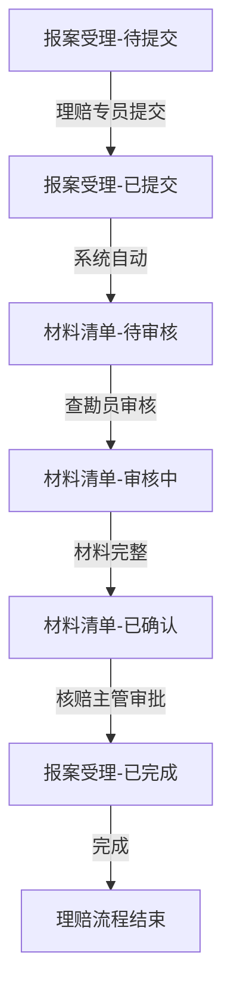
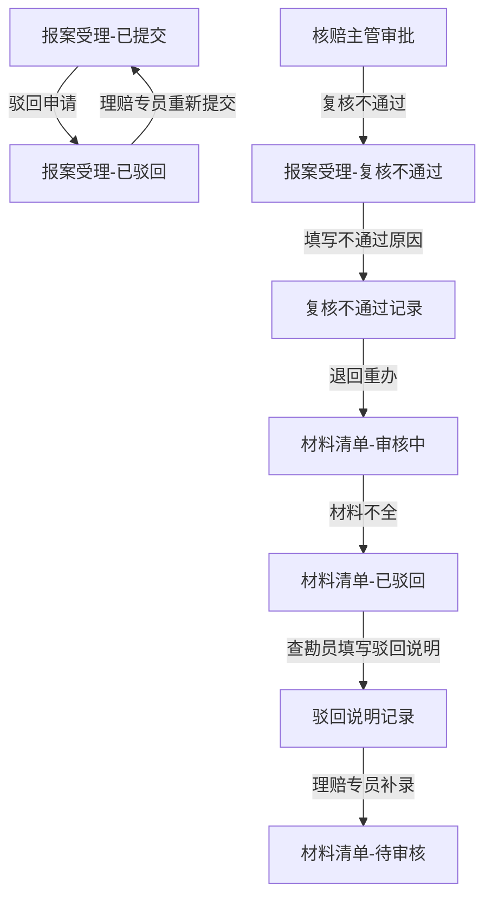

# 保险理赔中心-报案受理与材料清单 PRD

## 1. 产品概述

针对保险理赔业务流程中存在的翻群记录多、台账分散、交接不清等问题，构建一套完整的报案受理与材料清单管理系统。系统实现理赔全流程的数字化留痕，规范理赔专员、查勘员、核赔主管之间的交接顺序，确保每个节点的操作都有据可查。异常处理路径（退回、复核不通过）通过结构化表单记录，而非简单提示文案。

**目标用户**：理赔专员、查勘员、核赔主管
**核心价值**：减少沟通成本，实现理赔流程可追溯、可管控

## 2. 核心功能

### 2.1 用户角色定义

| 角色 | 职责 | 核心权限 |
|------|------|----------|
| 理赔专员 | 报案受理发起、初步审核 | 发起报案、提交材料清单、查看进度 |
| 查勘员 | 现场查勘、材料核实 | 查勘确认、材料复核、驳回申请 |
| 核赔主管 | 最终审批 | 审核通过、复核不通过、退回重办 |

### 2.2 功能模块

1. **报案受理模块**：报案信息录入、初步材料收集、状态提交
2. **材料清单模块**：材料清单管理、附件上传（占位）、材料状态跟踪
3. **流程流转模块**：状态机管理、节点交接、待办任务
4. **历史记录模块**：全流程操作留痕、时间轴展示

## 3. 核心流程

### 3.1 正常推进流程

### 3.2 异常处理流程

## 4. 页面设计

### 4.1 报案受理页面

**核心功能**：
- 报案信息表单（保单号、被保险人、事故经过）
- 附件上传区域（支持图片、PDF，占位符提示）
- 提交按钮（状态流转入口）
- 操作历史时间轴

**布局**：左侧报案表单，右侧材料清单预览和历史记录

### 4.2 材料清单页面

**核心功能**：
- 材料清单表格（材料名称、状态、上传情况）
- 附件上传组件（占位提示）
- 驳回/确认按钮组
- 驳回原因表单（非简单提示，需结构化填写）
- 补录操作记录

**布局**：顶部材料列表，中部附件区，底部操作按钮和历史

### 4.3 待办任务面板

**核心功能**：
- 待处理任务列表（按角色筛选）
- 任务状态标签（待提交、待审核、已完成、已驳回）
- 快速跳转入口

### 4.4 历史记录页面

**核心功能**：
- 操作时间轴（每个节点的时间、操作人、状态）
- 驳回/不通过原因记录
- 材料变更记录
- 附件上传记录

## 5. 数据模型

### 5.1 报案记录 (CaseReport)

| 字段 | 类型 | 说明 |
|------|------|------|
| id | UUID | 主键 |
| reportNo | String | 报案编号 |
| policyNo | String | 保单号 |
| policyHolder | String | 被保险人 |
| accidentDesc | String | 事故经过 |
| reporterId | String | 报案人ID |
| status | Enum | 状态：待提交/已提交/已驳回/已完成/复核不通过 |
| createdAt | DateTime | 创建时间 |
| updatedAt | DateTime | 更新时间 |

### 5.2 材料清单 (MaterialList)

| 字段 | 类型 | 说明 |
|------|------|------|
| id | UUID | 主键 |
| caseId | UUID | 关联报案ID |
| materialName | String | 材料名称 |
| materialType | String | 材料类型 |
| attachmentUrl | String | 附件URL（可为空占位） |
| uploadStatus | Enum | 状态：未上传/已上传/已确认 |
| verifiedBy | String | 审核人 |
| verifiedAt | DateTime | 审核时间 |

### 5.3 操作记录 (OperationLog)

| 字段 | 类型 | 说明 |
|------|------|------|
| id | UUID | 主键 |
| caseId | UUID | 关联报案ID |
| materialId | UUID | 关联材料ID（可选） |
| operatorId | String | 操作人ID |
| operatorRole | Enum | 角色：理赔专员/查勘员/核赔主管 |
| actionType | Enum | 操作类型：提交/审核/驳回/补录/确认 |
| beforeStatus | String | 操作前状态 |
| afterStatus | String | 操作后状态 |
| remark | String | 备注（含驳回/不通过原因） |
| createdAt | DateTime | 操作时间 |

## 6. 演示路径

### 6.1 正常推进演示路径

1. **理赔专员**登录 → 进入报案受理 → 填写报案信息 → 上传初步材料 → 点击提交
2. 系统自动创建材料清单 → 状态变为"待审核"
3. **查勘员**登录 → 查看待办任务 → 进入材料清单 → 逐项审核材料 → 点击确认
4. 材料清单全部确认 → 自动流转到核赔环节
5. **核赔主管**登录 → 查看待审批案件 → 审核通过 → 完成理赔报案

### 6.2 异常处理演示路径（退回）

1. 查勘员发现材料不全 → 填写驳回说明表单（必填） → 点击驳回
2. 系统记录驳回原因 → 材料清单状态变为"已驳回"
3. 理赔专员查看驳回记录 → 进入材料补录 → 补充材料 → 点击重新提交
4. 重新进入审核环节

### 6.3 异常处理演示路径（复核不通过）

1. 核赔主管复核时发现问题 → 填写复核不通过原因（必填） → 点击不通过
2. 系统记录不通过原因 → 案件状态变为"复核不通过"
3. 退回至查勘员重新审核
4. 查勘员根据原因重新核查 → 重新提交材料清单
5. 再次流转至核赔主管审批

## 7. 非功能性需求

- **留痕完整性**：所有状态流转必须记录操作人、角色、时间、备注
- **驳回结构化**：驳回和复核不通过必须填写结构化原因表单
- **附件占位**：未上传附件时显示占位提示，上传后实时更新
- **交接顺序**：严格按角色顺序流转，防止越级操作
