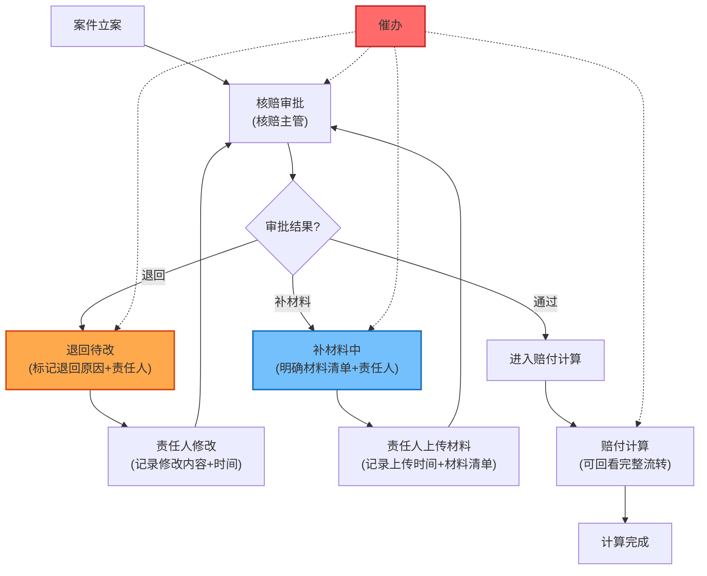
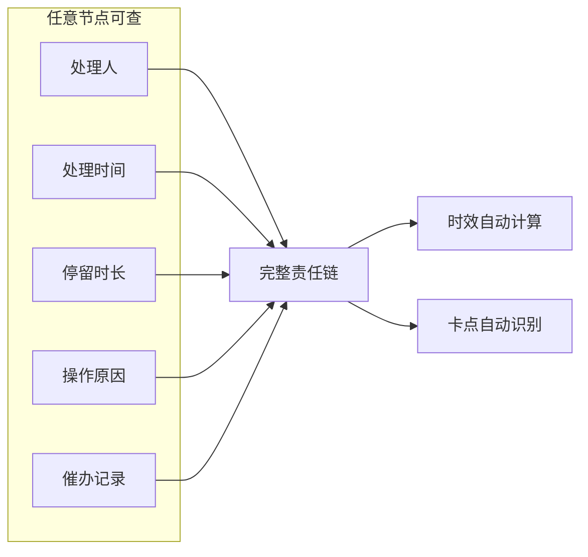

## 1. 产品概述

保险理赔中心核赔审批与赔付计算桌面应用，聚焦解决核赔审批与赔付计算环节责任不清、时效不明的核心痛点。通过明确的状态流转（催办、退回、补材料）和完整的责任追溯机制，确保每一步操作都可追踪、每一笔赔付都有据可依。

- 核心目标：解决核赔审批与赔付计算之间责任边界模糊导致的推诿和时效问题
- 目标用户：理赔专员、查勘员、核赔主管
- 核心价值：责任到人、时效清晰、流转可溯

## 2. 核心功能

### 2.1 用户角色

| 角色 | 注册方式 | 核心权限 |
|------|----------|----------|
| 理赔专员 | 系统分配 | 发起理赔、补充材料、查看流转记录、执行赔付计算 |
| 查勘员 | 系统分配 | 现场查勘记录、提交查勘报告、响应补材料要求 |
| 核赔主管 | 系统分配 | 核赔审批、退回案件、发起催办、查看全流程责任追溯 |

### 2.2 功能模块

1. **案件看板**：按状态分类展示所有案件，实时显示处理人、卡点位置、时效预警
2. **核赔审批**：审批处理、退回操作、催办发起、补材料要求
3. **赔付计算**：计算赔付金额、回看完整流转历史、查看每一步操作原因
4. **数据管理**：本地数据存储、数据备份、数据恢复
5. **通知中心**：外部通知入口、文件上传占位

### 2.3 页面详情

| 页面名称 | 模块名称 | 功能描述 |
|----------|----------|----------|
| 案件看板 | 状态分类卡片 | 按"待处理"、"催办中"、"退回待改"、"补材料中"、"审批通过"、"赔付计算中"分类展示 |
| 案件看板 | 责任三问面板 | 置顶显示：谁在处理、卡在哪里、为什么没完成 |
| 核赔审批 | 审批操作区 | 同意/退回/补材料按钮，必填原因输入框 |
| 核赔审批 | 流转时间线 | 完整展示案件从立案到当前的所有操作节点、处理人、耗时、原因 |
| 核赔审批 | 催办功能 | 一键催办，记录催办次数和时间，自动标记时效状态 |
| 赔付计算 | 计算表单 | 赔付项目明细、计算公式、自动计算结果 |
| 赔付计算 | 流转回看 | 左侧时间线展示所有历史操作，点击可查看操作详情和原因说明 |
| 赔付计算 | 责任追溯 | 高亮显示每一步的处理人、处理时间、停留时长，自动计算各环节时效 |
| 数据管理 | 本地存储 | 自动持久化所有数据到本地 |
| 数据管理 | 备份恢复 | 一键备份、选择备份文件恢复、备份列表管理 |
| 设置 | 通知入口 | 外部通知占位按钮，显示通知数量角标 |
| 设置 | 文件上传 | 文件上传入口，支持拖拽上传，显示上传状态占位 |

## 3. 核心流程

### 3.1 主流程描述

案件立案后进入核赔审批环节，核赔主管可选择通过、退回或要求补材料。被退回的案件需标注退回原因和责任人，需补材料的案件明确需补充的材料和责任人，所有操作均自动记录处理人和时间戳。审批通过后进入赔付计算环节，计算人员可完整回看前面所有流转记录和原因，确保计算依据清晰。全程可发起催办，系统自动标记超时案件。

### 3.2 核心流程图

### 3.3 责任追溯机制

## 4. 用户界面设计

### 4.1 设计风格

- **主色调**：深蓝 #1e3a5f，体现金融保险专业稳重
- **辅助色**：
  - 催办/预警：橙红 #ff6b6b
  - 退回状态：琥珀 #ffa94d
  - 补材料状态：天蓝 #74c0fc
  - 正常/通过：翠绿 #51cf66
- **字体**：标题使用 Noto Serif SC（专业稳重），正文使用 Noto Sans SC（清晰易读）
- **按钮风格**：直角扁平化，左侧边框彩色标识状态，hover时有细微阴影
- **布局风格**：三栏布局，左侧导航+中间主内容区+右侧信息面板
- **视觉元素**：使用细实线分割、数据卡片悬浮效果、时间线节点设计

### 4.2 页面设计概述

| 页面名称 | 模块名称 | UI元素 |
|----------|----------|--------|
| 案件看板 | 状态卡片 | 大数字统计、状态色条、横向滚动卡片组、hover上浮动画 |
| 案件看板 | 责任三问 | 置顶深色面板、三列等分布局、图标+大号文字、实时更新 |
| 核赔审批 | 时间线 | 左侧垂直时间线、节点用不同颜色标识状态、连接线动画 |
| 核赔审批 | 操作区 | 底部固定操作栏、三个主要按钮带状态色、必填原因输入框带字数统计 |
| 赔付计算 | 回看面板 | 可折叠左侧边栏、时间线节点可点击展开详情、流转原因高亮显示 |
| 赔付计算 | 计算区 | 表单式布局、自动计算结果高亮、计算公式可展开查看 |
| 数据管理 | 备份列表 | 卡片式备份记录、备份时间+大小、一键恢复按钮带确认 |
| 数据管理 | 存储状态 | 实时显示本地存储使用量、进度条、自动备份开关 |

### 4.3 响应式

- 桌面端优先设计，最小支持宽度 1280px
- 侧边栏可折叠，折叠后显示图标导航
- 时间线在小屏幕下自动调整布局
- 表格支持横向滚动

### 4.4 微交互设计

- 页面加载：卡片依次淡入， stagger 动画
- 状态变化：颜色过渡动画 0.3s
- 催办按钮：点击时震动反馈+数字角标弹跳
- 时间线：滚动时节点依次点亮
-  hover 效果：卡片上浮 2px，阴影加深
