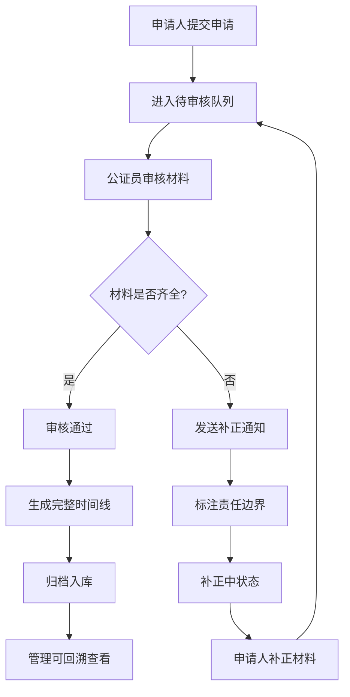

## 1. 产品概述

公证处窗口工作面系统，用于公证员连续处理申请材料审核、发送补正通知，并支持管理回看全流程操作记录。系统明确标注公证员审核与补正通知之间的责任边界，确保一线处理与管理回看基于同一份可追溯的数据。

- 核心目标：提升公证员审核效率，明确责任划分，实现全流程可追溯
- 目标用户：一线公证员、窗口管理人员
- 核心价值：连续高效处理、责任清晰可追溯、一线与管理数据统一

## 2. 核心功能

### 2.1 用户角色

| 角色 | 核心权限 |
|------|----------|
| 公证员（一线） | 待办列表浏览、材料审核、发送补正通知、填写异常说明、连续处理下一个 |
| 管理员（回看） | 全量记录查看、审核历史回溯、补正通知回看、异常说明查阅、统计概览 |

### 2.2 功能模块

1. **工作面主页**：待办统计概览、连续处理列表、快速筛选
2. **审核处理面板**：申请材料详情展示、审核操作（通过/补正/驳回）、异常说明填写
3. **侧栏详情区**：申请基本信息、材料清单、审核时间线、补正通知记录
4. **补正通知回看**：历史补正记录、补正内容、发送状态、责任标注
5. **空状态设计**：无待办、无补正记录、搜索无结果等场景

### 2.3 页面详情

| 页面名称 | 模块名称 | 功能描述 |
|----------|----------|----------|
| 工作面主页 | 顶部统计栏 | 展示待审核、补正中、已通过、已驳回四项统计数字 |
| 工作面主页 | 筛选标签栏 | 按状态筛选：全部/待审核/补正中/已归档 |
| 工作面主页 | 申请列表 | 卡片式列表，展示预约号、申请人、申请事项、状态标签、接收时间 |
| 工作面主页 | 连续处理入口 | "处理下一个"按钮，支持连续作业不中断 |
| 审核详情页 | 申请信息区 | 预约号、申请人、联系方式、申请事项、受理窗口 |
| 审核详情页 | 材料清单区 | 材料名称、提交状态、是否原件、备注 |
| 审核详情页 | 审核操作区 | 通过/补正/驳回三个操作按钮 + 异常说明输入框 |
| 审核详情页 | 补正通知区 | 补正项列表、补正原因、截止日期、责任标注提示 |
| 侧栏详情 | 时间线组件 | 完整展示从接收到归档的全流程操作节点 |
| 侧栏详情 | 操作人信息 | 每个节点显示操作人、操作时间、操作备注 |
| 侧栏详情 | 责任边界标识 | 明确标注"公证员审核"与"补正通知"的责任划分点 |
| 归档回看页 | 归档列表 | 已完成申请的归档记录，支持搜索和筛选 |
| 归档回看页 | 详情回溯 | 点击查看完整审核流程、补正历史、异常说明 |

## 3. 核心流程

### 3.1 顺利流（材料齐全直接通过）
申请人提交材料 → 公证员接收待办 → 核验申请材料 → 材料齐全无误 → 点击"通过" → 系统记录审核结果 → 进入归档状态 → 自动载入下一个待办

### 3.2 问题流（需要补正材料）
申请人提交材料 → 公证员接收待办 → 核验申请材料 → 发现材料缺失/有误 → 点击"补正" → 填写补正项和原因 → 系统发送补正通知 → 标注责任边界 → 申请状态变为"补正中" → 申请人补正后重新进入待审核队列

### 3.3 最终归档流
补正材料重新提交 → 公证员再次审核 → 材料齐全无误 → 点击"通过" → 系统关联历史补正记录 → 完整时间线生成 → 申请归档 → 支持管理回溯查看

## 4. 用户界面设计

### 4.1 设计风格
- **主色调**：深蓝 #1e3a5f（专业、权威），搭配青蓝 #0ea5e9 作为交互强调色
- **辅助色**：绿色 #10b981（通过）、琥珀色 #f59e0b（补正中）、红色 #ef4444（驳回/异常）
- **中性色**：从 #f8fafc 到 #0f172a 的灰阶体系，支撑信息层级
- **视觉风格**：简洁专业的工作台风格，卡片化布局，清晰的信息层级
- **字体**：标题使用 "Noto Sans SC" 加粗，正文使用系统无衬线字体，保证中文可读性
- **图标风格**：线性图标，统一 16px/20px 两种尺寸，与文字基线对齐

### 4.2 页面设计概述

| 页面名称 | 模块名称 | UI 元素 |
|----------|----------|---------|
| 工作面主页 | 顶部统计栏 | 四个统计卡片，数字 + 标签，悬停微动效 |
| 工作面主页 | 筛选标签栏 | 胶囊状标签，选中态为深蓝色填充 |
| 工作面主页 | 申请列表卡片 | 左侧状态色条 + 预约号 + 申请人 + 申请事项 + 时间 + 操作按钮 |
| 工作面主页 | "处理下一个"按钮 | 右下角悬浮按钮，突出显示，支持快捷键 |
| 审核详情页 | 双栏布局 | 左侧 60% 审核主操作区，右侧 40% 详情侧栏 |
| 审核详情页 | 材料清单 | 列表式，每行显示材料名 + 状态标签 + 备注 |
| 审核详情页 | 审核操作区 | 三按钮并排：通过（绿）、补正（橙）、驳回（红） |
| 审核详情页 | 补正表单 | 动态添加补正项，每项包含：材料名 + 补正原因 + 优先级 |
| 侧栏详情 | 时间线 | 垂直时间线，节点带状态图标，当前节点高亮 |
| 侧栏详情 | 责任边界 | 虚线分隔 + "责任划分点"标签 + 提示文字 |
| 空状态 | 无待办 | 大图标 + 提示文案 + 引导操作按钮 |
| 空状态 | 无补正记录 | 简洁图示 + "暂无补正记录"文案 |

### 4.3 视觉层级规范
1. **第一层级（页面标题/统计数字）**：20px 加粗，深灰色
2. **第二层级（卡片标题/列表主信息）**：16px 加粗，深灰色
3. **第三层级（正文/辅助信息）**：14px 常规，中灰色
4. **第四层级（次要信息/时间戳）**：12px 常规，浅灰色
5. **状态标签**：12px 加粗，圆角 4px，内边距 2px 8px

### 4.4 动效设计
- 列表项进入：上移淡入，stagger 延迟 50ms
- 侧栏展开/收起：宽度过渡 + 内容淡入淡出
- 按钮点击：scale 0.97 的微缩反馈
- 状态变更：颜色渐变过渡 200ms
- 时间线节点：滚入视口时逐个点亮

### 4.5 响应式
- 以桌面端 1440px 为基准设计
- 最小支持 1024px 宽度
- 不做移动端适配，这是桌面端工作台产品
