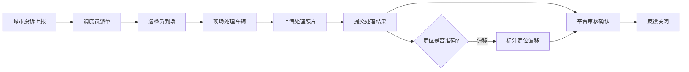

# 共享单车运维-违规停放与城市反馈系统 PRD

## 1. 产品概述
共享单车运维管理平台，服务城市管理反馈闭环，解决违规停放投诉处理中的信息不对称问题。
- 核心目标：打通投诉来源、现场处理、城市反馈的全流程时间线，实现可追溯的闭环管理
- 目标用户：运维调度员、巡检员、区域经理
- 价值：提升投诉处理效率，减少重复投诉，辅助城市管理决策

## 2. 核心功能

### 2.1 用户角色
| 角色 | 核心关注点 | 主要操作 |
|------|-----------|---------|
| 运维调度员 | 派单效率、待处理工单 | 查看投诉列表、派发工单、跟踪处理进度 |
| 巡检员 | 现场处理、结果上传 | 查看分配工单、上传处理照片、提交处理结果 |
| 区域经理 | 投诉热点、重复投诉、闭环率 | 查看区域统计、分析重复点位、监督闭环质量 |

### 2.2 功能模块
1. **地图列表联动**：左侧投诉列表 + 右侧地图点位，双向联动交互
2. **问题详情**：展示投诉全时间线、车辆信息、位置信息、处理记录
3. **处理照片占位**：巡检员上传处理前后照片，支持占位展示
4. **关闭反馈**：处理完成后提交关闭申请，支持多种关闭原因
5. **重复点位提醒**：同一区域多次投诉高亮标记，支持热点区域分析

### 2.3 页面详情
| 页面名称 | 模块名称 | 功能描述 |
|---------|---------|---------|
| 主工作台 | 顶部导航栏 | 角色切换、搜索筛选、统计概览 |
| 主工作台 | 左侧投诉列表 | 工单卡片、状态标签、优先级标识、重复投诉标记 |
| 主工作台 | 右侧地图视图 | 点位标记、聚类展示、选中高亮、定位偏移提示 |
| 问题详情抽屉 | 投诉信息 | 投诉来源、时间、描述、联系方式 |
| 问题详情抽屉 | 时间线 | 投诉-派单-到场-处理-关闭全流程节点 |
| 问题详情抽屉 | 车辆信息 | 车辆ID、定位坐标、定位精度、定位偏移警告 |
| 问题详情抽屉 | 处理记录 | 处理人、处理时间、处理照片、处理说明 |
| 问题详情抽屉 | 关闭操作 | 关闭原因选择、确认关闭、重新打开 |
| 重复点位面板 | 热点列表 | 按区域统计投诉次数、排序展示 |
| 重复点位面板 | 点位详情 | 展示该区域所有历史投诉工单 |

## 3. 核心流程

### 3.1 投诉处理闭环流程
城市反馈投诉 → 调度员派单 → 巡检员到场 → 现场处理 → 上传照片 → 提交处理结果 → 调度/城市侧确认关闭

### 3.2 重复投诉识别流程
新投诉进入 → 匹配历史投诉点位 → 计算距离阈值 → 标记重复投诉 → 区域经理重点关注

## 4. 用户界面设计

### 4.1 设计风格
- **设计方向**：工业/运维风格，专业务实，信息密度高
- **主色调**：深海蓝 (#1e3a5f) 作为主色，代表专业与可靠
- **辅助色**：警示橙 (#ff7a45) 标记待处理，成功绿 (#52c41a) 标记已完成，警告红 (#f5222d) 标记重复投诉
- **中性色**：深灰背景配合浅色卡片，减少视觉疲劳
- **字体**：主字体使用 Space Grotesk 搭配中文思源黑体，数字使用等宽字体
- **布局**：左右分栏布局，左侧列表 + 右侧地图，详情抽屉从右侧滑出
- **图标风格**：线性图标，简洁专业，配合状态色区分

### 4.2 页面设计概览
| 页面名称 | 模块名称 | UI 元素 |
|---------|---------|---------|
| 主工作台 | 顶部导航 | 深色背景、白色文字、角色切换下拉、统计数字卡片 |
| 主工作台 | 投诉列表 | 卡片式布局、状态标签角标、时间线缩略、hover 高亮效果 |
| 主工作台 | 地图视图 | 自定义 marker、聚类图标、选中脉冲动画、热力效果 |
| 详情抽屉 | 时间线 | 竖向时间线、节点图标、连接线动画、已完成/进行中状态 |
| 详情抽屉 | 照片区域 | 照片网格、上传占位框、前后对比布局 |
| 详情抽屉 | 操作区 | 主按钮突出、次按钮弱化、危险操作红色 |
| 重复点位 | 热点卡片 | 排名数字、投诉数量柱状、位置标签、展开动画 |

### 4.3 响应式
- 桌面端优先，保证大屏信息展示效率
- 平板端自适应，列表宽度可调节
- 地图区域始终占据主要可视空间

### 4.4 动效设计
- 列表项入场：从下往上渐入，错落延迟
- 抽屉展开：右侧滑入，伴随遮罩淡入
- 地图点位：选中时脉冲扩散动画
- 时间线：节点逐个点亮效果
- 状态变更：数字跳动动画
