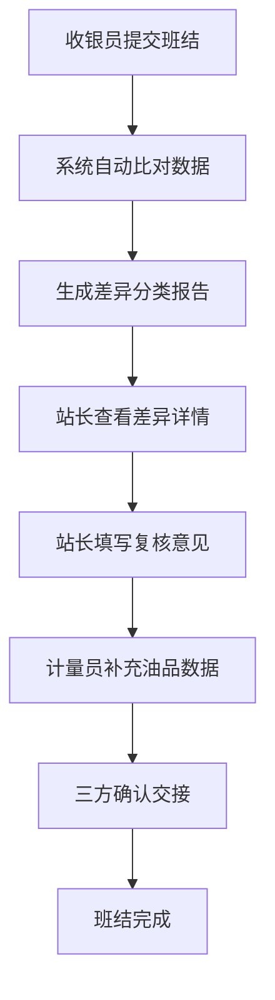

## 1. 产品概述
加油站班结差异复核系统，用于规范化加油站交接班流程，确保现金、油枪、会员充值和发票补开等数据的一致性，减少人工对账错误，提升运营效率。
- 解决传统交接班依赖口头说明、缺乏书面依据的问题
- 目标用户：收银员、站长、计量员

## 2. 核心功能

### 2.1 用户角色
| 角色 | 核心权限 |
|------|----------|
| 收银员 | 提交班结、查看差异、确认交接 |
| 站长 | 复核差异、填写复核意见、审批班结 |
| 计量员 | 补充油品损耗数据、确认油品盘点 |

### 2.2 功能模块
1. **班结工作台主页**：班结概览、差异统计、待办事项
2. **差异详情页**：分类展示各项差异、详细数据对比
3. **复核操作区**：站长复核意见、计量员补充数据、交接确认

### 2.3 页面详情
| 页面名称 | 模块名称 | 功能描述 |
|----------|----------|----------|
| 班结工作台 | 差异统计卡片 | 展示现金、油品、会员、发票四大类差异数量和金额 |
| 班结工作台 | 班结记录列表 | 展示各收银员提交的班结记录及状态 |
| 差异详情 | 差异分类标签 | 按现金短款、会员充值未同步、油品损耗异常、发票补开争议分类 |
| 差异详情 | 数据对比面板 | 展示系统数据与实际数据的对比，标注差异项 |
| 复核操作 | 复核意见输入 | 站长填写复核意见，选择处理方式 |
| 复核操作 | 油品数据补充 | 计量员录入实际油品损耗数据 |
| 复核操作 | 交接确认按钮 | 三方确认完成班结交接 |

## 3. 核心流程
收银员提交班结 → 系统自动比对生成差异报告 → 站长查看差异分类详情 → 站长填写复核意见 → 计量员补充油品损耗数据 → 三方确认交接完成

## 4. 用户界面设计

### 4.1 设计风格
- 主色调：深蓝色（#1e3a5f）代表专业、可信，辅以橙色（#f59e0b）作为警示色
- 按钮风格：圆角矩形，主按钮深蓝色，警示按钮橙色
- 字体：使用 Noto Sans SC，标题字重 600，正文字重 400
- 布局风格：卡片式布局，顶部导航 + 侧边栏 + 主内容区
- 图标：使用 lucide-react 图标库，线性风格

### 4.2 页面设计概述
| 页面名称 | 模块名称 | UI 元素 |
|----------|----------|---------|
| 班结工作台 | 差异统计卡片 | 四色卡片网格，图标 + 数字 + 趋势箭头 |
| 班结工作台 | 班结记录列表 | 表格布局，状态标签，操作按钮 |
| 差异详情 | 差异分类标签 | Tab 切换，高亮当前分类，显示差异数量 |
| 差异详情 | 数据对比面板 | 左右对比布局，差异项红色高亮标注 |
| 复核操作 | 复核意见输入 | 文本域 + 快捷选项按钮 |
| 复核操作 | 油品数据补充 | 表单输入，自动计算差异 |
| 复核操作 | 交接确认 | 分步确认流程，状态指示器 |

### 4.3 响应式
- Desktop-first 设计，主内容区最小宽度 1200px
- 平板端自适应调整卡片布局
- 移动端单列布局，折叠侧边栏
