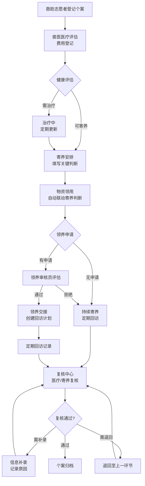

## 1. 产品概述

动物救助站寄养安排与物资领用管理系统，解决救助个体状态丢失、领养回访断档、医疗费用难对账的核心问题。通过救助志愿者、兽医、领养审核员的角色接力，将退回、补录、复核融入主流程，实现寄养安排与物资领用的一体化管理。

- 核心目标：建立可追溯的救助全生命周期管理，明确各环节责任与时效
- 目标用户：救助志愿者、驻站兽医、领养审核员、物资管理员

## 2. 核心功能

### 2.1 用户角色

| 角色 | 接入方式 | 核心权限 |
|------|----------|----------|
| 救助志愿者 | 系统账号登录 | 救助个案登记、寄养安排发起、物资领用申请、退回处理 |
| 兽医 | 系统账号登录 | 医疗记录录入、健康状态评估、医疗费用登记、复核医疗记录 |
| 领养审核员 | 系统账号登录 | 领养申请审核、寄养家庭评估、回访记录管理、个案归档 |
| 物资管理员 | 系统账号登录 | 物资库存管理、领用审批、物资补录、领用记录回看 |

### 2.2 功能模块

1. **救助个案工作台**：个案列表、状态追踪、时间线展示、筛选搜索
2. **寄养安排流程**：寄养家庭匹配、寄养记录、退回处理、补录修正
3. **医疗记录管理**：诊疗记录、费用登记、健康评估、医疗复核
4. **物资领用系统**：领用申请、审批、领用记录回看（联动寄养判断）、物资补录
5. **领养与回访**：领养审核、回访计划、回访记录、断档提醒
6. **复核中心**：医疗费用复核、寄养记录复核、个案归档复核

### 2.3 页面详情

| 页面名称 | 模块名称 | 功能描述 |
|-----------|-------------|---------------------|
| 工作台首页 | 数据概览 | 待处理任务、个案状态统计、超时预警、今日待办 |
| 工作台首页 | 个案列表 | 按状态/角色筛选、搜索、快捷操作入口 |
| 个案详情页 | 时间线 | 全流程操作记录、状态变更节点、责任人标记 |
| 个案详情页 | 寄养安排 | 寄养家庭信息、寄养周期、关键判断备注、退回原因 |
| 个案详情页 | 医疗记录 | 诊疗历史、费用明细、兽医签字、复核状态 |
| 个案详情页 | 物资领用 | 领用历史、领用原因、寄养判断联动展示、补录记录 |
| 个案详情页 | 领养回访 | 领养审核记录、回访计划、回访记录、断档提醒 |
| 寄养安排页 | 家庭匹配 | 寄养家庭列表、匹配度评分、历史寄养评价 |
| 寄养安排页 | 退回处理 | 退回原因登记、重新安排、责任记录 |
| 物资领用页 | 领用申请 | 物资选择、数量、领用原因、自动关联寄养判断 |
| 物资领用页 | 领用回看 | 历史领用记录、关联个案、操作人、时间戳 |
| 复核中心 | 待复核列表 | 医疗费用、寄养记录、待归档个案 |
| 复核中心 | 补录处理 | 信息补录、修正原因、审批记录 |

## 3. 核心流程

### 3.1 主流程描述

救助志愿者登记救助个体 → 兽医完成医疗评估与费用登记 → 救助志愿者发起寄养安排（填写关键判断） → 物资领用自动关联寄养判断 → 领养审核员审核领养 → 定期回访 → 复核中心复核医疗费用与寄养记录 → 个案归档

流程中任一环节可发起补录，异常情况可退回至上一环节，所有操作留痕。

### 3.2 流程图

## 4. 用户界面设计

### 4.1 设计风格

- **主色调**：暖橙色系（#F59E0B）代表温暖与希望，搭配深青色（#0D9488）代表专业与信任
- **辅助色**：暖灰背景（#F8FAFC），状态色：绿色成功、橙色警告、红色错误
- **按钮风格**：圆角8px，轻微阴影，hover时有上浮效果
- **字体**：标题使用 Noto Serif SC 增强人文温度，正文使用 Noto Sans SC 保证可读性
- **布局风格**：卡片式布局，左侧导航 + 顶部状态栏 + 主内容区，时间线贯穿个案详情
- **图标风格**：Lucide 线性图标，保持简约专业

### 4.2 页面设计概览

| 页面名称 | 模块名称 | UI 元素 |
|-----------|-------------|-------------|
| 工作台首页 | 数据概览 | 统计卡片带微动画、进度条展示回访完成率、超时预警高亮 |
| 工作台首页 | 个案列表 | 表格行悬停效果、状态标签色彩区分、快捷操作按钮组 |
| 个案详情页 | 时间线 | 垂直时间线、节点图标区分操作类型、当前状态高亮 |
| 个案详情页 | 信息区块 | 分栏卡片布局、可折叠面板、关键信息置顶 |
| 物资领用页 | 领用表单 | 自动填充寄养判断信息、物资选择带搜索、实时库存显示 |
| 复核中心 | 待办列表 | 批量操作、优先级标记、一键跳转详情 |

### 4.3 响应式

- 桌面端优先设计，适配1280px及以上宽度
- 平板端自适应调整卡片排列
- 移动端简化导航，优先展示核心操作

### 4.4 交互细节

- 状态变更时有平滑过渡动画
- 表单填写有实时校验提示
- 时间线节点悬停显示操作详情
- 退回/补录操作需填写原因弹窗
- 物资领用自动带出寄养关键判断作为参考
