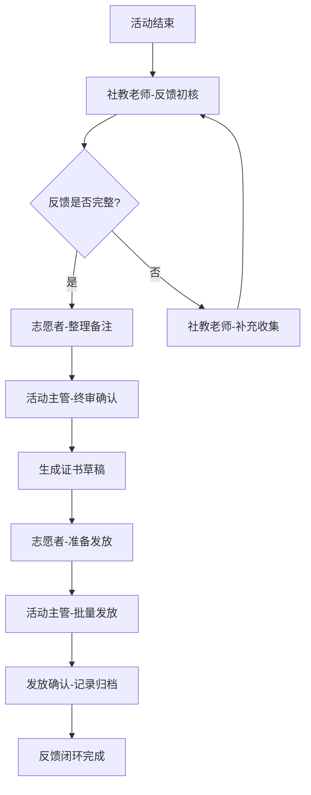
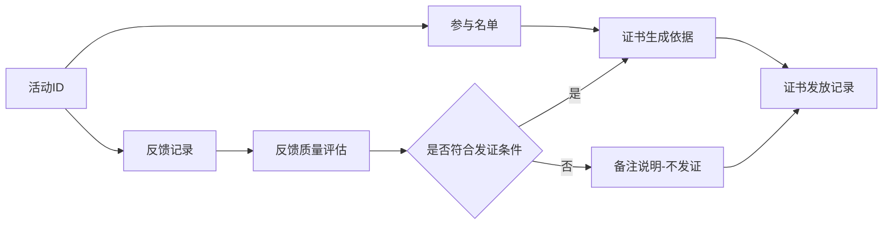

# 博物馆社教-反馈收集与证书发放系统

## 1. 产品概述

博物馆社会教育活动的反馈收集与证书发放业务工作台，解决活动执行后反馈收集与证书发放环节责任不清、流程断裂的问题。通过"社教老师→志愿者→活动主管"接力模式，将反馈收集与证书发放串联为完整闭环，确保每个活动都能追溯到责任人并完成闭环。

- **核心问题**：反馈收集和证书发放经常出现"两不管"地带，责任边界模糊
- **目标用户**：社教老师（初核反馈）、志愿者（协助整理）、活动主管（终审发放）
- **核心价值**：今日待办一目了然，流程接力责任到人，历史追溯有据可查

## 2. 核心功能

### 2.1 角色定义

| 角色 | 主要职责 | 操作权限 |
|------|----------|----------|
| 社教老师 | 活动后初步核查反馈、标记需跟进项 | 反馈初核、补充备注 |
| 志愿者 | 协助整理反馈、准备证书草稿、流转传递 | 查看详情、添加整理备注 |
| 活动主管 | 最终审核证书、确认发放、批量处理 | 全流程审批、批量操作、数据导出 |

### 2.2 功能模块

1. **今日待办工作台**（首页）
   - 当日需处理任务列表
   - 按紧急程度和角色分工筛选
   - 快速进入详情页

2. **反馈收集处理**
   - 活动反馈详情查看
   - 反馈状态流转（待初核→已整理→待终审→已完成）
   - 历史备注记录
   - 与证书发放关联

3. **证书发放管理**
   - 证书生成与预览
   - 发放状态追踪（待制作→待发放→已发放）
   - 批量发放操作
   - 发放记录追溯

4. **本地流转看板**
   - 接力棒传递可视化
   - 当前责任人提示
   - 滞留任务预警

## 3. 核心流程

### 3.1 主流程：反馈→证书接力闭环

### 3.2 反馈与证书关联流程

## 4. 页面设计

### 4.1 设计风格

- **整体风格**：业务工作台，简洁高效，强调可操作性和信息密度
- **色彩方案**：
  - 主色：#2563EB（专业蓝）
  - 成功：#10B981（完成绿）
  - 警告：#F59E0B（待处理橙）
  - 紧急：#EF4444（超时红）
  - 背景：#F8FAFC（浅灰白）
  - 文字：#1E293B（深灰）
- **字体**：思源黑体/Noto Sans SC（正文）、DIN Alternate（数字强调）
- **布局**：左右分栏-左侧导航+右侧工作区，卡片式信息展示
- **图标**：线性图标，清晰易懂

### 4.2 首页-今日待办工作台

| 模块 | UI元素 |
|------|--------|
| 顶部统计 | 今日任务总数、待处理、进行中、已完成，数字突出显示 |
| 任务筛选 | 角色筛选（全部/我的任务）、状态筛选、紧急程度 |
| 任务列表 | 卡片式，每个卡片显示：活动名称、当前环节、责任人、剩余时间 |
| 快捷入口 | 反馈处理、证书发放、流转看板 三个主要入口 |
| 预警区域 | 滞留超24小时任务标红提醒 |

### 4.3 反馈处理页

| 模块 | UI元素 |
|------|--------|
| 活动信息 | 活动名称、日期、讲师、参与人数 |
| 反馈内容 | 问卷汇总、学员评价、照片记录 |
| 流转历史 | 时间线展示，每个节点显示：操作人、操作时间、备注 |
| 当前状态标签 | 待初核/已整理/待终审/已完成 带颜色标识 |
| 操作按钮 | 初核通过/需补充/查看关联证书 |
| 备注输入 | 富文本编辑器，支持添加历史备注 |

### 4.4 证书发放页

| 模块 | UI元素 |
|------|--------|
| 证书列表 | 可批量选择，显示：姓名、活动名称、证书状态、发放方式 |
| 证书预览 | 点击查看证书样式，确认无误后发放 |
| 发放操作 | 批量发放按钮，支持现场领取/邮寄两种方式 |
| 发放记录 | 已发放证书列表，可导出Excel |
| 关联反馈 | 点击查看该活动的反馈情况 |

### 4.5 流转看板页

| 模块 | UI元素 |
|------|--------|
| 接力可视化 | 泳道图：社教老师→志愿者→活动主管 |
| 任务卡片 | 拖拽式（可选），显示当前责任人 |
| 滞留预警 | 超时任务自动上浮，红色边框 |
| 统计数据 | 各角色待处理数量、平均处理时长 |

## 5. 数据模型

### 5.1 核心实体

- **活动(Activity)**：活动ID、名称、日期、讲师、状态
- **反馈记录(Feedback)**：反馈ID、活动ID、提交时间、内容、状态、当前环节
- **证书(Certificate)**：证书ID、活动ID、姓名、状态、发放方式、发放时间
- **流转记录(FlowLog)**：日志ID、关联类型、关联ID、操作人、操作类型、备注、时间
- **用户(User)**：用户ID、姓名、角色、联系方式

### 5.2 状态定义

| 状态 | 反馈流程 | 证书流程 |
|------|----------|----------|
| 1 | 待初核 | 待制作 |
| 2 | 已整理 | 待发放 |
| 3 | 待终审 | 已发放 |
| 4 | 已完成 | 已归档 |

## 6. 样例数据要求

### 6.1 场景覆盖

1. **正常流程完成**：反馈完整→证书已发
2. **需补充反馈**：反馈初核发现问题→退回补充
3. **滞留任务**：某环节超时未处理
4. **批量处理**：多人证书待发放
5. **特殊备注**：有历史备注说明的复杂案例

### 6.2 每条样例需包含

- 活动基本信息
- 3-5条流转历史记录（含不同操作人、时间、备注）
- 当前状态和待处理事项
- 关联的证书信息（如有）
- 特殊说明或备注

## 7. 交互细节

### 7.1 连续处理支持

- 详情页内可直接切换"下一条"任务
- 处理完成后自动加载下一条，无需返回列表
- 批量选择后可一键流转
- 快捷键支持：Tab切换、Enter确认

### 7.2 状态标签系统

- 颜色对应：蓝（待处理）、黄（进行中）、绿（完成）、红（超时/紧急）
- 标签样式：圆角矩形，状态图标+文字
- 悬停显示详情

### 7.3 历史备注展示

- 时间线布局，最新在上
- 每条备注显示：操作人头像、姓名、操作类型、备注内容、时间
- 支持回复和追问
- 区分系统操作和人工备注

## 8. 技术要求

### 8.1 前端技术

- React 18 + TypeScript
- TailwindCSS 3（样式）
- Vite（构建工具）
- React Router（路由）

### 8.2 数据层

- 使用mock数据（模拟后端）
- 支持数据持久化到localStorage
- 响应式设计，支持1920×1080及以上分辨率

### 8.3 路由设计

| 路由 | 页面 |
|------|------|
| / | 首页-今日待办 |
| /feedback/:id | 反馈详情页 |
| /feedback | 反馈列表页 |
| /certificate/:id | 证书详情页 |
| /certificate | 证书列表页 |
| /flow | 流转看板页 |
