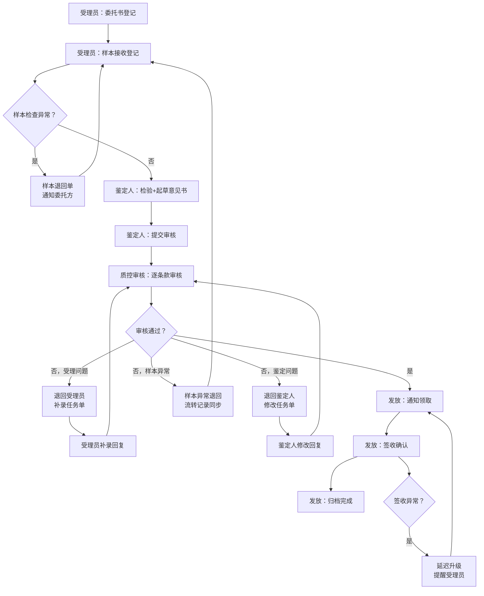

## 1. 产品概述

面向司法鉴定所日常运营的业务工作台系统，将《意见书审核与发放登记》从纸质台账/分散表格升级为可反复打开的连续处理工具。解决委托书、样本流转、鉴定意见书三大环节中反复确认的痛点，让驳回、补录、异常退回等操作脱离提示文案，成为可追溯、可执行、可回看的实体流程。

**核心价值**：
- 角色视角透明化：任何时刻明确"受理员/鉴定人/质控审核"谁在处理
- 流程卡点可视化：意见书审核在哪个环节卡住、卡住原因一目了然
- 发放延迟归因化：发放登记未完成的原因从"不知道"变为可量化

---

## 2. 核心功能

### 2.1 用户角色

| 角色 | 核心场景 | 关键权限 |
|------|----------|----------|
| 受理员 | 委托书登记、样本接收、发放登记执行 | 创建委托、录入样本、标记发放、触发补录提醒 |
| 鉴定人 | 样本检验、意见书起草、补录回复 | 起草意见书、提交审核、回复补录要求、标记异常 |
| 质控审核员 | 意见书审核、退回/通过、发放复核 | 驳回意见书、逐条标注问题、通过审核、批准发放 |
| 所领导（只读） | 全局看板、超时监控 | 查看所有案件状态、查看超时预警、导出统计 |

### 2.2 功能模块

1. **案件总览工作台**：角色切换视图、待办卡片、超时预警、快速筛选
2. **意见书审核处理面板**：逐条款审核、驳回标注、补录清单、异常样本触发退回
3. **发放登记回看模块**：发放时间线、签收凭证、未完成原因追踪、补录关联
4. **异常处理引擎**：样本异常自动提醒、意见书问题一键退回、发放延迟升级
5. **Mock 数据生成器**：预置典型/异常案例、支持快速切换连续处理场景

### 2.3 页面详情

| 页面名称 | 模块名称 | 功能描述 |
|----------|----------|----------|
| 主工作台 | 角色仪表盘 | 根据登录角色展示"我在处理/待我处理/我已处理"三栏，状态标签颜色体系统一 |
| 主工作台 | 待办卡片流 | 每个案件卡片显示：委托编号、当前处理人、当前状态、滞留时长、异常标记 |
| 主工作台 | 三问速览条 | 顶部固定回答三个问题：谁在处理分布、卡在哪个环节TOP3、发放未完成原因统计 |
| 意见书审核 | 审核对照视图 | 左：意见书正文；右：审核项清单（委托书对照、样本对照、格式规范、结论逻辑） |
| 意见书审核 | 驳回/补录操作 | 驳回需选择"退回节点"（受理/鉴定人）+勾选问题条目+填写说明，生成补录任务单而非提示 |
| 意见书审核 | 异常样本退回 | 点击样本异常按钮自动生成"样本退回单"，关联原委托，通知受理员并同步到流转记录 |
| 发放登记 | 发放时间线 | 从审核通过→通知领取→签收确认→归档的完整时间线，每步有操作人/时间戳 |
| 发放登记 | 未完成诊断 | 发放未完成时自动归因：待领取（X天）、签收凭证缺失、退回后未重审、关联补录未完成 |
| 发放登记 | 回看模式 | 可回溯任意历史节点的操作内容、驳回理由、补录回复，支持前后跳转对比 |
| Mock 场景 | 样例切换器 | 预置"正常全流程/多次驳回/样本异常/发放延迟/补录遗漏"5套典型案例一键加载 |

---

## 3. 核心流程

**主流程描述**：
受理员创建委托并登记样本 → 鉴定人接收样本完成检验并起草意见书 → 质控审核员逐条款审核（通过则进入发放、驳回则退回对应节点并生成补录单）→ 审核通过后发放登记（通知→签收→归档）→ 任何环节出现样本异常均触发独立的样本退回流程，不混入普通驳回。

---

## 4. 用户界面设计

### 4.1 设计风格
- **主色调**：深邃藏青 `#1e3a5f` 作为业务系统专业底色，搭配司法红 `#c0392b` 标记驳回/异常，审核绿 `#27ae60` 标记通过
- **辅助色**：琥珀橙 `#e67e22` 标记补录/待处理，钢灰蓝 `#34495e` 标记已完成归档
- **按钮风格**：直角微圆角（4px），驳回/退回类按钮带左侧 3px 色条强化识别，操作后有 loading + 成功反馈动效
- **字体**：标题用思源宋体 SC 体现司法文书的正式感，正文/数据用 JetBrains Mono 等宽字体保证编号/时间的对齐可读性
- **布局**：三栏式业务工作台（左：角色导航+筛选；中：案件卡片流/详情；右：操作面板/时间线）
- **图标**：Lucide 线性图标，异常/驳回场景下图标变为实心并带脉冲动画

### 4.2 页面设计概览

| 页面名称 | 模块名称 | UI 要素 |
|----------|----------|----------|
| 主工作台 | 三问速览条 | 顶部 100px 固定条，三列数据卡，每卡数字+占比饼图+异常提示角标 |
| 主工作台 | 案件卡片流 | 卡片左侧色条代表当前状态，右上角滞留时长标签，点击展开右面板 |
| 意见书审核 | 对照视图 | 双栏可拖拽分隔，审核项前复选框+严重等级色点，驳回时联动勾选 |
| 意见书审核 | 驳回弹窗 | 非模态抽屉从右滑出，分三栏：退回节点选择 / 问题勾选列表 / 原因填写 |
| 发放登记 | 时间线 | 竖向时间线，每个节点带状态图标+操作人头像悬停卡，未完成节点虚线闪烁 |
| 发放登记 | 诊断面板 | 底部常驻，发放未完成时自动展开，红色背景+可点击直接跳转到阻塞节点 |
| Mock 场景 | 样例切换器 | 左下角浮动条，5个场景按钮，切换时卡片流整体动效过渡 |

### 4.3 响应式
- **桌面端优先**：最小宽度 1440px，三栏布局完整呈现
- **平板适配**：1024-1439px，右面板改为可折叠抽屉
- **移动端**：<1024px，单栏堆叠，顶部速览条压缩为横向滚动卡片

### 4.4 交互细节
- 状态标签悬停显示"到达时间/已停留/预计完成"浮层
- 驳回操作后原意见书内容上叠加半透明驳回标记层，点击标记跳转对应问题
- 发放回看模式开启后，时间线节点可点击切换"当时状态快照"
- 异常样例触发时，对应卡片边框 3 秒呼吸红光动画 + 顶部警示横幅
