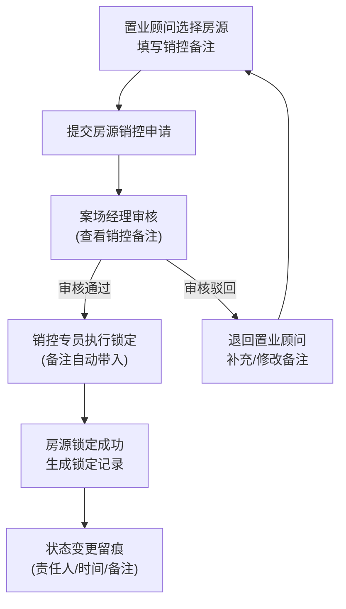

## 1. 产品概述

售楼处房源销控与锁定审批系统，解决案场忙时客户撞单、房源锁定超时、认购资料缺件等问题，通过系统化留痕减少口头解释和多轮询问。

- **核心问题**：案场忙时信息不同步，依赖人工翻查来访登记、置业顾问跟进表和认购单，导致沟通效率低、出错率高
- **目标用户**：案场经理、置业顾问、销控专员
- **核心价值**：流程留痕、信息复用、权责清晰、高效协同

## 2. 核心 Features

### 2.1 用户角色

| 角色 | 注册方式 | 核心权限 |
|------|---------|----------|
| 置业顾问 | 系统分配 | 提交房源销控申请、查看跟进客户、填写销控备注 |
| 案场经理 | 系统分配 | 审核房源销控、查看审批历史、管理角色权限 |
| 销控专员 | 系统分配 | 执行房源锁定、确认锁定审批、处理销控备注 |

### 2.2 功能模块

1. **房源销控处理页**：房源列表、销控表单、备注填写、状态流转
2. **锁定审批回看页**：审批流程、历史记录、备注回溯、操作留痕
3. **筛选搜索页**：多条件筛选、房源搜索、状态过滤、时间范围查询
4. **历史记录页**：操作日志、状态变更、责任人追踪、时间线展示

### 2.3 页面详情

| 页面名称 | 模块名称 | 功能描述 |
|---------|---------|----------|
| 房源销控处理 | 房源列表 | 展示房源状态、户型、面积、价格、所属楼栋 |
| 房源销控处理 | 销控表单 | 选择客户、填写销控备注、设置锁定时长、提交审批 |
| 房源销控处理 | 备注复用 | 销控备注自动带入锁定审批环节，无需重复填写 |
| 锁定审批回看 | 审批流程 | 展示审批节点、当前处理人、待办状态 |
| 锁定审批回看 | 历史时间线 | 按时间顺序展示所有操作记录、状态变更、责任人 |
| 锁定审批回看 | 备注回溯 | 查看各环节备注信息，支持追溯来源 |
| 筛选搜索 | 多条件筛选 | 按房源状态、楼栋、户型、价格区间、时间范围筛选 |
| 筛选搜索 | 搜索功能 | 支持房号、客户姓名、置业顾问模糊搜索 |
| 历史记录 | 操作日志 | 记录所有操作、状态变化、责任人、时间点、备注 |
| 历史记录 | 审计追踪 | 完整的操作留痕，支持问题复盘 |

## 3. 核心流程

### 3.1 房源销控与锁定审批流程

### 3.2 流程说明

1. 置业顾问在房源销控页面选择待售房源，填写客户信息和销控备注后提交
2. 案场经理在审批页面查看完整的销控信息和备注，进行审核
3. 审核通过后，销控专员在锁定页面可直接看到之前的销控备注，无需重复录入
4. 所有状态变更、操作人、时间点、备注信息完整记录，支持随时回看
5. 各角色操作有明确前后顺序，系统自动留痕，避免口头解释

## 4. 用户界面设计

### 4.1 设计风格

- **主色调**：深青色 `#0F4C5C` - 专业、稳重，适合企业级管理系统
- **辅助色**：琥珀橙 `#E36414` - 强调操作、状态提示
- **成功色**：墨绿色 `#2A9D8F` - 已锁定、审核通过
- **警告色**：朱砂红 `#D62828` - 已超时、驳回
- **中性色**：石板灰系列 - 文字、边框、背景层次
- **字体**：标题使用 "Noto Serif SC" 衬线字体增强专业感，正文使用 "Inter" 无衬线字体保证可读性
- **按钮风格**：直角微圆角(4px)，边框1px，悬停有细微阴影提升质感
- **布局风格**：卡片式布局，清晰的信息层级，左侧导航+顶部操作栏+主内容区
- **视觉风格**：精致的企业级仪表盘风格，适度的阴影和边框营造空间感

### 4.2 页面设计概览

| 页面名称 | 模块名称 | UI 元素 |
|---------|---------|---------|
| 房源销控处理 | 顶部统计 | 状态概览卡片、数字展示、颜色编码 |
| 房源销控处理 | 房源列表 | 表格布局、状态标签、操作按钮、快捷备注 |
| 房源销控处理 | 销控抽屉 | 右侧滑出表单、分步引导、备注输入区 |
| 锁定审批回看 | 流程进度条 | 节点式进度展示、当前高亮、已完成标记 |
| 锁定审批回看 | 时间线组件 | 垂直时间线、操作卡片、责任人头像 |
| 锁定审批回看 | 备注展示区 | 引用式备注卡片、来源标记、时间戳 |
| 筛选搜索 | 筛选栏 | 标签式筛选、下拉选择、日期范围选择器 |
| 筛选搜索 | 搜索框 | 带图标的搜索输入、实时过滤、清空按钮 |
| 历史记录 | 日志列表 | 可展开的日志项、详情面板、筛选器 |

### 4.3 响应式设计

- **桌面优先**：以 1440px 宽度为主要设计基准
- **平板适配**：1024px 以上保持完整功能，调整侧边栏宽度
- **触控优化**：按钮最小高度 44px，重要操作区域增加触控热区
- **滚动优化**：长列表使用虚拟滚动，固定表头和操作栏

### 4.4 视觉层级规范

- **一级标题**：20px / 600 字重 / 主色
- **二级标题**：16px / 600 字重 / 深灰
- **正文内容**：14px / 400 字重 / 中灰
- **辅助信息**：12px / 400 字重 / 浅灰
- **状态标签**：12px / 500 字重 / 对应状态色背景
- **重要数据**：24px / 700 字重 / 主色

## 5. 数据留痕规范

所有操作必须记录以下字段：
- `operationType`：操作类型（销控申请/审核通过/驳回/锁定/解锁等）
- `operatorId`：操作人ID
- `operatorName`：操作人姓名
- `operatorRole`：操作人角色
- `timestamp`：操作时间戳
- `beforeStatus`：操作前状态
- `afterStatus`：操作后状态
- `remark`：操作备注（跨环节复用）
- `source`：备注来源环节
