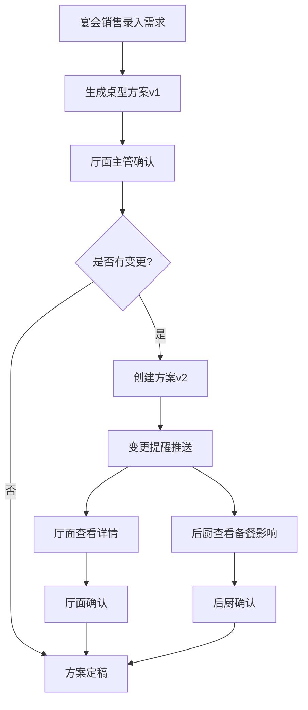

## 1. 产品概述

酒店宴会部桌型方案与会场物资管理系统，解决销售确认桌型后厅面与后厨物资口径不一致的问题。系统从会前准备切入，实现宴会销售录入需求、厅面主管确认执行细节、后厨统筹获取备餐相关变更的全流程协同管理。

## 2. 核心功能

### 2.1 用户角色

| 角色 | 注册方式 | 核心权限 |
|------|----------|----------|
| 宴会销售 | 系统分配账号 | 录入客户要求、创建宴会订单、提交桌型方案初稿 |
| 厅面主管 | 系统分配账号 | 确认桌型、台卡、音响、动线、管理物资清单、审核方案 |
| 后厨主管 | 系统分配账号 | 查看影响备餐的变更、确认食材准备、查看桌数/人数变更 |

### 2.2 功能模块

1. **宴会列表页**：宴会概览、状态筛选、快速搜索、变更提醒标识
2. **宴会详情页**：基本信息、会场方案、桌型布局、物资清单、确认记录、版本历史
3. **方案版本对比**：版本切换、差异高亮、变更类型标识
4. **变更提醒中心**：待处理变更、影响备餐变更、设备/物资缺失告警

### 2.3 页面详情

| 页面名称 | 模块名称 | 功能描述 |
|----------|----------|----------|
| 宴会列表页 | 顶部筛选栏 | 按日期、类型、状态筛选，关键字搜索 |
| 宴会列表页 | 宴会卡片列表 | 展示宴会基本信息、当前版本、确认状态、变更标识 |
| 宴会列表页 | 变更提醒面板 | 突出显示临时换厅、儿童椅增减、设备缺失等重要变更 |
| 宴会详情页 | 基本信息区 | 宴会名称、时间、地点、人数、类型、客户信息 |
| 宴会详情页 | 会场方案区 | 桌型图、台卡摆放、音响位置、动线规划 |
| 宴会详情页 | 物资清单区 | 按厅面/后厨分类展示物资清单，状态标识 |
| 宴会详情页 | 版本历史区 | 方案版本列表、版本对比入口 |
| 宴会详情页 | 确认记录区 | 各角色确认时间、确认人、备注信息 |
| 版本对比页 | 版本选择器 | 选择两个版本进行对比 |
| 版本对比页 | 差异展示区 | 高亮显示桌数、物资、场地等变更内容 |
| 变更提醒中心 | 待办列表 | 按优先级展示待处理变更，标注影响范围 |

## 3. 核心流程

宴会销售录入客户需求 → 生成初始桌型方案 → 厅面主管确认桌型/台卡/音响/动线 → 系统自动同步物资清单 → 后厨查看备餐相关信息 → 如有变更创建新版本 → 变更提醒推送相关角色 → 各角色确认签字 → 方案定稿执行

## 4. 用户界面设计

### 4.1 设计风格

- 主色调：深酒红色 #8B1A1A 搭配香槟金 #D4AF37，体现酒店高端质感
- 辅助色：森林绿 #228B22（确认状态）、暖橙色 #FF8C00（变更提醒）、深红色 #DC143C（重要告警）
- 按钮风格：圆角矩形，渐变填充，微阴影效果
- 字体：标题使用 Playfair Display（高端衬线），正文使用 Lato（优雅无衬线）
- 布局风格：卡片式布局，顶部导航 + 侧边信息栏 + 主内容区
- 图标风格：线性精致图标，搭配宴会相关元素（餐桌、香槟杯、餐盘等）

### 4.2 页面设计概述

| 页面名称 | 模块名称 | UI元素 |
|----------|----------|--------|
| 宴会列表页 | 顶部导航 | Logo、系统名称、用户角色切换、通知图标 |
| 宴会列表页 | 筛选区域 | 日期选择器、类型下拉、状态标签组、搜索框 |
| 宴会列表页 | 宴会卡片 | 宴会名称、日期时间、厅房、桌数、状态标签、变更标识角标 |
| 宴会详情页 | 头部信息 | 宴会主题横幅、基本信息标签组、状态进度条 |
| 宴会详情页 | 会场方案 | 可视化桌型图（圆形/方形桌）、图例说明、动线箭头 |
| 宴会详情页 | 物资清单 | 分类标签页、物资列表、数量/状态、确认勾选框 |
| 宴会详情页 | 版本历史 | 时间轴样式、版本号、变更描述、操作人 |
| 宴会详情页 | 确认记录 | 头像 + 签名 + 时间戳 + 备注 |
| 版本对比页 | 差异对比 | 左右分栏、行级高亮、变更类型图标 |
| 变更提醒中心 | 提醒列表 | 优先级排序、影响范围标签、快速处理按钮 |

### 4.3 响应式设计

- 桌面端（1280px+）：三栏布局，完整功能展示
- 平板端（768px-1279px）：两栏布局，侧边栏可折叠
- 移动端（<768px）：单栏流式布局，底部导航，核心功能优先展示

### 4.4 动效设计

- 页面加载：卡片依次淡入，时间间隔 100ms 错落
- 变更提醒：脉冲动画 + 数字角标弹跳
- 版本切换：平滑过渡，差异内容渐显高亮
- 卡片悬浮：轻微上浮 + 阴影加深
- 确认操作：勾选后出现涟漪扩散效果
