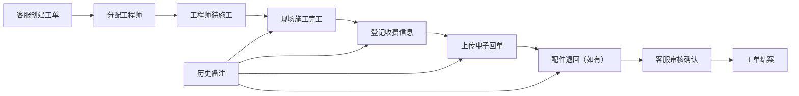

## 1. 产品概述

家电售后完工收费与电子回单管理工具，解决家电售后旧台账、现场记录与沟通截图之间的交接断层问题，明确完工收费与电子回单的责任边界，避免拖成后续问题。

- **核心问题**：多角色信息不对称，完工收费与电子回单责任不清，历史记录分散难以追溯
- **目标用户**：客服、维修工程师、配件管理员
- **产品价值**：单条记录贯穿全流程，各角色待办清晰，离线可用，支持导入导出

## 2. 核心功能

### 2.1 用户角色

| 角色 | 核心权限 | 主要待办 |
|------|----------|----------|
| 客服 | 查看全部工单、录入工单、补充备注、导出数据 | 待派单、待回访 |
| 维修工程师 | 查看分配给自己的工单、登记完工、上传收费信息、填写电子回单 | 待施工、待收费、待回单 |
| 配件管理员 | 查看配件相关工单、登记配件退回、审核配件状态 | 待出库、待退回、待审核 |

### 2.2 功能模块

1. **工作台（待办列表）**：按角色展示待办事项，快速筛选与搜索
2. **工单详情页**：单页展示完整信息（基础信息、完工收费、电子回单、历史备注、配件信息）
3. **完工收费处理**：收费金额、收费方式、收费凭证、收费确认
4. **电子回单管理**：回单上传、回单查看、回单确认、回单历史
5. **历史备注**：多角色补充备注，带时间戳和角色标识
6. **导入导出**：Excel/CSV格式导入导出，支持批量操作
7. **离线可用**：本地存储数据，断网可正常使用

### 2.3 页面详情

| 页面名称 | 模块名称 | 功能描述 |
|----------|----------|----------|
| 工作台 | 角色切换 | 切换客服/工程师/配件管理员视角 |
| 工作台 | 待办统计 | 各状态工单数量统计卡片 |
| 工作台 | 工单列表 | 按状态筛选、关键词搜索、分页展示 |
| 工单详情 | 基础信息 | 客户信息、家电信息、工单状态、分配人员 |
| 工单详情 | 完工收费 | 收费金额、收费方式、收费时间、收费凭证、确认状态 |
| 工单详情 | 电子回单 | 回单图片、回单时间、回单确认状态、历史回单记录 |
| 工单详情 | 配件信息 | 配件清单、退回原因、退回状态 |
| 工单详情 | 历史备注 | 时间线展示各角色备注，支持新增备注 |
| 工单详情 | 操作区 | 完工确认、收费确认、回单上传、配件退回等操作 |
| 导入导出 | 数据导出 | 按筛选条件导出Excel/CSV |
| 导入导出 | 数据导入 | 批量导入工单数据，支持模板下载 |

## 3. 核心流程

### 3.1 工单全流程

客服创建工单 → 分配工程师 → 工程师现场施工 → 完工登记 → 收费确认 → 上传电子回单 → 配件退回（如有） → 客服回访结案

### 3.2 流程图

## 4. 用户界面设计

### 4.1 设计风格

- **主色调**：深蓝 #1e40af（专业、可靠），辅助色：琥珀 #f59e0b（提醒/待办）
- **设计风格**：工业实用风，功能优先，减少装饰
- **布局**：左侧导航 + 右侧内容区，卡片式信息分组
- **字体**：系统无衬线字体，清晰易读
- **状态标识**：彩色标签 + 文字，不同状态一目了然

### 4.2 页面设计要点

| 页面名称 | 模块名称 | UI设计要点 |
|----------|----------|------------|
| 工作台 | 顶部栏 | 角色切换下拉、搜索框、导入导出按钮、新增工单按钮 |
| 工作台 | 统计卡片 | 四个状态卡片（待处理/进行中/待收费/已完成），数字醒目 |
| 工作台 | 工单列表 | 表格展示，状态标签色区分，操作按钮在右侧 |
| 工单详情 | 信息分区 | 基础信息、收费信息、回单信息、配件信息、备注区，用卡片分隔 |
| 工单详情 | 时间线 | 历史备注采用时间线布局，角色用不同颜色标识 |
| 工单详情 | 操作区 | 底部固定操作栏，根据状态显示不同操作按钮 |

### 4.3 响应式

- 桌面端优先设计，保证办公室大屏使用效率
- 平板端适配，方便现场工程师使用
- 最小宽度支持 1024px

### 4.4 离线能力

- 数据全量存储在 localStorage / IndexedDB
- 页面可在断网状态下正常浏览和操作
- 支持数据导出备份，避免数据丢失
