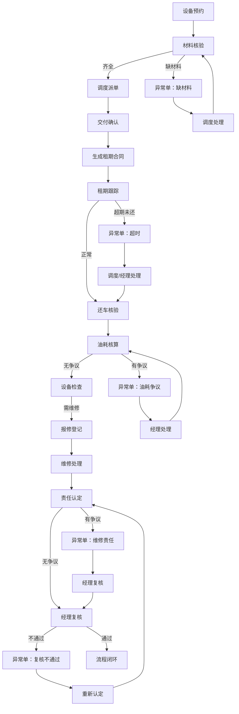

## 1. 产品概述

工程机械租赁设备预约与租期合同管理工具，针对租赁业务中"卡住的单子"事后才发现的痛点，实现全流程可视化管控。以异常单为核心入口，串联设备预约、租期合同、维修记录三大模块，通过租赁经理、调度、维修师傅三角色接力流转，前置暴露设备超期未还、油耗争议、维修责任认定等问题。

面向租赁公司办公室日常使用，强调实用功能优先，核心能力包括异常单预警、多维度快捷筛选、备份恢复、租期合同回看等，支持演示场景（缺材料、超时、复核不通过）。

## 2. 核心 Features

### 2.1 用户角色

| 角色 | 登录方式 | 核心权限 |
|------|----------|----------|
| 租赁经理 | 角色切换 | 审批合同、复核异常、查看全量数据、备份恢复 |
| 调度 | 角色切换 | 处理设备预约、安排交付、跟踪租期、处理超期预警 |
| 维修师傅 | 角色切换 | 登记维修记录、确认维修责任、上传维修凭证 |

### 2.2 功能模块

1. **异常单首页**：卡住单子看板、超时预警、待办任务统计、快捷筛选
2. **设备预约处理**：预约申请、材料核验、调度派单、交付确认
3. **租期合同管理**：合同详情、租期跟踪、超期告警、油耗核算、合同回看
4. **维修记录管理**：报修登记、维修处理、责任认定、费用核算
5. **系统工具**：数据备份、数据恢复、角色切换

### 2.3 页面详情

| 页面名称 | 模块名称 | 功能描述 |
|-----------|-------------|---------------------|
| 异常单首页 | 异常概览看板 | 统计待处理异常、超时预警、缺材料、复核不通过数量；分类展示所有卡住的单子 |
| 异常单首页 | 快捷筛选区 | 按异常类型（超时/缺材料/复核不通过/油耗争议/维修责任）、按角色、按时间范围筛选 |
| 异常单首页 | 异常单列表 | 卡片式展示异常单，显示单号、设备、客户、异常类型、当前处理人、卡顿时长，一键进入详情 |
| 设备预约详情 | 预约信息 | 展示预约设备、时间段、客户信息、用途 |
| 设备预约详情 | 材料核验 | 检查材料是否齐全，标记缺材料异常，上传凭证 |
| 设备预约详情 | 调度操作 | 派单、确认交付、转合同 |
| 租期合同详情 | 合同信息 | 展示合同条款、租期、租金、设备信息 |
| 租期合同详情 | 租期跟踪 | 实时显示已用时长、剩余时长、超期状态、超期费用计算 |
| 租期合同详情 | 油耗管理 | 记录出入库油位、计算油耗、标记油耗争议 |
| 租期合同详情 | 合同回看 | 时间线展示预约→交付→使用→归还全流程操作记录 |
| 维修记录详情 | 报修信息 | 故障描述、报修时间、报修人 |
| 维修记录详情 | 维修处理 | 维修师傅登记维修内容、更换配件、维修工时 |
| 维修记录详情 | 责任认定 | 标记责任方（客户/租赁方/自然损耗）、上传照片凭证、经理复核 |
| 系统设置 | 备份恢复 | 一键导出JSON备份、导入备份恢复数据 |
| 顶部导航 | 角色切换 | 租赁经理/调度/维修师傅快速切换，演示三角色接力 |

## 3. 核心流程

设备预约→材料核验（缺材料则异常）→调度派单→交付确认→生成租期合同→租期跟踪（超时则异常）→还车核验→油耗核算（有争议则异常）→设备检查→如需维修→报修登记→维修处理→责任认定（有争议则异常）→经理复核（不通过则异常）→流程闭环

## 4. 界面设计

### 4.1 设计风格

采用**工业实用主义**风格，强调信息密度和功能优先级：
- 主色调：工业深蓝 `#1e3a5f`，代表专业可靠
- 警告色：超时橙 `#f97316`、严重红 `#dc2626`、待办黄 `#eab308`、正常绿 `#16a34a`
- 中性色：深灰 `#1f2937`、中灰 `#4b5563`、浅灰 `#f3f4f6`
- 按钮风格：直角矩形，清晰边框，hover时有轻微阴影
- 字体：中文使用 `Noto Sans SC`，数字使用 `JetBrains Mono` 等宽字体，便于对比数据
- 布局：顶部固定导航 + 左侧筛选区 + 右侧内容区，信息密度高
- 图标：使用Lucide图标，保持线性简洁风格

### 4.2 页面设计概要

| 页面名称 | 模块名称 | UI元素 |
|-----------|-------------|-------------|
| 异常单首页 | 异常概览看板 | 4个统计卡片（待处理、超时、缺材料、复核不通过），数字醒目，卡片背景色对应异常等级 |
| 异常单首页 | 快捷筛选区 | 标签式筛选（全部/超时/缺材料/油耗争议/维修责任/复核不通过），时间范围选择器，搜索框 |
| 异常单首页 | 异常单列表 | 卡片式列表，每张卡片左侧色块标示异常类型，单号加粗，卡顿时长红色显示，底部操作按钮 |
| 详情页 | 信息区 | 左侧设备信息卡，右侧流程时间线，垂直时间轴展示全流程节点，异常节点红圈高亮 |
| 详情页 | 操作区 | 底部固定操作栏，根据当前角色显示可操作按钮，操作需填写备注 |
| 租期合同页 | 租期跟踪 | 进度条可视化展示租期，超期部分红色高亮，实时计算超期天数和费用 |
| 租期合同页 | 油耗管理 | 出入库油位对比柱状图，油耗计算公式展示，争议标记按钮 |
| 维修记录页 | 责任认定 | 三选项卡片（客户责任/租赁方责任/自然损耗），图片上传区域，复核意见输入框 |
| 系统设置 | 备份恢复 | 两个大按钮（导出备份/导入备份），备份列表展示历史备份时间和大小 |

### 4.3 响应式

- 桌面端优先（1280px及以上），三栏布局稳定
- 平板端（768px-1279px）：左侧筛选区可折叠
- 不强制移动端适配，以办公室桌面使用为主

### 4.4 交互特性

- 异常单卡片hover时轻微上浮 + 阴影加深
- 筛选标签切换时有平滑过渡动画
- 时间线节点按操作顺序依次加载，带淡入效果
- 超期警告数字有脉冲动画提示
- 操作按钮点击后显示loading状态，完成后提示成功
- 异常单从"待处理"转为"处理中"时，卡片背景色渐变过渡
