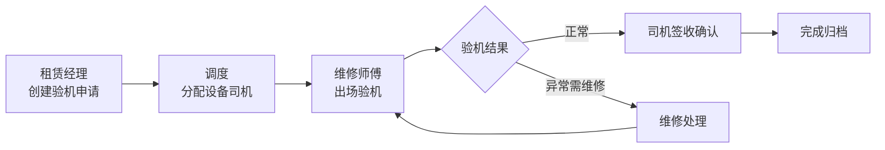

## 1. 产品概述

工程机械租赁出场验机与司机签收管理系统，解决租赁业务中设备出场检验、多角色接力处理、司机签收确认的全流程管控问题。

- 核心用户：租赁经理、调度员、维修师傅、司机
- 核心价值：通过角色接力式验机流程，确保设备出场状态可追溯，明确各方责任，减少后续争议

## 2. 核心功能

### 2.1 用户角色

| 角色 | 核心职责 | 核心权限 |
|------|----------|----------|
| 租赁经理 | 发起验机申请、审核验机结果、查看全量数据 | 创建验机单、审核、查看所有单据 |
| 调度 | 安排设备和司机、跟踪出场进度 | 分配调度、更新状态、查看待办 |
| 维修师傅 | 执行设备检验、记录问题 | 填写验机结果、上传照片、标记异常 |
| 司机 | 签收确认设备状态 | 查看验机单、签字确认、回看记录 |

### 2.2 功能模块

1. **工作台首页**：待办统计、异常提醒、已完成概览、快捷入口
2. **出场验机列表**：筛选搜索、状态标签、多视图切换
3. **验机详情/处理**：设备信息、检验项、流程时间线、角色接力操作
4. **司机签收**：签字确认、照片留证、签收回看

### 2.3 页面详情

| 页面名称 | 模块名称 | 功能描述 |
|-----------|-------------|---------------------|
| 工作台 | 统计卡片 | 待办、异常、已完成、今日新增数量展示 |
| 工作台 | 待办列表 | 按角色展示当前用户需要处理的事项 |
| 工作台 | 异常提醒 | 高亮展示超期、争议、维修待确认等异常 |
| 出场验机列表 | 筛选搜索 | 按状态、时间、设备类型、合同号等筛选 |
| 出场验机列表 | 列表展示 | 卡片/列表模式，状态标签，关键信息摘要 |
| 验机详情页 | 基本信息 | 设备、合同、租期、承租方等核心信息 |
| 验机详情页 | 检验项 | 外观、性能、安全、附件等分类检验项 |
| 验机详情页 | 流程时间线 | 各角色处理时间、处理人、处理结果 |
| 验机详情页 | 操作区 | 根据当前角色显示对应操作按钮 |
| 司机签收页 | 设备确认 | 设备信息、验机结果摘要展示 |
| 司机签收页 | 签字确认 | 手写签名、确认提交 |
| 司机签收页 | 签收回看 | 历史签收记录、签名、照片查看 |

## 3. 核心流程

租赁经理创建验机申请 → 调度分配设备和司机 → 维修师傅出场验机 → 司机签收确认 → 完成归档

## 4. 用户界面设计

### 4.1 设计风格

- **主色调**：工业蓝（#1e40af）作为主色，代表专业、可靠
- **辅助色**：琥珀色（#f59e0b）用于警告/待处理，翠绿色（#10b981）用于正常/已完成，玫红色（#ef4444）用于异常/危险
- **中性色**：锌灰色系（zinc），从50到900共9个层级
- **字体**：标题使用思源黑体 Bold，正文使用思源黑体 Regular，数字使用等宽字体
- **布局风格**：左侧导航 + 顶部状态栏 + 主内容区，卡片式布局
- **图标风格**：线性图标（lucide），统一 20px 尺寸
- **整体风格**：工业风、专业、稳重，信息密度适中，强调状态可视化

### 4.2 页面设计概览

| 页面名称 | 模块名称 | UI元素 |
|-----------|-------------|-------------|
| 工作台 | 统计卡片 | 渐变色背景、大数字、趋势箭头、图标 |
| 工作台 | 待办列表 | 左侧彩色状态条、标题、副标题、时间 |
| 工作台 | 异常提醒 | 红色背景、警告图标、紧急程度标签 |
| 出场验机列表 | 筛选栏 | 下拉选择、搜索框、状态标签组 |
| 出场验机列表 | 列表项 | 设备名称、合同号、状态徽章、操作按钮 |
| 验机详情页 | 信息区 | 双列布局、标签值对、分组标题 |
| 验机详情页 | 时间线 | 竖向时间线、节点圆点、连接线 |
| 验机详情页 | 检验项 | 分组折叠面板、通过/不通过图标 |
| 司机签收页 | 签字板 | 画布签字、清除、撤销按钮 |
| 司机签收页 | 照片墙 | 网格布局、缩略图、点击放大 |

### 4.3 响应式

- 桌面端优先（1280px+），适配 1440px 和 1920px
- 平板端（768px-1279px）：导航收起为图标模式
- 移动端（<768px）：底部导航栏，单列布局

### 4.4 动效设计

- 页面切换：淡入 + 轻微上移，200ms 缓动
- 按钮悬停：背景色过渡 + 轻微缩放（1.02倍）
- 状态变化：颜色渐变过渡，300ms
- 时间线：节点依次出现，带延迟的淡入动画
- 卡片悬浮：阴影加深 + 轻微上移（2px）
