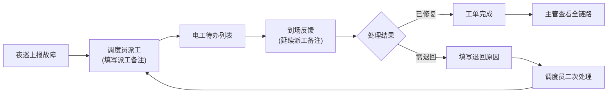

## 1. 产品概述
市政路灯所维修派工与到场反馈系统，解决主管临时追问进度时信息碎片化问题。打通灯杆台账、夜巡记录、维修工单，实现派工备注跨页面流转，让巡检员、电工、调度各角色清晰查看待办，全链路可追溯。

- 解决问题：信息分散在多系统，派工备注无法延续，进度追溯困难
- 目标用户：巡检员、电工、调度员、主管
- 核心价值：一条记录串联全流程，派工备注可被到场反馈继续使用

## 2. 核心 Features

### 2.1 用户角色

| 角色 | 登录方式 | 核心权限 |
|------|----------|----------|
| 巡检员 | 工号登录 | 上报故障、查看个人待办、提交到场反馈 |
| 电工 | 工号登录 | 查看派工待办、接单维修、到场反馈、退回申请 |
| 调度员 | 工号登录 | 工单派发、派工备注、进度跟踪、退回处理 |
| 主管 | 工号登录 | 全局视图、进度追问、全流程回看 |

### 2.2 功能模块
1. **登录页**：角色选择、工号登录、空状态引导
2. **待办看板**：按角色展示待办列表，支持状态筛选
3. **工单详情（侧栏）**：全链路时间线、灯杆台账、夜巡记录、维修记录、历史备注
4. **维修派工处理**：选择电工、派工备注（可延续）、优先级设置
5. **到场反馈**：延续派工备注、补充现场情况、上传照片、选择处理结果
6. **全流程回看**：按工单串联所有节点，支持主管追问场景

### 2.3 页面详情

| 页面名称 | 模块名称 | 功能描述 |
|----------|----------|----------|
| 登录页 | 角色选择 | 四个角色卡片切换，工号密码登录 |
| 登录页 | 空状态引导 | 首次登录展示操作指引 |
| 待办看板 | 角色待办区 | 巡检员/电工/调度各有专属待办列表 |
| 待办看板 | 工单列表 | 工单号、灯杆位置、故障类型、状态、优先级、最新备注 |
| 待办看板 | 筛选搜索 | 按状态、优先级、时间范围筛选 |
| 工单详情侧栏 | 基本信息 | 工单编号、灯杆编号、位置、故障类型 |
| 工单详情侧栏 | 全链路时间线 | 夜巡上报→派工→到场→维修→完成/退回，每个节点带操作人、时间、备注 |
| 工单详情侧栏 | 灯杆台账 | 灯杆型号、安装时间、历史维修记录 |
| 工单详情侧栏 | 历史备注区 | 派工备注、到场备注、退回原因、补充备注，按时间倒序 |
| 维修派工处理 | 电工选择 | 下拉选择在线电工，显示当前负载 |
| 维修派工处理 | 派工备注 | 富文本输入，支持@提及，备注自动带入到场反馈 |
| 维修派工处理 | 优先级设置 | 紧急/高/中/低 |
| 到场反馈 | 备注延续 | 自动显示派工备注，可补充修改 |
| 到场反馈 | 现场信息 | 到场时间、照片上传、现场描述 |
| 到场反馈 | 处理结果 | 已修复/需退回/需二次派工 |
| 到场反馈 | 退回原因 | 退回时必填原因，自动加入历史备注 |
| 全流程回看 | 主管视角 | 完整时间轴，支持展开每个节点详情 |

## 3. 核心流程

### 3.1 完整业务流程
夜巡员发现故障 → 上报系统生成工单 → 调度员派工（填写派工备注）→ 电工收到待办 → 电工到场（看到派工备注，补充到场反馈）→ 处理完成 / 退回 → 调度员处理退回 / 二次派工 → 工单闭环。

### 3.2 主管追问流程
主管点击工单 → 侧栏展开详情 → 查看全链路时间线 → 点击任意节点查看详情和备注 → 确认当前状态和责任人。

## 4. 用户界面设计

### 4.1 设计风格
- **主色调**：市政蓝 (#1E40AF)，代表专业、可靠
- **辅助色**：警示橙 (#F97316) 用于紧急状态，成功绿 (#10B981) 用于已完成，警告红 (#EF4444) 用于退回
- **中性色**：深灰 #1F2937、中灰 #6B7280、浅灰 #F3F4F6、纯白 #FFFFFF
- **按钮风格**：直角微圆角 (4px)，实心按钮带细微阴影，悬停有明暗变化
- **字体**：标题使用 "Noto Sans SC" 700，正文使用 "Noto Sans SC" 400/500，等宽字体用于工单号
- **布局风格**：左侧导航 + 主内容区 + 右侧滑出详情面板，典型后台管理布局
- **图标风格**：线性图标，统一 16px/20px 尺寸，与文字基线对齐

### 4.2 页面设计概览

| 页面名称 | 模块名称 | UI 元素 |
|----------|----------|----------|
| 登录页 | 角色选择卡 | 4张卡片横向排列，选中态蓝色边框+背景微亮，点击有微缩动画 |
| 登录页 | 登录表单 | 居中卡片，工号/密码输入框，底部登录按钮 |
| 待办看板 | 顶部导航 | 角色切换、搜索框、筛选按钮、用户头像 |
| 待办看板 | 待办统计卡 | 4个统计卡片（待派工/处理中/待反馈/已完成），数字醒目 |
| 待办看板 | 工单列表 | 表格布局，每行可点击展开侧栏，行悬停背景变化 |
| 工单详情侧栏 | 头部 | 工单编号+状态标签，关闭按钮 |
| 工单详情侧栏 | 时间线 | 垂直时间线，节点图标区分类型，连接线为虚线 |
| 工单详情侧栏 | 备注区 | 气泡式备注卡片，不同角色不同颜色，带时间和操作人 |
| 维修派工处理 | 表单弹窗 | 半透明遮罩，弹窗从右侧滑入，表单分块布局 |
| 到场反馈 | 表单区域 | 派工备注只读显示，新增备注输入框，底部操作按钮 |

### 4.3 交互细节
- **侧栏滑出**：点击工单列表行，右侧详情面板从右向左滑入，耗时 300ms，带阴影
- **备注延续**：到场反馈页面顶部灰色框显示派工备注，标注"派工备注"标签，下方为新增备注区
- **状态流转动画**：工单状态变更时，行背景闪烁对应颜色 1 秒后恢复
- **空状态**：无数据时显示市政路灯图标 + 引导文字 + 操作按钮
- **时间线展开**：点击时间线节点可展开查看该节点完整信息

### 4.4 响应式
- 桌面端优先设计（1440px 基准）
- 平板端（≥768px）：侧栏宽度自适应，列表保持表格布局
- 移动端：列表转为卡片布局，详情面板改为全屏覆盖

## 5. Mock 数据样例要求

### 5.1 工单样例（5条）
1. **紧急工单**：人民路与建设路交叉口，路灯不亮，带3条历史备注
2. **进行中工单**：解放路56号灯杆，线路故障，已派工待到场
3. **退回工单**：中山路12号，需更换变压器，已退回待二次处理
4. **待派工工单**：环城路34号，灯罩破损，等待派工
5. **已完工单**：高新区88号，LED电源故障，已完成，带完整时间线

### 5.2 备注样例
- 派工备注："请检查电源控制器，上周同路段出现过类似问题，可能是批次性故障"
- 到场反馈："已到达现场，确认是电源控制器烧毁，已更换备用件，建议采购XX型号备存"
- 退回原因："现场情况比预期复杂，需要高空作业车配合，明天上午9点可到场"
- 补充备注："已协调高空作业车，请联系张师傅138XXXX"
