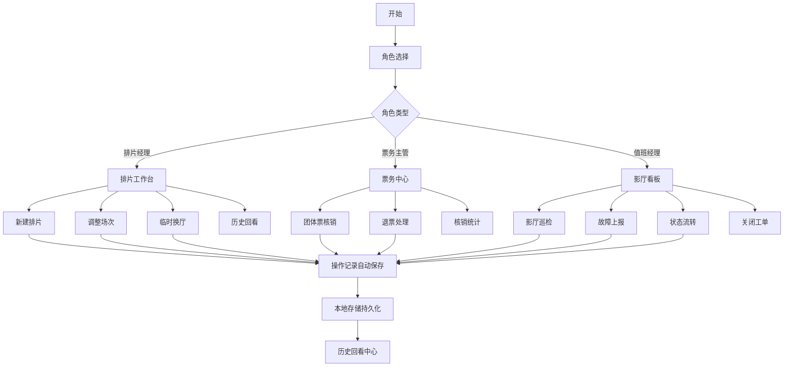

## 1. 产品概述

影院运营工作面系统，聚焦影片排片与影厅资源全流程管理，替代传统Excel大表协作模式。针对临时换厅混乱、团体票核销不清、设备故障退票难三大核心痛点，为排片经理、票务主管、值班经理提供独立工作区，实现可追溯、可流转、可回看的闭环运营。

## 2. 核心功能

### 2.1 用户角色

| 角色 | 登录方式 | 核心权限 |
|------|---------|---------|
| 排片经理 | 角色切换 | 创建排片计划、调整场次、临时换厅审批、查看排片历史 |
| 票务主管 | 角色切换 | 团体票核销、票务统计、退票处理、查看核销历史 |
| 值班经理 | 角色切换 | 影厅巡检、设备故障上报、影厅状态流转、关闭工单 |

### 2.2 功能模块

1. **影片排片工作台**: 排片计划列表、新建排片、场次调整、临时换厅、历史回溯
2. **影厅资源工作面**: 影厅状态看板、巡检记录、设备故障工单、换厅流转历史
3. **票务核销中心**: 团体票批量核销、退票申请、票务流水、核销统计
4. **历史回看中心**: 全流程操作日志、流转轨迹、变更对比、筛选导出

### 2.3 页面详情

| 页面名称 | 模块名称 | 功能描述 |
|---------|---------|---------|
| 排片工作台 | 排片列表卡片 | 按日期展示排片计划，支持状态筛选、快速操作 |
| 排片工作台 | 新建排片表单 | 影片信息、影厅选择、场次时间、票价设置、批量录入 |
| 排片详情页 | 排片信息展示 | 完整排片信息、操作时间线、相关工单关联 |
| 排片详情页 | 操作动作区 | 调整场次、临时换厅、退回修改、补充信息、关闭 |
| 影厅看板 | 影厅状态网格 | 实时展示各影厅状态（空闲/放映/故障/维护） |
| 影厅详情页 | 影厅基本信息 | 座位数、设备配置、最近巡检时间 |
| 影厅详情页 | 流转时间线 | 完整展示影厅状态变更原因、处理人、时间戳 |
| 影厅详情页 | 巡检与故障 | 提交巡检记录、上报设备故障、处理故障工单 |
| 票务中心 | 团体票核销 | 券号输入、批量导入、核销确认、核销记录 |
| 票务中心 | 退票处理 | 退票申请、关联场次、审核退票、退款记录 |
| 历史中心 | 操作日志 | 全系统操作记录，支持按角色、时间、类型筛选 |
| 历史中心 | 流转轨迹 | 可视化展示单条记录的完整处理流程 |

## 3. 核心流程

### 3.1 排片创建与处理流程

排片经理新建排片 → 选择影片与影厅 → 设置场次时间 → 提交排片 → 系统校验影厅冲突 → 排片生效 → 如需调整：值班经理申请换厅 → 排片经理审批 → 系统自动更新场次 → 操作记录留痕 → 排片关闭归档

### 3.2 影厅巡检与故障处理流程

值班经理进入影厅看板 → 选择目标影厅 → 提交巡检记录 → 如发现故障 → 创建设备故障工单 → 标注影响场次 → 系统自动触发退票提醒 → 票务主管处理退票 → 维修完成 → 值班经理验证并关闭工单 → 全流程可追溯

### 3.3 团体票核销流程

票务主管进入票务中心 → 输入/导入券号 → 系统校验有效性 → 关联场次与座位 → 确认核销 → 生成核销记录 → 如需退票 → 提交退票申请 → 值班经理审核 → 退票完成 → 状态同步更新

## 4. 用户界面设计

### 4.1 设计风格

- **主色调**: 深邃影院红 `#B91C1C` 搭配专业炭灰 `#1F2937`，营造专业运营氛围
- **辅助色**: 状态色体系：正常绿 `#059669`、预警橙 `#D97706`、故障红 `#DC2626`、信息蓝 `#2563EB`
- **字体**: 标题使用思源黑体 Bold，正文使用思源黑体 Regular，数字使用等宽字体
- **布局**: 左侧导航 + 右侧工作面的经典后台布局，卡片式信息分组，时间线式历史展示
- **动效**: 状态变更时微动画提示，卡片悬停阴影加深，时间线节点脉冲效果

### 4.2 页面设计概述

| 页面名称 | 模块名称 | UI元素 |
|---------|---------|-------|
| 排片工作台 | 列表卡片 | 圆角卡片、状态标签、快速操作按钮、时间胶囊 |
| 排片详情页 | 时间线 | 垂直时间线、节点图标、操作人头像、变更对比 |
| 影厅看板 | 状态网格 | 色块网格、状态图标、tooltip详情、点击展开 |
| 影厅详情页 | 流转记录 | 可折叠时间线、原因标签、处理人信息 |
| 票务中心 | 核销表单 | 文本域批量输入、导入按钮、核销进度条 |
| 历史中心 | 筛选面板 | 多条件筛选、日期范围、关键词搜索 |

### 4.3 响应式

- 桌面端优先设计（1280px+），适配1920px大屏
- 平板端（768px-1279px）：导航折叠为图标模式，卡片单列展示
- 移动端仅保留核心查询功能，不建议进行复杂操作

### 4.4 交互细节

- 所有状态变更操作均需二次确认
- 表单错误实时校验提示
- 批量操作显示进度与结果统计
- 关键数据变更高亮闪烁提示
- 时间线支持展开/收起详情
