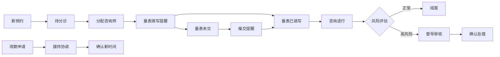

## 1. 产品概述

心理咨询室内部工作台原型，用于替代人工协调预约、分诊、咨询师排班、量表回收流程，解决来访者改期复杂和高风险个案预警不足的问题。

- 目标用户：接待人员、咨询师、督导
- 核心价值：提升工作效率，保护来访者隐私，及时识别高风险个案

## 2. 核心功能

### 2.1 用户角色

| 角色 | 登录方式 | 核心权限 |
|------|----------|----------|
| 接待人员 | 工号登录 | 查看全部预约、处理待分诊、管理来访者改期 |
| 咨询师 | 工号登录 | 查看个人排班、查看来访详情、记录咨询笔记 |
| 督导 | 工号登录 | 查看高风险个案、审核风险等级、不查看完整隐私信息 |

### 2.2 功能模块

1. **工作台首页**：今日概览、待办提醒、角色专属视图
2. **预约管理**：预约列表、初访/复访标识、改期处理、状态筛选
3. **分诊管理**：待分诊断、匹配咨询师、分配记录
4. **排班管理**：咨询师日程、可预约时段、排班调整
5. **量表管理**：量表状态、填写提醒、复测标记、回收记录
6. **高风险预警**：风险个案列表、风险等级、督导审核

### 2.3 页面详情

| 页面名称 | 模块名称 | 功能描述 |
|---------|----------|----------|
| 工作台首页 | 概览卡片 | 今日预约数、待分诊数、高风险预警数、量表待交数 |
| 工作台首页 | 待办事项 | 按优先级展示待处理项，包含改期申请、量表提醒等 |
| 预约管理 | 预约列表 | 展示来访者匿名标识、预约时间、类型（初访/复访）、状态 |
| 预约管理 | 改期处理 | 查看改期原因、调整时间、通知来访者 |
| 分诊管理 | 待分诊断 | 展示需要分配咨询师的初访个案 |
| 排班管理 | 日程视图 | 按日期展示咨询师可用时段和已安排咨询 |
| 量表管理 | 状态追踪 | 显示量表是否已填写、是否需复测、是否已通知 |
| 高风险预警 | 风险列表 | 展示高风险个案，脱敏显示来访者信息 |

## 3. 核心流程

### 3.1 主要业务流程

接待人员创建预约 → 初访个案进入待分诊 → 分配咨询师 → 来访者填写量表 → 咨询师查看安排 → 咨询完成 → 如评估为高风险 → 督导审核确认

### 3.2 改期流程

来访者申请改期 → 接待人员查看申请 → 协调新时段 → 确认改期 → 通知咨询师和来访者

### 3.3 流程图

## 4. 用户界面设计

### 4.1 设计风格

- **主色调**：深青色 (#1a4d5c) - 专业、沉稳、保护隐私
- **辅助色**：浅青色 (#e8f4f8) - 背景、柔和
- **警示色**：珊瑚红 (#e07a5f) - 高风险提醒
- **状态色**：
  - 正常：灰绿色 (#81b29a)
  - 待处理：琥珀色 (#f2cc8f)
  - 高风险：珊瑚红 (#e07a5f)
  - 已完成：深灰色 (#6b7280)

- **按钮风格**：圆角 6px，扁平设计，悬停微浮起
- **字体**：
  - 标题：思源黑体 Bold，16-20px
  - 正文：思源黑体 Regular，14px
  - 辅助文字：12px，灰色
- **布局风格**：卡片式布局，左侧导航，右侧内容区，大量留白
- **图标风格**：线性简约图标，避免花哨装饰

### 4.2 页面设计概览

| 页面名称 | 模块名称 | UI 元素 |
|---------|----------|---------|
| 工作台首页 | 概览卡片 | 四卡片横向排列，数字醒目，图标简洁 |
| 工作台首页 | 待办列表 | 时间线布局，状态标签区分优先级 |
| 预约管理 | 列表视图 | 表格布局，行悬停高亮，匿名化名称显示 |
| 排班管理 | 日程视图 | 时间轴布局，色块区分咨询师，可拖拽调整 |
| 量表管理 | 状态卡片 | 进度条显示填写状态，徽章标记复测需求 |
| 高风险预警 | 风险卡片 | 红色边框警示，关键信息脱敏，需督导确认按钮 |

### 4.3 响应式

- 桌面端优先设计，最小支持 1280px 宽度
- 侧边导航可折叠，适应不同屏幕尺寸
- 表格在小屏幕下转为卡片列表展示

### 4.4 隐私保护设计

- 来访者姓名显示为「来访者+编号」或「姓氏+*」
- 高风险个案对督导隐藏具体隐私信息，仅展示风险等级和必要摘要
- 避免在界面上同时展示过多敏感信息
- 页面无任何营销性质的文案和装饰
