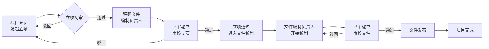
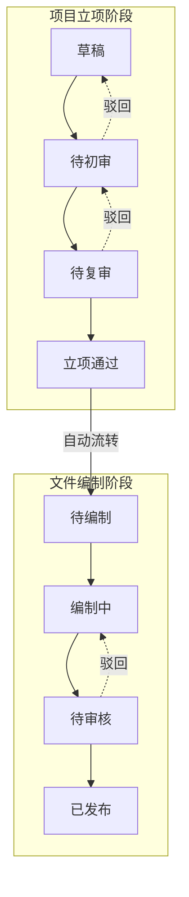
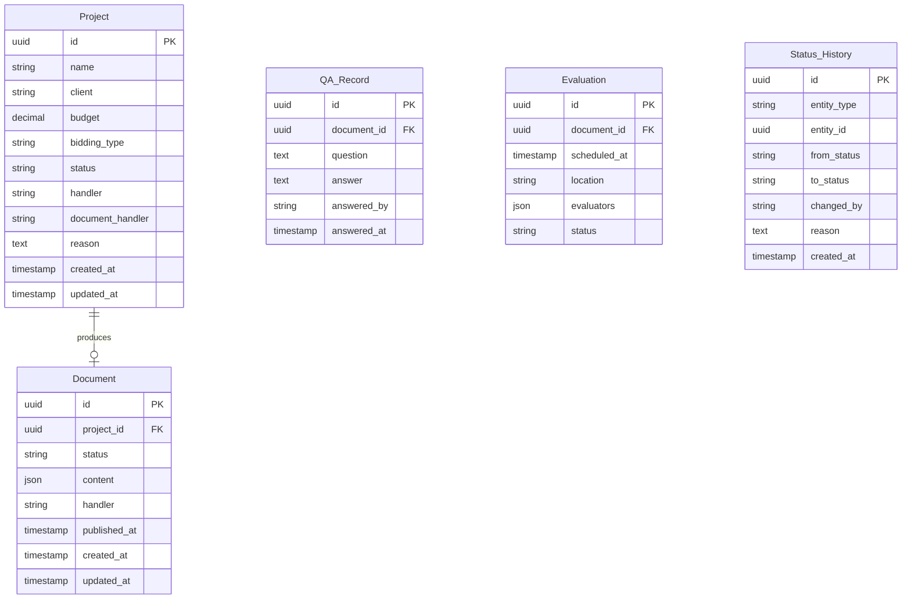

# 招标代理公司-项目立项与文件编制系统 PRD

## 1. 产品概述

解决招标代理公司一线业务中最常见的三个问题：
1. **责任断层**：项目立项与文件编制之间出现无人负责的空档
2. **状态不一致**：项目专员、评审秘书、财务看到的信息口径不统一
3. **过程黑盒**：只记录结果，不记录"为什么"，导致追溯困难

目标用户：项目专员、评审秘书、财务人员
核心价值：建立清晰的责任链，确保每个环节有人负责、可追溯

## 2. 核心功能

### 2.1 用户角色

| 角色 | 职责范围 | 核心视图 |
|------|---------|---------|
| 项目专员 | 项目立项发起、文件编制跟进 | 我发起的项目、待处理任务 |
| 评审秘书 | 项目评审、文件审核、答疑安排 | 待评审项目、审核队列 |
| 财务人员 | 费用确认、保证金管理 | 费用待确认列表 |

### 2.2 功能模块

1. **项目立项管理**
   - 项目基本信息录入（项目名称、委托单位、预算金额、招标方式）
   - 立项审批流程（提交→初审→复审→立项通过）
   - 立项原因记录（必填：为什么这个项目要立项）
   - 责任人明确（立项负责人、后续文件编制负责人）

2. **文件编制管理**
   - 招标文件编制（从立项继承项目信息）
   - 答疑记录管理（问题、答复、时间和责任人）
   - 评标安排记录（时间、地点、评委）
   - 编制状态追踪（待编制→编制中→待审核→已发布）

3. **统一状态中心**
   - 全局状态看板（所有角色看到同一数据）
   - 状态变更历史（谁、什么时候、为什么改）
   - 待办事项聚合（跨角色统一视图）

4. **简化收尾说明**
   - 权限简化点（角色基础权限，不做细粒度控制）
   - 附件简化点（上传下载，不做版本管理）
   - 通知简化点（站内消息，不做外部推送）
   - 外部系统简化点（预留接口桩，不做真实集成）

## 3. 核心流程

### 3.1 项目立项→文件编制责任链



### 3.2 状态一致性保证机制



## 4. 页面设计

### 4.1 设计风格

- **色调**：政务蓝 #1a56db 为主，状态色（绿/黄/红）辅助
- **布局**：经典后台布局，左侧导航+右侧内容区
- **字体**：思源黑体/Noto Sans SC
- **交互**：表格为主，表单弹窗编辑
- **图标**：简洁线性图标

### 4.2 页面清单

| 页面 | 核心模块 | 功能描述 |
|------|---------|---------|
| 统一工作台 | 待办聚合、快捷入口 | 跨角色统一入口，显示所有待办 |
| 项目立项列表 | 分页表格、筛选、状态筛选 | 展示所有项目，支持按状态、人员筛选 |
| 项目立项详情 | 基本信息、审批历史、变更记录 | 显示立项全貌，包含"为什么"记录 |
| 新建立项 | 表单、责任人选择 | 发起新项目立项 |
| 文件编制列表 | 分页表格、项目关联 | 展示文件编制任务 |
| 文件编制详情 | 招标文件、答疑记录、评标安排 | 完整的文件编制记录 |
| 状态变更历史 | 时间线展示 | 记录所有状态变更及原因 |

### 4.3 响应式设计

- 桌面优先设计（主要用户场景）
- 平板适配（评审场景）
- 不做移动端优化（一线业务以PC为主）

## 5. 服务层设计

### 5.1 API 请求示例

#### 项目立项相关

```typescript
// 获取项目列表（分页+筛选）
GET /api/projects?page=1&pageSize=20&status=pending&handler=张三

// 创建项目立项
POST /api/projects
{
  "name": "XX单位办公楼装修招标",
  "client": "XX单位",
  "budget": 5000000,
  "biddingType": "公开招标",
  "handler": "李四",
  "documentHandler": "王五",  // 明确文件编制负责人
  "reason": "委托单位已完成内部审批流程..."
}

// 获取项目详情（含状态历史）
GET /api/projects/:id

// 更新项目状态
PATCH /api/projects/:id/status
{
  "status": "review_pending",
  "reason": "初审通过，建议进入复审"
}
```

#### 文件编制相关

```typescript
// 获取文件编制列表
GET /api/documents?projectId=xxx&status=draft

// 创建/更新招标文件
PUT /api/documents/:id
{
  "content": "...",
  "handler": "王五"
}

// 添加答疑记录
POST /api/documents/:id/qa-records
{
  "question": "招标文件第5条如何理解",
  "answer": "按委托单位解释为...",
  "answeredBy": "王五",
  "answeredAt": "2024-01-15T10:00:00Z"
}

// 安排评标
POST /api/documents/:id/evaluation
{
  "scheduledAt": "2024-01-20T09:00:00Z",
  "location": "评标室A",
  "evaluators": ["评委1", "评委2", "评委3"]
}
```

### 5.2 错误码设计

| 错误码 | 含义 | 处理建议 |
|-------|------|---------|
| PROJECT_001 | 项目不存在 | 检查项目ID |
| PROJECT_002 | 状态流转不合规 | 查看当前状态允许的流转 |
| PROJECT_003 | 缺少必填字段 | 检查reason、handler字段 |
| PROJECT_004 | 无权限操作 | 检查用户角色 |
| DOCUMENT_001 | 文件不存在 | 检查文档ID |
| DOCUMENT_002 | 文档已发布，无法编辑 | 联系管理员 |
| AUTH_001 | 未登录 | 跳转登录页 |
| AUTH_002 | 权限不足 | 联系项目负责人 |

## 6. 数据模型

### 6.1 核心实体



## 7. 简化点说明

### 7.1 权限简化
- 基于角色的粗粒度控制（项目专员/评审秘书/财务）
- 不做数据级别的权限隔离
- 不做字段级别的权限控制

### 7.2 附件简化
- 支持上传/下载附件
- 不做版本管理
- 不做在线预览
- 附件存储使用本地文件系统

### 7.3 通知简化
- 站内消息通知（数据库存储）
- 不做邮件/短信推送
- 不做实时推送（轮询或刷新）

### 7.4 外部系统简化
- 预留接口定义（API桩）
- 不做真实第三方集成
- 不做单点登录
