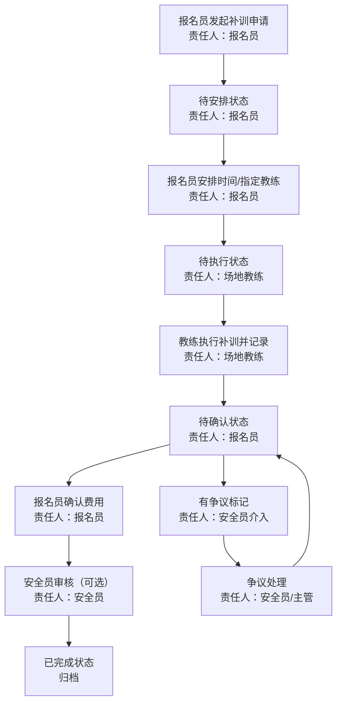

## 1. 产品概述

摩托车驾培补训安排与费用确认管理系统，用于解决驾校补训流程中责任不清、状态不一致、费用确认脱节的问题。系统覆盖报名员、场地教练、安全员三类角色，确保补训安排到费用确认的全链路可追溯、责任可界定。

- 核心问题：补训安排与费用确认之间存在信息断层，责任归属不清易引发争议
- 目标用户：驾校报名员、场地教练、安全员
- 产品价值：统一状态口径、消除责任空档、完整追溯历史记录

## 2. 核心 Features

### 2.1 用户角色

| 角色 | 登录方式 | 核心权限 |
|------|----------|----------|
| 报名员 | 账号登录 | 创建补训申请、确认费用、查看全量补训记录 |
| 场地教练 | 账号登录 | 接收补训安排、记录补训执行、标记完成状态 |
| 安全员 | 账号登录 | 审核补训安全合规、确认安全记录、查看相关历史 |

### 2.2 功能模块

1. **补训列表主页**：补训记录列表、状态筛选、角色切换、搜索
2. **侧栏详情面板**：学员基本信息、补训详情、当前责任人、操作按钮
3. **补训安排处理**：安排补训时间、指定教练、添加备注
4. **费用确认回看**：费用明细、缴费状态、确认记录
5. **历史记录时间线**：状态流转、操作人、操作时间、备注信息

### 2.3 页面详情

| 页面名称 | 模块名称 | 功能描述 |
|----------|----------|----------|
| 补训列表主页 | 顶部导航栏 | 角色切换、统计概览、搜索框 |
| 补训列表主页 | 状态筛选标签 | 待安排/待执行/待确认/已完成/有争议 |
| 补训列表主页 | 补训记录列表 | 学员姓名、车型、补训原因、当前状态、当前责任人、操作按钮 |
| 侧栏详情面板 | 学员信息卡 | 姓名、身份证号、联系方式、报名日期、剩余学时 |
| 侧栏详情面板 | 补训详情 | 补训科目、原因、原课时、补训课时、费用金额 |
| 侧栏详情面板 | 操作区 | 根据角色和状态显示对应操作按钮（安排/执行/确认/审核） |
| 侧栏详情面板 | 费用确认回看 | 费用构成、缴费状态、确认人、确认时间 |
| 侧栏详情面板 | 历史记录时间线 | 完整的状态流转记录，含操作人、时间、备注 |

## 3. 核心流程

补训申请由报名员发起，经教练执行补训后，由报名员确认费用，安全员全程可审核安全合规性。每个状态节点都有明确的责任人，确保无空档。

状态流转规则：
- **待安排** → 报名员操作后 → **待执行**
- **待执行** → 教练操作后 → **待确认**
- **待确认** → 报名员确认费用后 → **已完成**
- 任何环节均可标记 **有争议**，由安全员介入处理

## 4. 用户界面设计

### 4.1 设计风格

- **主色调**：深海军蓝 `#0F2540`（专业、稳重），搭配警示橙 `#FF6B35`（状态提示）
- **辅助色**：状态绿 `#10B981`（完成）、状态黄 `#F59E0B`（进行中）、状态红 `#EF4444`（争议）
- **中性色**：炭灰 `#1F2937`、浅灰 `#F3F4F6`、白色 `#FFFFFF`
- **按钮风格**：直角微圆角（2px），扁平风格，hover 有轻微背景加深
- **字体**：标题使用 "Noto Serif SC"（衬线体，专业感），正文使用 "Noto Sans SC"（无衬线，易读）
- **布局风格**：左侧主列表 + 右侧详情面板的经典后台双栏布局
- **图标风格**：线性图标（Lucide React），统一描边宽度

### 4.2 页面设计概览

| 页面名称 | 模块名称 | UI 元素 |
|----------|----------|---------|
| 补训列表主页 | 顶部导航 | 深色背景、白色文字、角色切换下拉、统计数字卡片 |
| 补训列表主页 | 状态标签栏 | 横向排列、底部下划线选中态、角标数字 |
| 补训列表主页 | 列表行 | 斑马纹背景、状态胶囊标签、责任人头像、hover 高亮 |
| 侧栏详情面板 | 学员信息卡 | 浅灰卡片、头像圆形、关键信息加粗 |
| 侧栏详情面板 | 补训详情 | 两列网格布局、标签-值对、费用金额高亮加粗 |
| 侧栏详情面板 | 操作区 | 按钮组、主操作按钮强调色、危险操作红色 |
| 侧栏详情面板 | 历史时间线 | 左侧时间轴竖线、节点圆点、操作人信息右侧对齐 |

### 4.3 响应式

- 桌面端优先设计（最小宽度 1280px）
- 侧栏详情面板固定宽度 480px，主列表自适应
- 移动端（< 768px）切换为上下布局，列表在上详情在下
- 所有表格在移动端转为卡片式展示

### 4.4 视觉细节

- 顶部栏添加细微渐变纹理
- 卡片添加 1px 内阴影增强质感
- 状态流转时间线使用虚线连接，当前节点使用脉冲动画
- 争议记录行添加左侧红色边条警示
- 页面切换使用淡入过渡动画（150ms）
