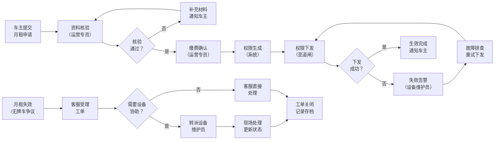

## 1. 产品概述

智慧停车场月租车审核与权限下发处理工具，面向一线运营人员（运营专员、客服、设备维护员），解决当前依赖车场日志、月租名单和道闸异常表兜底的痛点。系统清晰回答"谁在处理、审核卡在哪里、权限下发为什么没完成"三个核心问题。

- 核心价值：将分散的异常处理流程系统化，减少临时补说明，提升处理效率和可追溯性
- 目标用户：运营专员、客服人员、设备维护员

## 2. 核心功能

### 2.1 用户角色

| 角色 | 登录方式 | 核心权限 |
|------|----------|----------|
| 运营专员 | 工号登录 | 月租车审核、权限下发操作、处理记录查看 |
| 客服人员 | 工号登录 | 争议工单处理、车主沟通记录、进度查询 |
| 设备维护员 | 工号登录 | 道闸故障处理、设备状态更新、权限下发重试 |

### 2.2 功能模块

1. **仪表盘首页**：待处理事项、风险预警、最近变更记录、处理人在岗状态
2. **月租车审核处理**：审核流程跟踪、节点卡住标识、审核操作、历史记录
3. **权限下发回看**：下发链路追踪、失败原因定位、重试操作、离线日志
4. **异常处理**：月租权限失效、无牌车争议、道闸故障三类工单处理

### 2.3 页面详情

| 页面名称 | 模块名称 | 功能描述 |
|----------|----------|----------|
| 仪表盘首页 | 待处理队列 | 按优先级展示待审核、待处理、待重试事项，点击直达处理页 |
| 仪表盘首页 | 风险预警 | 超时未处理、权限失效超24h、道闸离线等风险项高亮展示 |
| 仪表盘首页 | 最近变更 | 最近30分钟内的审核通过、权限下发成功、故障修复等记录 |
| 仪表盘首页 | 处理人状态 | 展示三类角色当前在岗及处理中数量 |
| 月租车审核 | 审核流程卡 | 显示申请→资料核验→缴费确认→权限生成→下发准备各节点状态，卡住节点红色标识 |
| 月租车审核 | 处理操作区 | 核验资料、确认缴费、驳回申请、补充材料等操作 |
| 权限下发回看 | 下发链路 | 展示权限生成→队列→道闸A→道闸B→确认的完整链路，失败节点可展开原因 |
| 权限下发回看 | 操作区 | 单条重试、批量重试、下发日志导出、离线模式切换 |
| 异常处理 | 工单列表 | 月租失效、无牌车争议、道闸故障三类工单分类展示 |
| 异常处理 | 工单处理 | 原因记录、处理措施、车主沟通记录、转派操作 |

## 3. 核心流程

一线处理顺序优先级：
1. 道闸故障（影响所有车辆）→ 设备维护员优先
2. 月租权限失效（车主无法入场）→ 客服/运营协同
3. 无牌车争议（特定车辆）→ 客服优先
4. 新月租审核（不影响现有）→ 运营专员按序处理

## 4. 界面设计

### 4.1 设计风格
- **主色调**：深灰蓝（#1E293B）作为导航和头部，强调专业稳重
- **强调色**：橙色（#F97316）用于待处理和风险预警，绿色（#10B981）用于已完成，红色（#EF4444）用于严重风险
- **中性色**：不同层级的灰色用于信息分层，减少视觉噪音
- **设计方向**：工业实用风格，高密度信息展示，最近打开优先于装饰效果
- **字体**：使用 "JetBrains Mono" 作为数字和编号字体，"Noto Sans SC" 作为中文主体，突出工具属性
- **交互**：表格行悬停高亮，点击即展开详情，减少弹窗干扰

### 4.2 页面设计概览

| 页面名称 | 模块名称 | UI 元素 |
|----------|----------|----------|
| 仪表盘首页 | 待处理队列 | 卡片列表，左边缘颜色条区分优先级，数字角标显示数量，悬停显示快捷操作 |
| 仪表盘首页 | 风险预警 | 顶部警示条，闪烁动画提示最严重项，可折叠展开详细列表 |
| 仪表盘首页 | 最近变更 | 时间线布局，左侧时间戳，右侧事件描述和处理人，淡入动画按时间排序 |
| 仪表盘首页 | 处理人状态 | 头像+状态圆点（绿/灰/红），处理中数量徽标，点击查看该人处理列表 |
| 月租车审核 | 流程卡 | 水平步骤条，卡住节点脉冲动画，点击节点显示该节点详情和操作 |
| 权限下发回看 | 链路图 | 垂直流向布局，节点间连线，失败节点红色边框，可展开查看错误堆栈 |
| 权限下发回看 | 操作栏 | 固定底部操作栏，离线模式切换按钮醒目，状态指示灯 |

### 4.3 响应式
- Desktop-first 设计，主内容区最小宽度 1280px
- 侧边栏可折叠，增加表格展示空间
- 表格支持横向滚动，适配小屏幕
- 触控设备优化按钮点击区域 ≥ 44px

### 4.4 特殊要求
- 非满状态展示：默认数据中包含待处理、进行中、失败、已完成等多种状态，避免全是成功状态
- 一打开即可见：待处理、风险项、最近变更三区域在首屏无滚动可见
- 离线可用：核心数据支持本地缓存，断网时可查看历史记录和处理已缓存事项
- 最近打开：左侧边栏显示最近访问的5条记录，优先于其他装饰元素
