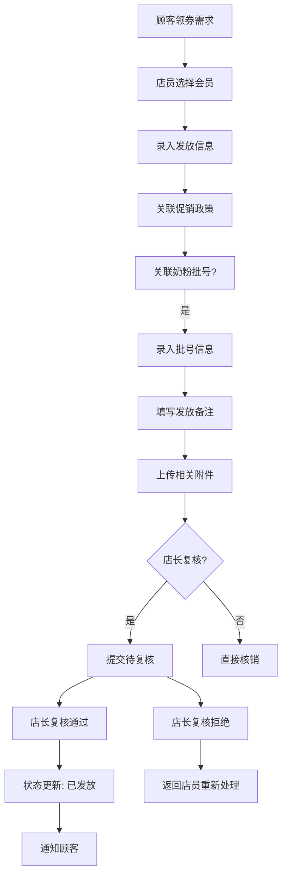

# 母婴零售店-促销券发放与核销复核系统

## 1. 产品概述

针对母婴零售店促销券发放与核销的业务痛点，设计从发放到复核的完整业务流程。系统围绕"一券一档"核心理念，确保促销券从发放、处理、复核到归档的全生命周期可追溯。

**核心价值：**
- 一线操作员按业务场景顺序处理，减少跨页面跳转
- 发放备注自动流转至复核环节，避免信息断层
- 多角色看到不同视角，但状态口径完全一致
- 任何环节都有明确责任人，消除"空档期"

**目标用户：**
- 店员：日常发放处理与基础查询
- 店长：复核审批与门店整体运营视图
- 采购：供应商促销政策对接与成本分析

## 2. 核心功能

### 2.1 用户角色

| 角色 | 登录方式 | 核心权限 |
|------|---------|---------|
| 店员 | 门店账号密码 | 促销券发放、基础查询、附件上传 |
| 店长 | 门店账号密码 | 复核审批、全门店视图、风险监控 |
| 采购 | 采购账号密码 | 供应商政策查看、批号追溯、成本分析 |

### 2.2 核心页面

1. **首页仪表盘**：待办任务、风险项预警、最近变更记录
2. **促销券发放**：新建发放、发放记录查询、批号关联
3. **促销券核销复核**：待复核列表、历史复核记录、发放备注追溯
4. **会员档案**：会员信息、券使用历史、积分变动
5. **奶粉批号管理**：批号录入、有效期跟踪、质量追溯
6. **附件管理**：上传下载、关联查看

## 3. 业务流程

### 3.1 促销券发放流程



### 3.2 核销复核流程


### 3.3 关键业务规则

**发放备注流转规则：**
- 发放时填写的备注，自动携带至复核界面
- 复核时可追加复核意见，但原始发放备注不可删除
- 备注历史完整保留，支持时间轴回看

**状态流转规则：**
```
草稿 → 待复核 → 已发放/已核销 → 已归档
                  ↓
              复核拒绝 → 待修改 → 待复核
```

**责任人规则：**
- 发放录入：店员（自动记录）
- 复核操作：店长（系统派发）
- 拒绝修改：原发放店员（自动派回）
- 归档操作：系统自动（30天后）

## 4. 页面设计

### 4.1 设计风格

**整体定位：** 专业母婴零售场景，强调清晰、可靠、可追溯

**色彩方案：**
- 主色：柔和粉蓝 `#4A90A4`（专业可信）
- 辅助色：暖心橙 `#E8A87C`（母婴温馨）
- 状态色：成功绿 `#52C41A`、警告黄 `#FAAD14`、危险红 `#FF4D4F`
- 背景：纯净白 `#FFFFFF` 搭配浅灰 `#F5F7FA`
- 文字：深灰 `#2D3748`、中灰 `#718096`、浅灰 `#A0AEC0`

**字体方案：**
- 标题：思源黑体（Source Han Sans CN）Bold
- 正文：思源黑体（Source Han Sans CN）Regular
- 数据：Roboto Mono（数字清晰）

**布局风格：**
- 卡片式布局，清晰的信息层级
- 左侧导航 + 右侧内容区的经典B/S架构
- 状态标签使用圆角pill样式
- 列表页使用斑马纹表格，提高可读性

**图标风格：**
- 使用线性图标，保持视觉一致性
- 状态图标使用语义化颜色

### 4.2 首页设计

**布局：**
- 顶部：欢迎语 + 角色标识 + 快捷操作
- 左侧：待办任务卡片（按紧急程度排序）
- 中间：风险项预警（过期未核、异常批号等）
- 右侧：最近变更记录（时间线展示）

**角色差异化：**
- 店员：待办优先，强调"今天要做什么"
- 店长：风险项优先，强调"门店有什么问题"
- 采购：变更记录优先，强调"政策有什么变化"

### 4.3 促销券发放页面

**核心模块：**
1. 会员选择器（支持扫码/手机号/姓名查询）
2. 促销政策选择（自动显示适用政策）
3. 奶粉批号关联（可选，支持扫码录入）
4. 发放备注编辑器（富文本，支持追加历史）
5. 附件上传区（支持图片、PDF）
6. 操作日志（自动记录所有变更）

**交互设计：**
- 分步骤填写，减少认知负担
- 必填项使用红色星号标识
- 智能提示（如关联政策推荐）
- 提交后立即显示状态和预计复核时间

### 4.4 核销复核页面

**核心模块：**
1. 发放信息摘要（一眼看清全貌）
2. 发放备注历史（时间轴展示）
3. 批号追溯信息（点击可展开详情）
4. 附件预览区（支持在线预览）
5. 复核操作区（通过/拒绝/需补充）
6. 复核意见输入（拒绝时必填）

**关键交互：**
- 复核时可查看完整的发放链路
- 拒绝原因提供标准选项 + 自定义输入
- 支持"需要补充材料"操作
- 操作前二次确认，防止误操作

## 5. 数据模型

### 5.1 核心实体

**促销券 (PromotionCoupon)**
- coupon_id: 券唯一标识
- policy_id: 关联促销政策
- member_id: 领券会员
- store_id: 发放门店
- operator_id: 操作店员
- status: 当前状态（草稿/待复核/已发放/已核销/已归档/复核拒绝）
- issue_date: 发放日期
- expiry_date: 有效期
- batch_number: 关联批号（可选）
- issue_remarks: 发放备注
- review_remarks: 复核备注
- attachments: 附件列表
- created_at: 创建时间
- updated_at: 更新时间

**会员档案 (Member)**
- member_id: 会员ID
- name: 姓名
- phone: 手机号
- baby_name: 宝宝姓名
- baby_birthday: 宝宝生日
- tier: 会员等级
- points: 积分
- created_at: 注册时间

**奶粉批号 (MilkPowderBatch)**
- batch_id: 批号ID
- batch_number: 批号
- supplier: 供应商
- production_date: 生产日期
- expiry_date: 过期日期
- quantity: 数量
- status: 状态（正常/即将过期/已过期）
- linked_coupons: 关联券列表

### 5.2 状态与权限矩阵

| 操作 | 店员 | 店长 | 采购 |
|------|------|------|------|
| 新建发放 | ✓ | ✓ | ✗ |
| 修改草稿 | ✓ | ✓ | ✗ |
| 提交复核 | ✓ | ✓ | ✗ |
| 复核通过 | ✗ | ✓ | ✗ |
| 复核拒绝 | ✗ | ✓ | ✗ |
| 查看发放记录 | ✓（本店） | ✓（全店） | ✓ |
| 追溯批号 | ✓ | ✓ | ✓ |
| 成本分析 | ✗ | ✗ | ✓ |

## 6. 风险控制

### 6.1 风险项监控

**高风险项（立即处理）：**
- 过期未核销的券（超过有效期7天）
- 异常批号（临近过期3天内）
- 复核超期（超过48小时未处理）

**中风险项（需要关注）：**
- 频繁退券（同一会员30天内退券3次以上）
- 政策滥用（同一政策使用率异常）
- 附件缺失（重要券种缺少附件）

### 6.2 审计追踪

- 所有操作自动记录操作日志
- 状态变更记录时间戳和操作人
- 备注修改保留完整历史
- 支持按时间、操作人、券号等多维度查询

## 7. 非功能性需求

### 7.1 性能要求
- 页面加载时间 < 3秒
- 列表查询响应时间 < 1秒
- 支持100并发用户

### 7.2 安全性
- 登录验证（简化版：账号密码）
- 角色权限控制（RBAC）
- 操作审计日志
- 数据加密存储

### 7.3 可用性
- 支持IE10+/Chrome/Firefox/Safari
- 移动端适配（查看为主）
- 打印功能（复核单、统计报表）

## 8. MVP版本范围

**必须实现：**
- ✓ 用户登录（简化版）
- ✓ 首页仪表盘（待办、风险项、最近变更）
- ✓ 促销券发放处理
- ✓ 核销复核（含备注追溯）
- ✓ 状态流转
- ✓ 会员档案基础查询
- ✓ 奶粉批号基础查询
- ✓ 附件上传占位
- ✓ 基础操作日志

**可延后实现：**
- 完整的附件预览功能
- 移动端完整支持
- 数据导出功能
- 统计分析报表
