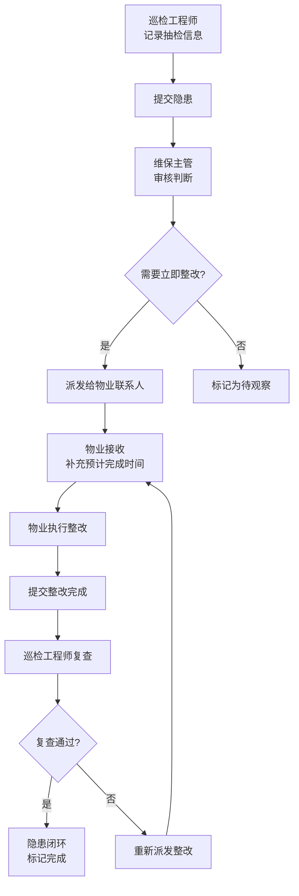

## 1. 产品概述

消防维保设施抽检与隐患派发系统，解决传统消防维保仅停留在拍照记录的问题，实现从问题发现、派发、整改到复查的全流程闭环管理。目标用户包括巡检工程师、维保主管和物业联系人，通过数字化管理提升消防设施维保效率和整改追踪能力。

## 2. 核心功能

### 2.1 用户角色

| 角色 | 注册方式 | 核心权限 |
|------|----------|----------|
| 巡检工程师 | 系统分配 | 记录抽检信息（设施、位置、风险等级、照片）、提交隐患、执行复查 |
| 维保主管 | 系统分配 | 审核隐患、判断是否立即整改、派发隐患给物业、查看整改进度 |
| 物业联系人 | 系统分配 | 接收隐患通知、补充预计完成时间、提交整改完成、查看历史记录 |

### 2.2 功能模块

1. **抽检列表**：展示所有抽检记录，支持按设施类型、风险等级、状态筛选
2. **隐患详情**：展示隐患完整信息、照片、整改历史、派发记录
3. **派发记录**：展示所有隐患派发记录，支持按派发时间、接收人筛选
4. **整改状态**：实时展示隐患整改进度、预计完成时间、实际完成时间
5. **复查入口**：对已完成整改的隐患进行复查，确认整改效果

### 2.3 页面详情

| 页面名称 | 模块名称 | 功能描述 |
|---------|----------|---------|
| 抽检列表 | 筛选区域 | 按设施类型、风险等级、状态、时间范围筛选 |
| 抽检列表 | 列表区域 | 展示抽检记录卡片，包含设施名称、位置、风险等级、状态标签 |
| 抽检列表 | 新增抽检 | 弹窗表单：设施类型、位置、风险等级、问题描述、照片上传占位 |
| 隐患详情 | 基本信息 | 设施名称、位置、风险等级、问题描述、发现时间、发现人 |
| 隐患详情 | 照片展示 | 缩略图网格，点击放大查看 |
| 隐患详情 | 派发记录 | 派发时间、派发人、接收人、派发备注 |
| 隐患详情 | 整改追踪 | 预计完成时间、实际完成时间、整改说明、状态流转时间线 |
| 隐患详情 | 操作区域 | 根据角色显示：审核派发、补充预计时间、提交整改、执行复查 |
| 派发记录 | 列表区域 | 展示所有派发记录，支持搜索和筛选 |
| 整改状态 | 统计卡片 | 待整改、整改中、待复查、已完成数量统计 |
| 整改状态 | 状态时间线 | 每个隐患的完整状态流转时间轴 |
| 复查入口 | 待复查列表 | 展示已完成整改等待复查的隐患 |
| 复查入口 | 复查表单 | 复查结果、复查备注、复查照片上传 |

## 3. 核心流程

### 3.1 隐患处理全流程

巡检工程师发现问题 → 记录设施、位置、风险等级、照片 → 提交抽检记录 → 维保主管审核 → 判断是否需要立即整改 → 派发给物业联系人 → 物业接收并补充预计完成时间 → 物业整改完成后提交 → 巡检工程师复查 → 复查通过则闭环，不通过则重新派发

## 4. 用户界面设计

### 4.1 设计风格
- **主色调**：消防红 (#DC2626) 作为主色，代表警示和专业；深灰 (#1F2937) 作为背景，白色 (#F9FAFB) 作为内容区
- **辅助色**：橙色 (#F59E0B) 表示中风险，绿色 (#10B981) 表示安全/完成，黄色 (#FBBF24) 表示待处理
- **按钮风格**：圆角8px，主色按钮带有细微阴影，hover状态有轻微上浮效果
- **字体**：标题使用"Noto Sans SC" Bold，正文使用"Noto Sans SC" Regular
- **布局风格**：左侧导航栏 + 顶部状态栏 + 右侧内容区，卡片式布局，信息分组清晰
- **图标**：使用线性图标，保持简洁专业的视觉风格

### 4.2 页面设计概览

| 页面名称 | 模块名称 | UI元素 |
|---------|----------|--------|
| 抽检列表 | 筛选区域 | 下拉选择器、日期范围、搜索框、重置按钮 |
| 抽检列表 | 列表区域 | 卡片网格布局，风险等级颜色标签，状态徽标，照片缩略图 |
| 隐患详情 | 基本信息 | 图标+文字对其布局，风险等级醒目展示 |
| 隐患详情 | 时间线 | 垂直时间线，状态节点用不同颜色标记 |
| 整改状态 | 统计卡片 | 渐变背景卡片，数字动画效果 |
| 整改状态 | 进度条 | 彩色分段进度条，展示整体整改率 |

### 4.3 响应式
- 桌面端优先设计（1280px+），三栏布局
- 平板端（768px-1279px）：两栏布局，导航可折叠
- 移动端（<768px）：单栏布局，底部导航，列表简化展示
- 触摸操作优化：按钮最小高度44px，手势滑动切换标签页

### 4.4 视觉动效
- 页面加载：元素淡入+上移动画，stagger延迟效果
- 状态变更：状态标签颜色切换时的平滑过渡动画
- 卡片hover：轻微上浮+阴影加深
- 时间线展开：垂直方向的smooth展开动画
- 数字统计：countUp数字滚动动画
