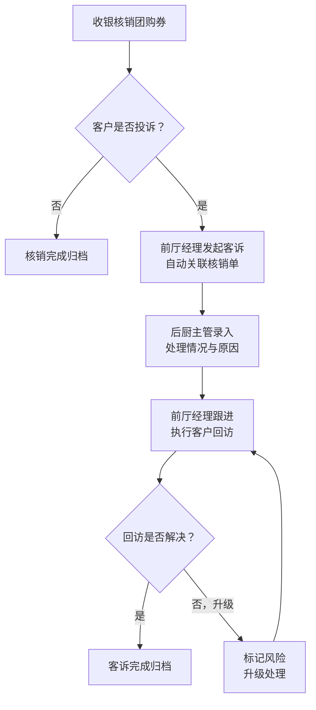

## 1. 产品概述

火锅店后厨团购核销与客诉回访管理系统，面向火锅店一线运营团队（前厅经理、后厨主管、收银），解决团购核销与客诉回访之间责任不清、依赖旧台账和沟通截图兜底的问题，通过系统化流程串联核销到回访的主链路，实现状态可追溯、责任明确、批量高效处理。

- 核心问题：团购核销完成后客诉回访脱节，处理人需临时补说明，责任边界模糊
- 目标价值：打通核销→客诉→回访的自然流转，减少人工沟通成本，提升客诉处理效率

## 2. 核心功能

### 2.1 用户角色

| 角色 | 核心权限 | 典型使用场景 |
|------|----------|--------------|
| 收银 | 团购核销录入、核销记录查询、标记异常 | 日常团购券核销，发现核销异常时标记 |
| 后厨主管 | 核销订单查看、出品状态更新、客诉原因录入 | 跟进团购订单出品，处理客诉的后厨责任部分 |
| 前厅经理 | 全量视图、客诉回访、批量处理、状态流转、风险项管理 | 整体把控，处理客诉回访，批量跟进待办 |

### 2.2 功能模块

1. **角色工作台首页**：分角色展示待处理、风险项、最近变更，一屏掌握当日核心事项
2. **团购核销管理**：核销列表、核销详情、批量核销、异常核销标记
3. **客诉回访管理**：客诉列表、客诉详情、回访记录、回看历史、状态标签流转
4. **核销-客诉联动**：核销完成后自动触发客诉待分配/回访流程，状态自然衔接

### 2.3 页面详情

| 页面名称 | 模块名称 | 功能描述 |
|----------|----------|----------|
| 角色切换总览 | 角色导航栏 | 收银/后厨主管/前厅经理三个角色入口切换，高亮当前角色 |
| 角色工作台 | 顶部统计卡 | 待处理数、风险项数、今日核销数、待回访数，数字醒目 |
| 角色工作台 | 待处理列表 | 按优先级展示待办，支持批量勾选与批量操作 |
| 角色工作台 | 风险项专区 | 高亮展示超时未处理、客诉升级、异常核销等风险项 |
| 角色工作台 | 最近变更流 | 时间线展示最近操作记录，谁做了什么一目了然 |
| 团购核销列表 | 筛选搜索 | 按日期、核销状态、团购平台筛选，关键字搜索 |
| 团购核销列表 | 核销表格 | 核销单号、团购信息、桌号、金额、核销人、状态标签、操作列 |
| 团购核销详情 | 核销信息卡 | 团购券详情、核销时间、关联订单、桌号人数 |
| 团购核销详情 | 客诉联动区 | 显示关联客诉状态，无客诉时提供「发起客诉」入口 |
| 客诉回访列表 | 状态标签 | 待受理、处理中、待回访、已完成、已升级，彩色标签 |
| 客诉回访列表 | 批量操作 | 批量分配、批量标记回访、批量导出 |
| 客诉回访详情 | 客诉信息卡 | 客诉来源、关联核销单、投诉内容、责任方、严重程度 |
| 客诉回访详情 | 处理时间线 | 核销→受理→后厨处理→前厅跟进→回访完成的完整时间线 |
| 客诉回访详情 | 回访记录区 | 多次回访记录可回看，含回访方式、结果、客户反馈 |
| 客诉回访详情 | 状态操作区 | 根据当前状态提供下一状态流转按钮 |

## 3. 核心流程

### 3.1 团购核销到客诉回访主链路

收银核销团购券 → 系统自动记录核销信息 → 如客户投诉则前厅经理发起客诉 → 关联核销单与客诉 → 后厨主管录入处理情况 → 前厅经理跟进回访 → 回访完成归档

### 3.2 一线同事日常处理顺序

1. 打开工作台 → 优先查看风险项 → 处理待办列表 → 查看最近变更确认上下文
2. 收银：核销团购券 → 标记异常 → 关注关联客诉
3. 后厨主管：查看需处理客诉 → 录入处理结果 → 更新状态
4. 前厅经理：批量分配客诉 → 执行回访 → 完成归档/升级

## 4. 用户界面设计

### 4.1 设计风格

- **主色调**：暖橙红 (#D84315) 作为品牌主色，呼应火锅的热情氛围；搭配深灰 (#2C2C2C) 作为中性背景
- **辅助色**：成功绿 (#2E7D32)、警告橙 (#F57C00)、风险红 (#C62828)、信息蓝 (#1565C0)
- **按钮风格**：圆角 8px，主按钮实心带轻微投影，次按钮描边空心
- **字体**：标题用「思源黑体 Bold」，正文用「思源黑体 Regular」，数字等宽字体突出数据
- **布局风格**：顶部导航 + 左侧角色切换 + 右侧内容区的三栏结构，卡片式信息分组
- **视觉层级**：风险项用红底白字醒目条 + 左侧色条；待处理用橙黄边框高亮；已完成低饱和度灰
- **状态标签**：胶囊形圆角标签，不同状态对应不同配色，标签前带状态指示圆点

### 4.2 页面设计概览

| 页面名称 | 模块名称 | UI元素 |
|----------|----------|--------|
| 角色工作台 | 顶部统计卡 | 大数字展示、左侧色条、趋势箭头、悬停微动效 |
| 角色工作台 | 风险项专区 | 红橙渐变头部、警示图标、倒计时显示 |
| 角色工作台 | 待处理列表 | 优先级排序、批量勾选框、悬浮操作按钮 |
| 角色工作台 | 最近变更流 | 垂直时间线、头像气泡、操作描述 |
| 团购核销列表 | 筛选栏 | 下拉筛选、日期范围、搜索框、批量操作按钮 |
| 团购核销列表 | 数据表格 | 斑马纹行、状态彩色标签、行悬停高亮 |
| 客诉详情 | 处理时间线 | 垂直步骤条、已完成打勾、进行中脉冲动画 |
| 客诉详情 | 回访记录 | 折叠卡片、回访方式图标、客户满意度星级 |

### 4.3 响应式

- 桌面端优先设计，最小宽度适配 1280px
- 表格区域横向滚动，关键列固定
- 移动端折叠侧边角色导航为底部 Tab 栏

### 4.4 状态样例设计原则

- 首页展示：3-5 条待处理、1-2 条风险项、5-8 条最近变更
- 列表页：混合展示不同状态，避免全是满状态或全是空状态
- 详情页：包含已完成节点和进行中节点，体现流程感
