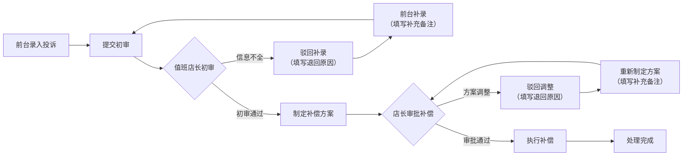

## 1. 产品概述
球馆运营投诉记录与补偿处理系统，解决投诉到补偿流程中的驳回、补录责任不清问题，实现场馆前台、教练、值班店长角色的待办分离，确保投诉记录、补偿处理、退回原因、补充备注完整链路可追溯。

## 2. 核心功能

### 2.1 用户角色
| 角色 | 登录方式 | 核心权限 |
|------|----------|----------|
| 场馆前台 | 角色切换 | 录入投诉记录，查看前台待办，补充客户信息 |
| 教练 | 角色切换 | 查看涉及自己的投诉，处理现场沟通，填写处理意见 |
| 值班店长 | 角色切换 | 审核投诉、审批补偿方案、驳回并注明原因、查看全部记录 |

### 2.2 功能模块
1. **待办工作台**：按角色展示待处理事项，按优先级和时效排序
2. **投诉记录列表**：全部投诉记录筛选、搜索、状态跟踪
3. **投诉详情页**：完整时间线、操作日志、补偿信息、历史备注一体化展示
4. **投诉处理流程**：提交→初审→补录（驳回时）→补偿审批→处理完成
5. **补偿处理回看**：已完结案件的完整流程回溯

### 2.3 页面详情
| 页面名称 | 模块名称 | 功能描述 |
|-----------|-------------|---------------------|
| 待办工作台 | 角色切换栏 | 一键切换前台/教练/店长视角，待办数量徽标提示 |
| 待办工作台 | 待办卡片列表 | 展示待办事项、紧急程度、剩余时效、当前处理人 |
| 投诉记录列表 | 筛选搜索区 | 按状态、时间、投诉类型、处理人筛选 |
| 投诉记录列表 | 数据表格 | 投诉单号、客户、类型、状态、创建时间、当前节点 |
| 投诉详情页 | 基本信息区 | 客户信息、投诉类型、来源渠道、优先级 |
| 投诉详情页 | 时间线区域 | 完整操作时间线，包含操作人、时间、动作、备注 |
| 投诉详情页 | 补偿处理区 | 补偿方案、金额/方式、审批状态、驳回原因 |
| 投诉详情页 | 操作区 | 根据角色和状态显示：提交、驳回、补录、审批、完成 |

## 3. 核心流程

投诉记录由前台录入后提交，值班店长初审，如信息不全则驳回给前台补录，补录完成后重新提交。初审通过后进入补偿处理环节，店长审批补偿方案，驳回时必须填写退回原因，补录时必须填写补充备注。所有操作记录在同一条记录的时间线中，可完整回看。

## 4. 用户界面设计

### 4.1 设计风格
- **主色调**：深海军蓝 (#0F2743) 作为主色，体现专业和信任感
- **辅助色**：琥珀橙 (#F59E0B) 用于强调待办和紧急状态，翠绿 (#10B981) 表示完成正常，玫瑰红 (#EF4444) 表示驳回和异常
- **中性色**：以 slate 色系为基础，层次分明的灰白背景
- **按钮风格**：轻微圆角（6px），悬停时有微妙的阴影和颜色过渡
- **字体**：标题使用 Lora，正文使用 Inter，营造专业稳重的企业级感觉
- **布局风格**：卡片式布局，左侧导航 + 顶部状态栏 + 主内容区
- **图标风格**：使用 lucide-react 线性图标，保持简洁统一

### 4.2 页面设计概览
| 页面名称 | 模块名称 | UI 元素 |
|-----------|-------------|-------------|
| 待办工作台 | 角色切换栏 | 标签式切换，选中状态有下划线强调，待办数字徽章 |
| 待办工作台 | 待办卡片 | 白色卡片，左侧状态色条，标题、描述、元信息（时间、优先级） |
| 投诉详情页 | 时间线 | 垂直时间线，节点图标区分操作类型，操作内容卡片 |
| 投诉详情页 | 操作区 | 底部固定操作栏，主按钮突出，次要按钮弱化 |

### 4.3 响应式
桌面端优先设计，主内容区最小宽度 1024px，在平板设备上自适应调整卡片布局，移动端折叠侧边栏。

### 4.4 动效设计
- 页面加载时内容区域渐入，列表项错落显示
- 状态变更时有轻微的背景色闪烁反馈
- 时间线节点在滚动到视口时渐入
- 模态框和抽屉使用平滑的滑入/淡入动画
