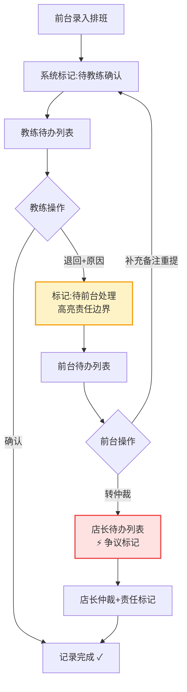

# 球馆运营-教练排班与课时确认系统 PRD

## 1. 产品概述

面向羽毛球/篮球等运动场馆的现场运营工作台系统，解决教练排班与课时确认流程中的责任不清、现场压力大、流程脱节等问题。通过将排班、确认、退回、备注集中在同一条记录中，强化三种角色（前台、教练、店长）的待办驱动与连续处理能力。

核心价值：将"说不清"的责任边界在系统中显性化标记，用异常提醒和压力感设计倒逼现场规范操作。

---

## 2. 核心功能

### 2.1 用户角色

| 角色 | 登录方式 | 核心权限 |
|------|----------|----------|
| 场馆前台 | 工号登录 | 录入排班、发起课时确认、查看待办、补充现场备注 |
| 教练 | 工号登录 | 查看个人排班、确认课时、退回并填写原因、查看历史 |
| 值班店长 | 工号登录 | 查看全部待办、仲裁争议、批量处理、查看责任标记记录 |

### 2.2 功能模块

1. **角色切换工作台**：顶部身份切换 + 待办数字强提醒 + 实时压力指标
2. **排班与课时记录列表**：统一记录卡片，包含排班信息、课时状态、退回原因、备注、责任标记
3. **教练排班处理**：单条/批量排班、调整时间、指派教练、标记特殊场景
4. **课时确认流程**：教练确认/退回、前台补录、店长仲裁，全链路可追溯
5. **批量操作与历史回看**：批量确认、批量退回、操作历史时间线、筛选查询

### 2.3 页面详情

| 页面名称 | 模块名称 | 功能描述 |
|----------|----------|----------|
| 运营工作台 | 顶部状态栏 | 角色切换、待办计数、实时告警条、压力值显示 |
| 运营工作台 | 待办列表区 | 按角色过滤的待办卡片，支持标签、紧急程度、责任标记高亮 |
| 运营工作台 | 记录详情面板 | 右侧滑出面板，展示排班、确认、退回、备注、操作历史全链路 |
| 运营工作台 | 批量操作栏 | 多选后批量确认/退回/标记责任，支持连续处理下一条 |
| 运营工作台 | 异常触发区 | 内置异常样例按钮，可直接触发超时、争议、数据不一致等场景 |

---

## 3. 核心流程

### 3.1 主流程描述

1. 前台录入排班记录（学员、时间、场地、教练）
2. 系统自动标记"待教练确认"，进入教练待办
3. 教练查看排班：
   - 正常：点击确认，记录完成
   - 异常：点击退回，选择退回原因（时间冲突/学员未到/场地问题/其他），填写备注，记录回到前台待办
4. 前台收到退回记录：
   - 补充现场说明、上传沟通截图描述、调整排班
   - 重新提交或转店长仲裁
5. 值班店长查看所有争议记录，进行仲裁并标记责任方

**关键设计：每条记录全程只有一条 ID，排班、确认、退回、备注、责任标记全部挂载在同一条记录上，避免信息割裂。**

### 3.2 核心流程图

---

## 4. 用户界面设计

### 4.1 设计风格

- **主色调**：深 slate 灰（#0f172a）为基底，营造专业运营工作台氛围
- **强调色**：
  - 紧急/告警：炽热红（#ef4444）
  - 待办/关注：琥珀橙（#f59e0b）
  - 正常/完成：翡翠绿（#10b981）
  - 责任标记：紫罗兰（#8b5cf6）
- **按钮风格**：直角小圆角（4px），实底填充，点击有明显按压反馈
- **字体**：
  - 标题/数字："JetBrains Mono" 等宽字体，强化数字感和专业感
  - 正文："Noto Sans SC"，清晰易读
- **布局风格**：三栏式工作台布局，左侧导航/筛选，中间列表，右侧详情；高密度信息呈现
- **视觉特征**：深色模式优先，荧光色告警条，数字跳动动画，红色闪烁提醒，营造现场压力感

### 4.2 页面设计概览

| 页面名称 | 模块名称 | UI 元素 |
|----------|----------|---------|
| 运营工作台 | 顶部状态栏 | 深色底、角色切换下拉、待办数字 badge（跳动动画）、告警滚动条、压力值进度条 |
| 运营工作台 | 待办卡片列表 | 卡片式列表、状态标签（彩色胶囊）、责任标记紫色角标、hover 显示快捷操作、超时记录红色边框脉动 |
| 运营工作台 | 详情侧面板 | 从右滑入、信息分区（排班信息/确认记录/退回原因/备注补充/操作历史）、时间线样式展示历史 |
| 运营工作台 | 底部操作栏 | 固定在底部、多选计数、批量操作按钮、"连续处理下一条"快捷按钮 |

### 4.3 响应式

- 桌面端优先（1440px 及以上），三栏完整布局
- 平板端：折叠左侧导航，列表+详情两栏
- 移动端：单列堆叠，底部 tab 切换角色

### 4.4 压力感与异常设计要点

1. **待办数字跳动**：超过 5 条待办时数字放大并轻微抖动
2. **超时记录脉动**：超过 30 分钟未处理的记录边框红色呼吸动画
3. **责任标记高亮**：存在责任不清风险的记录，左上角紫色三角形角标 + "责任待澄清"标签
4. **告警横幅**：顶部滚动显示最新异常，可点击直达
5. **异常触发按钮**：开发者区域提供"模拟超时"、"模拟争议"、"模拟数据不一致"按钮，一键触发异常流程验证
