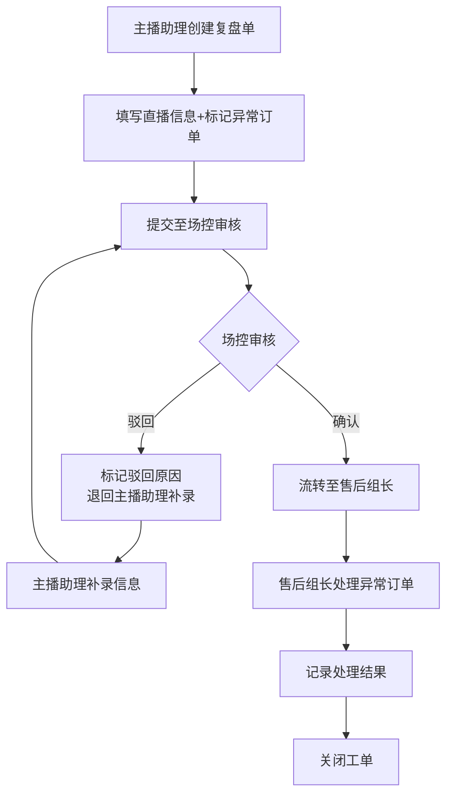

## 1. 产品概述

直播电商场次复盘与异常订单管理系统，用于管理直播场次复盘流程及异常订单的全链路追踪。通过主播助理、场控、售后组长的接力式协作，确保每场直播的问题能够被及时发现、记录并跟进处理。

- 核心目的：简化外部系统对接，强化业务责任追溯，实现场次复盘到异常订单的无缝流转
- 目标用户：主播助理、场控、售后组长等直播运营团队成员
- 产品价值：提升异常订单处理效率，减少人工沟通成本，建立完整的责任追溯体系

## 2. 核心功能

### 2.1 用户角色

| 角色 | 核心职责 | 核心权限 |
|------|----------|----------|
| 主播助理 | 发起场次复盘、记录直播现场情况、初步标记异常订单 | 创建复盘单、提交异常、补录信息 |
| 场控 | 审核复盘内容、核实异常订单真实性、流转至售后 | 驳回复盘、确认异常、流转工单 |
| 售后组长 | 处理异常订单、跟进退款补偿、记录最终处理结果 | 处理订单、记录日志、关闭工单 |

### 2.2 功能模块

1. **工作台首页**：今日待处理、超时提醒、刚退回记录统计卡片 + 快速入口
2. **场次复盘列表**：筛选、搜索、分页、状态标签、驳回/补录标记
3. **场次复盘详情**：直播基本信息、现场记录、异常订单列表、操作日志、流转按钮
4. **异常订单处理**：订单详情、驳回原因、补录要求、处理记录、状态流转
5. **操作日志**：全链路操作记录、操作人、时间、操作类型、备注

### 2.3 页面详情

| 页面名称 | 模块名称 | 功能描述 |
|---------|---------|---------|
| 工作台首页 | 数据概览卡片 | 今日待处理数、超时数、刚退回数的统计展示 |
| 工作台首页 | 快速处理列表 | 展示优先级最高的待处理记录，支持一键跳转处理 |
| 场次复盘列表 | 筛选工具栏 | 按状态、时间、主播、场次号等多维度筛选 |
| 场次复盘列表 | 数据表格 | 展示复盘单列表，突出显示驳回和补录标记 |
| 场次复盘详情 | 基础信息区 | 直播场次基本信息、主播、时间、GMV等 |
| 场次复盘详情 | 现场记录区 | 旧台账、现场记录、沟通截图的背景信息展示 |
| 场次复盘详情 | 异常订单区 | 关联的异常订单列表，支持快速查看和处理 |
| 场次复盘详情 | 操作日志区 | 全流程操作记录时间线 |
| 异常订单详情 | 订单信息区 | 订单号、商品、金额、用户信息 |
| 异常订单详情 | 处理流程区 | 驳回、补录、确认、处理完成的状态流转 |
| 操作日志页 | 日志筛选 | 按操作人、时间、操作类型筛选 |
| 操作日志页 | 日志列表 | 全链路操作记录列表 |

## 3. 核心流程

### 3.1 业务流转过程

主播助理创建场次复盘单，填写直播基本信息和现场记录，标记异常订单。提交后流转至场控审核，场控可驳回（需填写原因）或确认异常后流转至售后组长。售后组长处理异常订单，记录处理结果，最终关闭工单。整个过程中驳回和补录要求需在界面上显著标记，而非仅通过提示文案展示。

## 4. 用户界面设计

### 4.1 设计风格

- 主色调：深海军蓝（#0F2B4A）作为主色，搭配琥珀金（#D4A853）作为强调色
- 辅助色：警示红（#E5484D）用于驳回/超时，成功绿（#2E9E5C）用于已完成，警告橙（#F2994A）用于待处理/补录
- 中性色：从 #FAFBFC 到 #1A1A1A 的多层次灰色系
- 按钮风格：直角微圆角（4px），主按钮采用渐变填充，次要按钮采用描边样式
- 字体：标题使用 "Noto Serif SC" 体现专业感，正文使用 "Inter" 保证可读性
- 布局风格：卡片式布局，清晰的分区线，适度的阴影层次
- 图标风格：使用 lucide-react 线性图标，统一 20px 尺寸

### 4.2 页面设计概述

| 页面名称 | 模块名称 | UI 元素 |
|---------|---------|---------|
| 工作台首页 | 数据概览卡片 | 三色卡片并排，数字大号加粗，底部带趋势箭头，悬停微动效 |
| 工作台首页 | 快速处理列表 | 带状态标签的列表项，驳回/补录用醒目标记突出显示 |
| 场次复盘列表 | 筛选工具栏 | 搜索框 + 下拉筛选器组合，支持多条件叠加 |
| 场次复盘列表 | 数据表格 | 斑马纹行，驳回行加浅红背景，补录行加浅橙背景，状态徽章 |
| 场次复盘详情 | 左侧信息区 | 直播信息卡片，关联订单数量统计 |
| 场次复盘详情 | 右侧流程区 | 垂直时间线展示流转过程，当前节点高亮 |
| 异常订单详情 | 顶部状态栏 | 订单号 + 状态标签 + 快捷操作按钮 |
| 异常订单详情 | 处理表单 | 驳回/补录输入框带显著边框标记，必填项红星提示 |
| 操作日志页 | 时间线列表 | 左侧图标 + 时间，右侧操作内容和操作人 |

### 4.3 响应式

- 采用桌面端优先设计，主内容区最小宽度 1280px
- 侧边栏在平板宽度可折叠为图标模式
- 表格在小屏下支持横向滚动，优先展示关键字段

### 4.4 交互细节

- 驳回和补录标记采用带图标的徽章形式，始终显示在列表和详情的醒目位置
- 状态流转时添加平滑过渡动画，操作成功后显示反馈提示
- 表格行悬停时背景色变化，点击行可展开查看更多信息
- 操作按钮根据当前角色和状态动态显示可用操作
