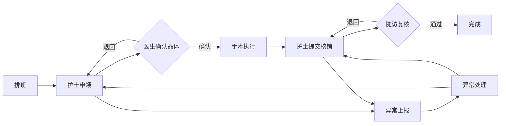

## 1. 产品概述

眼科手术中心晶体预留与耗材核销后台管理系统，解决手术流程中责任不清、状态不透明的问题。通过可视化的状态流转追踪，系统明确回答：谁在处理、卡在哪里、为什么没完成。

## 2. 核心功能

### 2.1 用户角色

| 角色 | 说明 | 核心权限 |
|------|------|----------|
| 手术护士 | 负责耗材申领与核销 | 提交核销、查看状态、异常上报 |
| 主刀医生 | 负责晶体预留确认 | 确认晶体、调整预留、退回申请 |
| 随访专员 | 负责术后随访与复核 | 复核核销、随访记录、异常处理 |
| 管理员 | 全局查看与配置 | 全流程监控、统计报表、异常处理 |

### 2.2 功能模块

1. **工作台首页**：待办事项、异常提醒、状态统计
2. **手术列表页**：手术排班、状态筛选、快速操作
3. **手术详情页**：侧栏详情、晶体预留处理、耗材核销回看、状态时间线
4. **异常中心**：异常列表、异常处理、退回操作

### 2.3 页面详情

| 页面名称 | 模块名称 | 功能描述 |
|---------|---------|----------|
| 工作台 | 待办卡片 | 展示各角色待处理任务数量与快速入口 |
| 工作台 | 异常提醒区 | 红色高亮显示待处理异常，可直接处理 |
| 工作台 | 状态统计 | 各状态手术数量统计与趋势 |
| 手术列表 | 筛选搜索 | 按状态、角色、日期筛选手术 |
| 手术列表 | 状态标签 | 彩色标签显示当前状态与处理人 |
| 手术详情 | 侧栏详情 | 患者信息、手术信息、时间线 |
| 手术详情 | 晶体预留模块 | 晶体信息、预留状态、医生确认/退回操作 |
| 手术详情 | 耗材核销模块 | 耗材清单、核销状态、核销历史回看 |
| 异常中心 | 异常列表 | 所有异常工单，支持按类型筛选 |
| 异常中心 | 异常处理 | 直接触发提醒、退回操作、添加备注 |

## 3. 核心流程

### 3.1 正常流程
手术排班 → 护士申领耗材 → 医生确认晶体预留 → 手术执行 → 护士提交核销 → 随访专员复核 → 完成

### 3.2 异常流程
- 晶体不符：医生退回预留 → 护士重新申请 → 医生再次确认
- 耗材缺失：护士上报异常 → 提醒管理员 → 补充耗材后继续
- 核销异议：随访专员退回核销 → 护士修正 → 重新提交复核

## 4. 用户界面设计

### 4.1 设计风格
- **主色调**：深蓝 #165DFF（专业医疗感）
- **辅助色**：警示红 #F53F3F、成功绿 #00B42A、警告橙 #FF7D00
- **按钮风格**：圆角 4px，简约扁平，状态色区分明显
- **字体**：中文使用 PingFang SC，数字使用 Roboto Mono，清晰易读
- **布局风格**：左侧导航 + 主内容区 + 右侧详情抽屉，三栏式后台布局
- **图标风格**：线性图标，简洁专业

### 4.2 页面设计概览

| 页面名称 | 模块名称 | UI 元素 |
|---------|---------|---------|
| 工作台 | 待办卡片 | 渐变背景、数字强调、悬停动效 |
| 手术列表 | 状态标签 | 彩色胶囊标签、处理人头像微标 |
| 手术详情 | 时间线 | 垂直时间线、节点状态色、责任人标识 |
| 异常中心 | 异常卡片 | 红色边框警示、优先级标记、快速操作按钮 |

### 4.3 响应式
- 桌面端（1440px+）：三栏完整布局
- 平板端（1024px-1440px）：两栏布局，详情抽屉可收起
- 移动端（<1024px）：单栏流式布局

### 4.4 动效设计
- 状态变更：节点高亮闪烁动画
- 异常提醒：红色脉冲呼吸效果
- 抽屉展开：平滑滑入动画
- 按钮点击：微缩反馈效果
