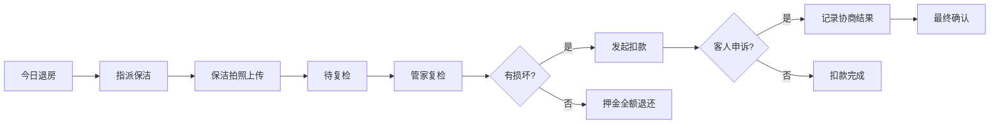

## 1. 产品概述

短租公寓运营管理后台，解决验房和押金争议处理流程混乱的问题。目标用户为管家、运营人员，核心价值是将退房照片、保洁问题、维修估价、客人异议集中展示，实现一站式处理。

## 2. 核心功能

### 2.1 用户角色

| 角色 | 注册方式 | 核心权限 |
|------|----------|----------|
| 管家 | 系统账号 | 房源管理、保洁指派、复检提交、扣款处理、协商记录 |

### 2.2 功能模块

1. **房源列表页**：状态筛选卡片（今日退房、待保洁、待复检、押金待确认）、房源表格列表
2. **房源详情页**：退房照片、保洁问题记录、维修估价、客人异议、操作记录时间线

### 2.3 页面详情

| 页面名称 | 模块名称 | 功能描述 |
|---------|----------|----------|
| 房源列表页 | 状态统计卡片 | 显示各状态房源数量，点击可筛选 |
| 房源列表页 | 房源表格 | 显示房号、客人信息、入住时间、状态标签、操作按钮 |
| 房源详情页 | 退房照片区 | 网格展示保洁上传照片，支持放大查看 |
| 房源详情页 | 保洁问题区 | 问题描述、损坏程度、预估费用 |
| 房源详情页 | 客人异议区 | 异议内容、申诉时间、处理状态 |
| 房源详情页 | 操作栏 | 指派保洁、提交复检、发起扣款、撤回扣款、记录协商 |

## 3. 核心流程

## 4. 用户界面设计

### 4.1 设计风格
- **主色调**：深海军蓝 (#1e3a5f) 作为品牌色，体现专业稳重
- **辅助色**：状态色 - 待处理(#f59e0b)、进行中(#3b82f6)、待确认(#ef4444)、完成(#10b981)
- **按钮风格**：直角或微圆角 (2px)，紧凑高度，体现运营效率感
- **字体**：使用现代无衬线字体，标题 14-16px，正文 12-13px，信息密度高
- **布局风格**：顶部导航 + 左侧筛选 + 右侧内容区，表格为主，卡片为辅
- **图标风格**：线性简约图标，功能性优先

### 4.2 页面设计概述

| 页面名称 | 模块名称 | UI元素 |
|---------|----------|--------|
| 房源列表页 | 状态统计卡片 | 紧凑卡片布局、数字高亮、状态标签、悬停效果 |
| 房源列表页 | 房源表格 | 斑马纹、状态标签色、固定操作列、行悬停高亮 |
| 房源详情页 | 照片网格 | 固定尺寸缩略图、点击放大、照片标注 |
| 房源详情页 | 问题列表 | 问题严重度标识、费用金额高亮、时间线布局 |
| 房源详情页 | 操作栏 | 分组按钮、危险操作二次确认、操作状态反馈 |

### 4.3 响应式
- Desktop-first 设计，优化 1440px 及以上分辨率
- 表格支持横向滚动，适应不同屏幕宽度
- 操作按钮在小屏幕下折叠为更多菜单

### 4.4 非功能性需求
- 页面加载时间 < 1s
- 操作响应时间 < 300ms
- 支持键盘快捷键（如 ESC 关闭弹窗）
