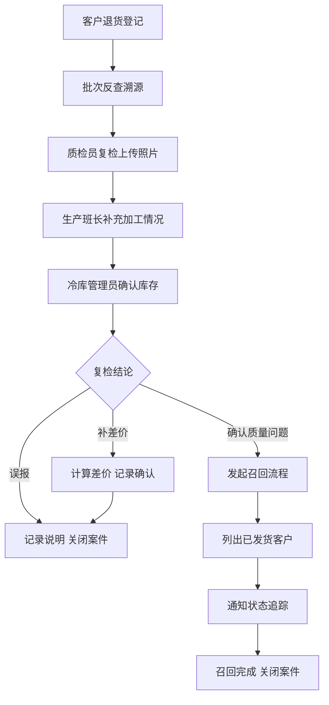

## 1. 产品概述

肉类分割厂退货复检与召回追踪系统，专注于客户退货后的质量反查与召回管理，解决传统退货仅登记不溯源的问题。当客户反馈异味、规格不符等问题时，系统可快速追溯原料批次、分割班组和冷库记录，实现全链条质量追踪。

- 核心价值：建立退货-复检-溯源-召回的闭环质量管理流程
- 目标用户：质检员、生产班长、冷库管理员、质量管理人员

## 2. 核心功能

### 2.1 用户角色

| 角色 | 登录方式 | 核心权限 |
|------|----------|----------|
| 质检员 | 账号登录 | 退货登记、复检结论、上传照片、查看批次追溯 |
| 生产班长 | 账号登录 | 查看退货记录、补充加工情况说明 |
| 冷库管理员 | 账号登录 | 确认库存余量、查看冷库记录 |
| 质量主管 | 账号登录 | 发起召回、查看召回进度、关闭案件 |

### 2.2 功能模块

1. **退货登记页**：录入退货信息、客户反馈、产品信息
2. **批次反查页**：根据产品批号追溯原料批次、分割班组、冷库记录
3. **复检处理页**：上传复检照片、填写质检结论、相关人员补充信息
4. **召回管理页**：召回任务列表、已发货客户清单、通知状态追踪
5. **案件详情页**：单条退货案件全流程视图，从登记到关闭

### 2.3 页面详情

| 页面名称 | 模块名称 | 功能描述 |
|----------|----------|----------|
| 退货登记页 | 退货信息表单 | 客户名称、产品名称、批号、退货数量、退货原因（异味/规格/其他） |
| 退货登记页 | 客户反馈区 | 客户描述文本、上传客户提供的照片 |
| 批次反查页 | 溯源信息面板 | 原料批次信息、供应商信息、进厂检验记录 |
| 批次反查页 | 生产追溯面板 | 分割班组、生产日期、生产班长、加工记录 |
| 批次反查页 | 冷库记录面板 | 入库时间、库位、出库记录、当前库存余量 |
| 复检处理页 | 复检照片上传 | 多张照片占位、照片说明 |
| 复检处理页 | 质检结论区 | 复检结论（误报/确认问题/补差价）、质检员签字 |
| 复检处理页 | 生产补充区 | 生产班长填写当时加工情况说明 |
| 复检处理页 | 库存确认区 | 冷库管理员确认同批次剩余库存 |
| 召回管理页 | 召回任务列表 | 召回状态（待通知/已通知/已完成）、涉及客户数 |
| 召回管理页 | 客户清单 | 已发货客户列表、通知状态、召回数量确认 |
| 案件详情页 | 时间线视图 | 完整流程时间轴：登记→复检→处理→关闭 |

## 3. 核心流程

退货处理核心流程：
1. 客户反馈问题，质检员登记退货信息
2. 系统根据产品批号自动反查原料、生产、冷库全链路信息
3. 质检员进行复检并上传照片，给出初步结论
4. 生产班长补充当时加工情况，冷库管理员确认库存
5. 根据复检结论分支处理：
   - 误报：记录后关闭案件
   - 确认质量问题：发起召回，列出已发货客户并追踪通知状态
   - 规格问题补差价：计算差价，记录后关闭
6. 质量主管最终确认并关闭案件

## 4. 用户界面设计

### 4.1 设计风格

- **主色调**：深工业蓝 #1E3A5F，体现食品工业的专业严谨
- **辅助色**：警示红 #E63946（召回/异常）、成功绿 #2A9D8F（正常/完成）、提醒橙 #F4A261（待处理）
- **中性色**：深灰 #2B2D42、中灰 #8D99AE、浅灰 #EDF2F4
- **按钮风格**：方形微圆角（4px）、工业风、点击有下沉反馈
- **字体**：标题使用 Noto Sans SC Bold，正文使用 Noto Sans SC Regular，数据表格使用等宽字体增强可读性
- **布局风格**：左侧导航+主内容区，卡片式模块分区，数据表格为主
- **图标风格**：线性图标，统一2px描边，工业简约风格

### 4.2 页面设计概述

| 页面名称 | 模块名称 | UI 元素 |
|----------|----------|---------|
| 退货登记页 | 表单区 | 双列表单布局，左侧产品信息，右侧客户反馈，底部操作按钮组 |
| 批次反查页 | 溯源面板 | 三栏卡片布局：原料/生产/冷库，每栏独立标题和数据列表 |
| 复检处理页 | 多角色区 | 垂直分区：复检区（蓝边）、生产补充区（绿边）、库存区（橙边） |
| 召回管理页 | 任务列表 | 表格+状态标签，点击展开客户清单抽屉 |
| 案件详情页 | 时间线 | 左侧垂直时间轴，右侧对应详情卡片，状态色块标记 |

### 4.3 响应式

- 桌面端优先设计（1440px+）
- 平板端：导航收窄为图标，表格支持横向滚动
- 移动端：简化表格为卡片列表，核心信息优先展示

### 4.4 动效设计

- 页面加载：模块渐入+轻微上移动画，stagger 间隔 80ms
- 状态变更：状态标签颜色渐变过渡 300ms
- 照片上传：占位框虚线呼吸动画，上传后缩略图淡入
- 时间线：滚动触发节点点亮效果
