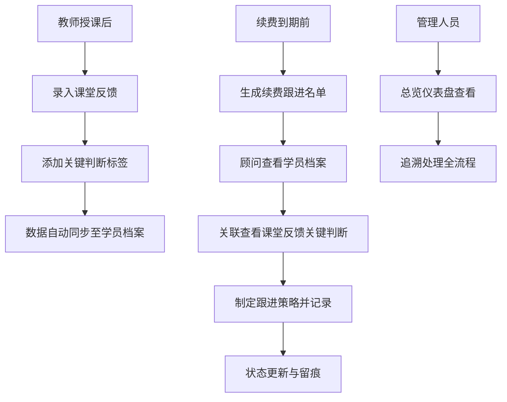

## 1. 产品概述

舞蹈培训机构内部管理系统，解决课堂反馈与续费跟进过程中数据分散、口径不一、留痕不足的问题。通过统一的数据中台，将课堂反馈、续费跟进、异常说明串联起来，实现一线处理与管理回看基于同一份数据。

- 目标用户：前台教务、课程顾问、教学主管、校区校长
- 核心价值：统一口径、全程留痕、数据追溯、高效协同

## 2. 核心功能

### 2.1 用户角色

| 角色 | 核心权限 |
|------|----------|
| 前台教务 | 录入课堂反馈、处理续费跟进、记录异常说明 |
| 课程顾问 | 查看学员档案、跟进续费、批量操作 |
| 教学主管 | 查看全量数据、风险监控、报表分析 |
| 校区校长 | 全局数据总览、关键指标监控 |

### 2.2 功能模块

1. **总览仪表盘**：待处理事项、风险预警、最近变更动态、关键指标
2. **课堂反馈**：反馈列表、反馈详情、新增/处理反馈、关键判断标签
3. **续费跟进**：续费名单、跟进记录、状态流转、批量动作
4. **学员档案**：学员基本信息、历史反馈、续费记录、完整追溯链

### 2.3 页面详情

| 页面名称 | 模块名称 | 功能描述 |
|----------|----------|----------|
| 总览仪表盘 | 待办卡片 | 展示待处理反馈、待跟进续费、待处理异常，支持快捷跳转 |
| 总览仪表盘 | 风险预警 | 高亮高流失风险学员、超期未跟进、考级漏报名等风险项 |
| 总览仪表盘 | 最近变更 | 时间线展示最近的反馈更新、跟进记录、状态变更 |
| 总览仪表盘 | 关键指标 | 续费率、反馈及时率、风险学员数等核心数据 |
| 课堂反馈 | 反馈列表 | 按状态/班级/时间筛选，支持搜索，状态标签一目了然 |
| 课堂反馈 | 反馈详情 | 完整反馈内容、学员信息、历史反馈、处理记录留痕 |
| 课堂反馈 | 新增反馈 | 选择学员、填写表现、打关键标签、提交处理 |
| 续费跟进 | 续费名单 | 按到期时间/班级/状态筛选，支持多选批量操作 |
| 续费跟进 | 跟进详情 | 学员信息、课堂反馈关键判断、历史续费、跟进记录 |
| 续费跟进 | 批量动作 | 批量标记已联系、批量设置跟进时间、批量导出 |
| 学员档案 | 基本信息 | 学员资料、所在班级、服装尺码、考级进度 |
| 学员档案 | 反馈历史 | 时间线展示所有课堂反馈，支持点击查看详情 |
| 学员档案 | 续费记录 | 历史续费记录、当前课时剩余、续费提醒设置 |

## 3. 核心流程

一线同事处理续费跟进时，系统自动关联展示该学员的课堂反馈关键判断（如"近期注意力下降"、"基本功进步明显"、"家长对考级有疑虑"等），帮助顾问更有针对性地沟通。

## 4. 用户界面设计

### 4.1 设计风格

- **主色调**：深酒红 #8B2635 + 暖金 #D4A574，体现舞蹈艺术的优雅与专业
- **辅助色**：暖米色 #F5F0E8 背景，深灰 #2C2C2C 文字
- **状态标签**：待处理-琥珀橙、进行中-天空蓝、已完成-森绿、风险-酒红
- **设计风格**：编辑室杂志风，精致排版，大量留白，数据卡片层次分明
- **字体**：标题用衬线体展现优雅气质，正文用无衬线体保证可读性
- **图标**：线性风格，纤细优雅
- **动效**：微妙的悬停过渡、卡片入场动画、状态变更微光提示

### 4.2 页面设计概览

| 页面名称 | 模块名称 | UI 元素 |
|----------|----------|---------|
| 总览仪表盘 | 待办卡片 | 三列卡片布局，数字大号衬线字体，底部快捷操作按钮 |
| 总览仪表盘 | 风险预警 | 左侧红色竖条强调，风险等级徽章，悬停展开详情 |
| 总览仪表盘 | 最近变更 | 时间线布局，头像+操作摘要，点击展开完整记录 |
| 课堂反馈 | 反馈列表 | 表格+卡片混合布局，状态标签彩色药丸，关键标签微标签 |
| 课堂反馈 | 反馈详情 | 左右分栏，左侧学员信息卡，右侧反馈内容与时间线 |
| 续费跟进 | 续费名单 | 可多选列表，顶部批量操作栏，行内快速状态切换 |
| 续费跟进 | 跟进详情 | 顶部学员概览，中部课堂反馈关键判断高亮卡，底部跟进记录 |
| 学员档案 | 档案页 | 顶部头像与基本信息，下方 Tab 切换反馈/续费/考级/服装 |

### 4.3 响应式

桌面端优先设计，主内容区最大宽度 1440px。平板端自适应调整列数，移动端单列堆叠。核心操作（列表、详情）在各尺寸下均保证可用。

### 4.4 数据状态设计

样例数据采用混合状态，打开页面即可看到：
- **待处理**：3-5 条待处理课堂反馈，5-8 条待跟进续费
- **风险项**：2-3 个高流失风险学员，1 个考级漏报名提醒
- **最近变更**：最近 24 小时内的 5-8 条操作记录
- **已完成**：部分已处理项作为对照，避免全是空状态或全满状态
