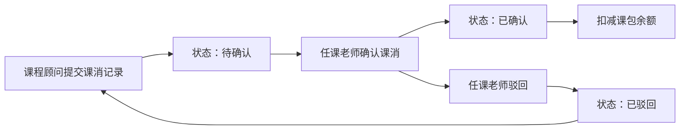
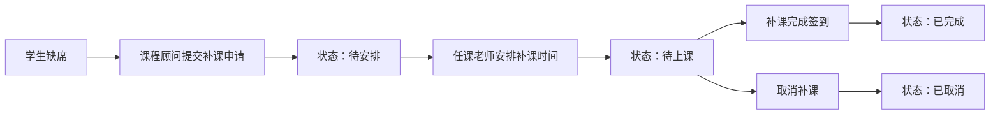

## 1. 产品概述

艺术培训机构课包消耗与补课安排管理系统，解决课包消耗与补课安排之间责任不清、依赖口头解释的问题。

- 核心问题：旧台账、现场记录、沟通截图分散，课包消耗与补课安排责任边界模糊
- 目标用户：课程顾问、任课老师、校区主管
- 产品价值：通过清晰的状态流转和角色差异化入口，建立可追溯的责任体系

## 2. 核心功能

### 2.1 用户角色

| 角色 | 登录方式 | 核心权限 |
|------|----------|----------|
| 课程顾问 | 简化登录（选择角色+姓名） | 课包消耗记录、查看学生补课状态、提交补课申请 |
| 任课老师 | 简化登录（选择角色+姓名） | 确认课消、安排补课、查看补课回看、更新课程状态 |
| 校区主管 | 简化登录（选择角色+姓名） | 全量数据查看、状态流转审核、风险预警处理、数据统计 |

### 2.2 功能模块

1. **登录页**：角色选择、简化身份验证
2. **首页（仪表盘）**：待办事项、风险项预警、最近变更记录
3. **课包消耗处理**：课消记录、课消确认、课包余额查询
4. **补课安排管理**：补课申请、补课安排、补课回看、状态跟踪
5. **学生档案**：学生课包信息、消耗历史、补课记录汇总

### 2.3 页面详情

| 页面名称 | 模块名称 | 功能描述 |
|----------|----------|----------|
| 登录页 | 角色选择 | 三种角色切换，输入姓名快速登录 |
| 首页 | 待办事项 | 按角色展示待处理事项，点击直达处理入口 |
| 首页 | 风险项 | 超时未处理补课、课包不足预警、异常课消标记 |
| 首页 | 最近变更 | 最近7天的状态变更记录，含操作人和时间 |
| 课包消耗页 | 课消记录 | 新增课消记录，关联学生、课程、课时数 |
| 课包消耗页 | 课消确认 | 任课老师确认课消生效，状态流转 |
| 课包消耗页 | 课包查询 | 按学生查看课包余额、消耗历史 |
| 补课安排页 | 补课申请 | 课程顾问提交补课申请，关联缺席课程 |
| 补课安排页 | 补课安排 | 任课老师安排补课时间，确认补课教室 |
| 补课安排页 | 补课回看 | 查看历史补课记录，含补课内容、签到状态 |
| 补课安排页 | 状态跟踪 | 清晰的状态流转：待申请→待安排→待上课→已完成/已取消 |

## 3. 核心流程

### 3.1 课包消耗流程

### 3.2 补课安排流程

## 4. 用户界面设计

### 4.1 设计风格

- **主色调**：深青色 #0F766E（专业、可信赖），辅助色：琥珀色 #F59E0B（提醒、预警）
- **按钮风格**：圆角 8px，微阴影，悬停时有轻微上浮效果
- **字体**：Noto Sans SC（中文显示友好），标题字重 600，正文字重 400
- **布局风格**：左侧导航 + 右侧内容区，卡片式布局，信息分区明确
- **图标风格**：线性图标，统一 24px 尺寸，状态用颜色区分（绿色正常、黄色预警、红色异常）

### 4.2 页面设计概览

| 页面名称 | 模块名称 | UI 元素 |
|----------|----------|---------|
| 登录页 | 角色卡片 | 三张角色卡片并列，选中有边框高亮，底部输入姓名 |
| 首页 | 数据概览 | 顶部统计卡片（课包数、待处理补课数、本月课消数），下方三列布局 |
| 首页 | 待办列表 | 列表样式，每条待办带状态标签和快捷操作按钮 |
| 首页 | 风险预警 | 卡片带橙色/红色边框，按严重程度排序 |
| 课包消耗页 | 记录列表 | 表格样式，支持筛选、搜索，每行带操作按钮 |
| 补课安排页 | 时间线 | 状态流转时间线，清晰展示每个节点的处理人和时间 |
| 补课安排页 | 日程视图 | 日历形式展示补课安排，支持快速查看 |

### 4.3 响应式

- 桌面端优先设计（1280px 及以上）
- 平板端：导航折叠，内容区自适应
- 移动端：单列布局，底部导航，简化操作

### 4.4 交互细节

- 状态标签使用不同背景色，悬停显示状态说明
- 列表行悬停高亮，点击展开详情
- 表单提交有加载状态，成功/失败有消息提示
- 角色切换时，导航菜单和功能入口动态更新
