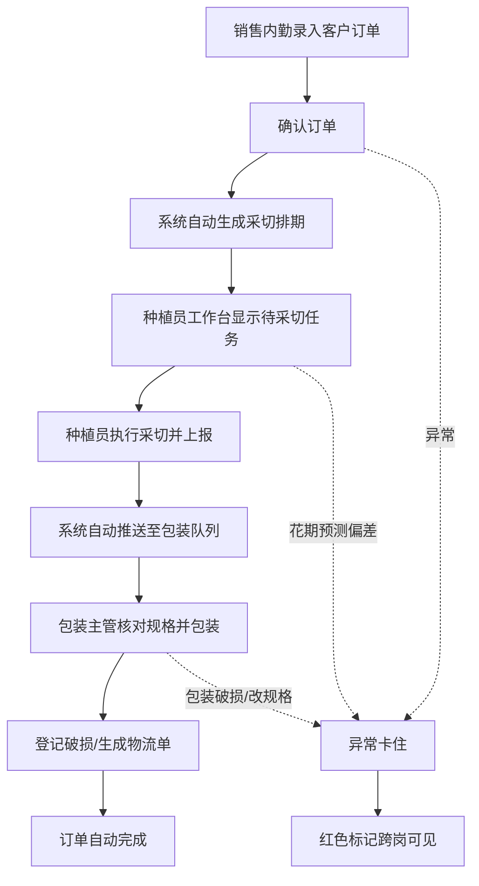

## 1. 产品概述

花卉基地业务工作台系统，聚焦客户订单→采切排期→包装物流的全链路协同，消除微信群口头沟通、信息碎片化的痛点。通过角色化工作台设计，让种植员、销售内勤、包装主管在各自入口连续处理业务，订单状态自动流转衔接，无需额外发消息提醒。

- 目标用户：花卉基地种植员、销售内勤、包装主管三大岗位
- 核心价值：减少翻群翻记录、消除信息断层、业务状态自动衔接、卡住记录可视化暴露

## 2. 核心功能

### 2.1 用户角色

| 角色 | 注册方式 | 核心权限 |
|------|----------|----------|
| 销售内勤 | 系统分配 | 客户订单录入/修改/确认、订单异常处理、历史记录查询、全局数据看板 |
| 种植员 | 系统分配 | 采切排期看板、棚区花卉状态上报、采切任务执行、花期异常标记 |
| 包装主管 | 系统分配 | 采切待包装任务承接、包装规格调整、破损上报、物流单生成、历史追溯 |

### 2.2 功能模块

1. **角色选择入口页**：三角色卡片切换，高亮当前角色，支持岗位间快速切换
2. **销售内勤工作台**：客户订单处理中心（待确认/进行中/已完成/卡住异常）、订单详情、改规格操作
3. **种植员工作台**：采切排期时间轴、棚区巡检状态、花期预测偏差、采切任务执行
4. **包装主管工作台**：待包装队列、包装规格核对、破损登记、物流单输出
5. **历史记录与回看**：全流程日志、卡住记录归档、操作时间线、状态变更溯源

### 2.3 页面详情

| 页面名称 | 模块名称 | 功能描述 |
|----------|----------|----------|
| 角色选择入口 | 角色卡片区 | 三个角色卡片独立入口，显示当前在岗人数与待办计数，点击进入对应工作台 |
| 角色选择入口 | 全局卡住提醒横幅 | 顶部红色区域展示当前系统中所有卡住的记录数量与摘要，跨角色可见 |
| 销售内勤工作台 | 订单处理流水 | 按时间倒序的订单列表，支持状态筛选（待确认/已确认/采切中/包装中/已完成/异常卡住） |
| 销售内勤工作台 | 订单详情抽屉 | 展示订单全流程时间线、客户信息、花卉规格、改规格历史、备注 |
| 销售内勤工作台 | 订单快捷操作 | 确认订单→自动触发采切排期、修改规格、标记异常、关闭订单 |
| 种植员工作台 | 采切排期时间轴 | 以日期为分组的采切任务列表，显示花卉品种、棚区、预计可采量、实际状态 |
| 种植员工作台 | 棚区状态看板 | 各棚区花期状态（待成熟/可采切/已采切/异常）、花期预测偏差标记 |
| 种植员工作台 | 采切执行操作 | 扫码或点击完成采切→自动推送至包装队列、上报采切量偏差 |
| 包装主管工作台 | 待包装队列 | 已采切待包装订单列表，显示订单号、花卉品种、数量、客户包装要求 |
| 包装主管工作台 | 包装规格核对 | 对照订单要求逐项核对，支持规格调整并同步回订单记录 |
| 包装主管工作台 | 破损与物流 | 登记包装破损、生成物流单号、确认发货→自动更新订单为已完成 |
| 历史记录页 | 全流程筛选器 | 按角色、时间、状态、关键词搜索历史记录 |
| 历史记录页 | 卡住记录专区 | 单独tab展示所有曾经卡住的记录，显示卡住原因、处理人、恢复时间 |
| 历史记录页 | 流程回看时间线 | 单笔订单的全流程操作时间线回放，每个节点显示操作人、时间、内容 |

## 3. 核心流程

### 3.1 主业务流程

销售内勤录入并确认客户订单 → 系统自动生成采切排期推送至种植员工作台 → 种植员按排期执行采切并上报 → 采切完成自动推送至包装主管待包装队列 → 包装主管核对规格、处理破损、生成物流单 → 订单自动标记为已完成。全流程各环节状态自动衔接，无需跨岗发消息提醒。

### 3.2 卡住记录处理流程

任意环节出现异常（花期不准、包装破损、客户改规格）→ 系统自动标记为卡住状态 → 顶部横幅与对应工作台红色高亮 → 相关人员处理并标记恢复 → 流程继续推进 → 历史记录保留卡住痕迹。

## 4. 用户界面设计

### 4.1 设计风格

- **主色调**：深绿（#2D5A27）代表种植/花卉基地，辅以暖金（#C89B3C）作为状态高亮色
- **卡住异常色**：信号红（#D64545），大面积使用于卡住横幅、标签、数字角标
- **已完成色**：墨绿（#4A7C59），配浅绿背景条
- **按钮风格**：微圆角（6px），实心按钮带轻微阴影，点击下陷微交互
- **字体**：系统中文无衬线 + Noto Sans SC，数据数字使用等宽字体增强可读性
- **布局风格**：顶部导航（角色名+卡住横幅）+ 左侧功能tab + 右侧工作台流水区域，高密度业务卡片布局，支持快速连续点击操作
- **图标风格**：线性icon，花卉/剪刀/箱子/卡车等业务语义图标，状态色区分

### 4.2 页面设计概览

| 页面名称 | 模块名称 | UI元素 |
|----------|----------|--------|
| 角色选择入口 | 角色卡片区 | 三列等宽卡片，每张卡片含角色图标+名称+待办数字徽章+在岗人数+进入按钮，选中态深绿描边 |
| 角色选择入口 | 卡住提醒横幅 | 固定顶部红色横幅，左侧警示三角图标，中间"X条业务卡住中"+展开按钮，右侧查看全部 |
| 销售内勤工作台 | 订单流水表 | 斑马纹表格，每行一个订单，状态标签右对齐，行内快捷操作按钮（确认/改规格/详情），异常行红底浅红描边 |
| 销售内勤工作台 | 订单详情抽屉 | 右侧滑出抽屉，头部订单号+客户名+状态大标签，中部时间线+花卉列表+改规格历史 |
| 种植员工作台 | 采切排期时间轴 | 垂直时间轴按天分节，每天卡片内多个棚区任务，可采切绿色脉冲点，偏差黄色圆点，异常红色圆点 |
| 种植员工作台 | 棚区状态看板 | 2xN栅格卡片，每卡片棚区号+花卉品种+成熟进度条+状态标签+采切按钮 |
| 包装主管工作台 | 待包装队列 | 左中右三栏：待包装/包装中/已发货，类看板拖拽视觉，每卡订单摘要+规格+客户要求+快捷操作 |
| 包装主管工作台 | 包装规格核对 | 表格式核对清单，每行规格项+订单值+实际值+勾选框，差异自动红色标红 |
| 历史记录页 | 筛选器 | 顶部一行搜索+日期范围+角色下拉+状态多选标签，搜索时卡片渐变淡入 |
| 历史记录页 | 卡住记录专区 | 红色表头tab，卡片列表显示卡住原因+卡住时长+处理人+恢复状态 |
| 历史记录页 | 流程时间线 | 垂直时间线每个节点：图标+操作人+时间戳+操作内容，卡住节点红色脉冲边框 |

### 4.3 响应式设计

- **Desktop优先**：默认1440px宽度布局，工作台表格与看板使用固定列宽保证密度
- **平板适配**：1024px时侧边tab改为顶部横向滚动tab，表格支持横向滚动
- **操作连续**：所有核心操作按钮固定在可视区域或行内，减少滚动；支持键盘快捷键（Enter确认、Esc关闭抽屉）

## 5. Mock数据要求

### 5.1 数据规模

- 客户订单：20条（10条正常关闭全流程、5条已采切包装中、3条采切中、2条卡住异常）
- 棚区：8个，每个棚区对应花卉品种+成熟状态
- 历史操作日志：每订单8~15条，覆盖各角色操作
- 卡住记录：至少3条，分别覆盖"花期预测不准"、"包装破损"、"客户临时改规格"三种场景

### 5.2 卡住记录示例

1. **订单DD20260608003**：花期预测不准，卡住在采切环节，已卡48小时，种植员标记"玫瑰A棚成熟度不足，需延后2天"
2. **订单DD20260607012**：包装破损，卡住在包装环节，已卡6小时，包装主管登记"3扎洋牡丹包装压损，需补采"
3. **订单DD20260609007**：客户临时改规格，卡住在销售确认，已卡12小时，销售内勤待确认"从20扎改为35扎，新增红色系"
