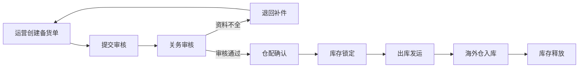
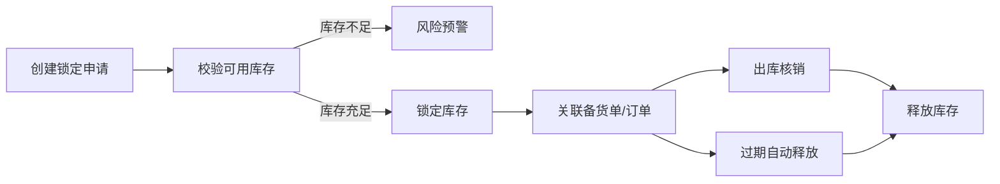

## 1. 产品概述

跨境电商海外仓备货与库存锁定系统是服务于运营、关务、仓配三类角色的内部业务管理系统。解决当前平台订单、报关资料、海外仓库存表分散管理导致的申报信息补件混乱、海外仓超卖、退件原因无法追溯复盘等核心痛点。

系统以海外仓备货单和库存锁定为两条主线，实现备注信息跨模块流转、角色分权操作、全链路历史追溯，提升跨境供应链协同效率。

## 2. 核心功能

### 2.1 用户角色

| 角色 | 登录方式 | 核心权限 |
|------|----------|----------|
| 运营专员 | 企业SSO | 创建备货单、查看库存锁定、处理退件复盘、导出报表 |
| 关务专员 | 企业SSO | 报关资料审核、申报信息补件、海关状态同步 |
| 仓配专员 | 企业SSO | 库存锁定操作、出入库确认、退件原因登记 |
| 系统管理员 | 企业SSO | 角色配置、权限管理、系统参数设置 |

### 2.2 功能模块

1. **工作台首页**：待办事项汇总、风险预警、最近变更动态
2. **海外仓备货管理**：备货单列表、备货单详情、备货处理动作
3. **库存锁定管理**：库存锁定列表、锁定详情、历史追溯回看
4. **报关资料中心**：报关单管理、补件提醒、申报状态跟踪
5. **退件复盘中心**：退件登记、原因分析、整改跟踪
6. **接口文档中心**：API文档、权限校验说明、对接指南

### 2.3 页面详情

| 页面名称 | 模块名称 | 功能描述 |
|---------|----------|----------|
| 工作台首页 | 待办卡片 | 展示待审核备货单、待补件报关单、待处理库存锁定数 |
| 工作台首页 | 风险预警 | 超卖风险SKU、库存不足预警、报关逾期提醒 |
| 工作台首页 | 最近变更 | 最近24小时关键操作动态流 |
| 备货单列表 | 筛选查询 | 按状态、仓库、时间范围、SKU筛选 |
| 备货单列表 | 批量操作 | 批量提交审核、批量导出 |
| 备货单详情 | 基本信息 | 备货单基础信息、关联订单、报关资料 |
| 备货单详情 | 处理动作 | 提交审核、关务审核、仓配确认、备注添加 |
| 备货单详情 | 操作日志 | 全链路操作历史记录 |
| 库存锁定列表 | 锁定状态 | 待锁定、已锁定、已释放、已过期 |
| 库存锁定详情 | 锁定信息 | 锁定数量、关联备货单、锁定原因、备注 |
| 库存锁定详情 | 历史回看 | 锁定全生命周期时间轴、状态变更记录 |
| 接口文档中心 | API列表 | 所有对外接口清单、参数说明、示例代码 |
| 接口文档中心 | 权限说明 | 接口权限矩阵、Token获取方式、校验规则 |

## 3. 核心流程

### 3.1 海外仓备货主流程

运营创建备货单 → 提交关务审核 → 关务审核报关资料 → 补件/通过 → 仓配确认备货 → 库存锁定 → 出库发运 → 海外仓入库 → 库存释放

### 3.2 库存锁定流程

创建锁定申请 → 校验可用库存 → 锁定库存 → 关联业务单据 → 出库/过期 → 释放库存

## 4. 用户界面设计

### 4.1 设计风格

- **主色调**：深蓝色 #1e3a8a（专业、稳重），辅助色：橙色 #f97316（预警、强调），成功绿 #10b981，危险红 #ef4444
- **按钮风格**：直角微圆角（2px），实心主按钮，描边次要按钮，悬停有轻微阴影
- **字体**：系统无衬线字体，标题加粗，正文常规，等宽字体用于编号和金额
- **布局风格**：左侧导航 + 顶部状态栏 + 主内容区卡片式布局，数据表格支持固定列和横向滚动
- **图标风格**：线性图标，统一24px尺寸，状态使用色点标识

### 4.2 页面设计概述

| 页面名称 | 模块名称 | UI元素 |
|---------|----------|--------|
| 工作台首页 | 待办卡片 | 四色卡片网格，数字放大展示，点击跳转对应列表 |
| 工作台首页 | 风险预警 | 带图标列表，红色高亮高风险项，hover显示详情 |
| 工作台首页 | 最近变更 | 时间轴布局，头像+操作+时间，可展开查看详情 |
| 备货单列表 | 数据表格 | 斑马纹，状态标签彩色，行悬停高亮，操作列固定右侧 |
| 备货单详情 | 信息分区 | 分栏布局，左侧基本信息，右侧状态进度，底部操作区 |
| 库存锁定详情 | 历史时间轴 | 垂直时间轴，状态节点用彩色圆点，可展开查看备注 |
| 接口文档中心 | 文档布局 | 左侧目录导航，右侧内容区，代码块深色背景 |

### 4.3 响应式

- 桌面端优先设计，最小支持1366px宽度
- 1200px以下自动收起左侧导航为图标模式
- 表格支持横向滚动，操作列固定
- 移动端简化视图，保留核心查询和审批功能

### 4.4 交互细节

- 页面切换有淡入过渡效果
- 按钮点击有缩放反馈
- 表格行悬停背景色变化
- 模态框从底部滑入
- 表单校验错误有抖动动画
