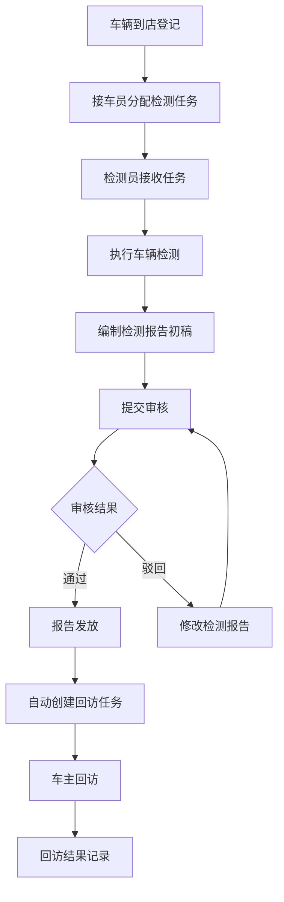
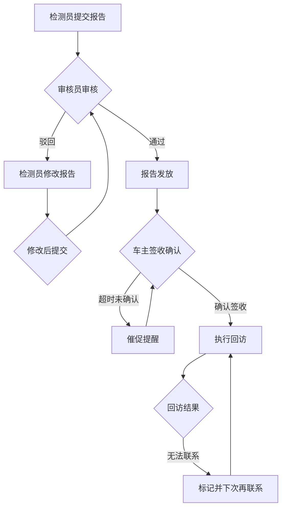

# 车辆年检站-报告发放与车主回访系统

## 1. 产品概述

针对车辆年检站报告发放与车主回访工作流程管理的数字化解决方案。通过分离接车员、检测员、审核员的工作入口，实现报告发放与车主回访的闭环衔接，消除传统台账管理中的责任不清、流程断点问题。

### 核心价值
- **责任明确**：三角色分入口操作，全程可追溯
- **流程闭环**：报告发放后自动触发回访任务，消除提醒依赖
- **状态可视**：多维度状态标签，实时掌握业务进度
- **数据联动**：车辆信息、检测记录、报告状态、回访记录一体化呈现

### 目标用户
- 接车员：负责车辆接收、基础信息登记
- 检测员：负责车辆检测、报告编制
- 审核员：负责报告审核、发放确认
- 站长/管理员：全局监控、统计报表

---

## 2. 核心功能

### 2.1 用户角色

| 角色 | 入口标识 | 核心权限 |
|------|---------|---------|
| 接车员 | 蓝色主题 | 车辆登记、基础信息录入、检测任务接收 |
| 检测员 | 橙色主题 | 检测任务执行、检测结果录入、报告初稿编制 |
| 审核员 | 绿色主题 | 报告审核、驳回/通过操作、报告发放确认 |
| 管理员 | 紫色主题 | 全局数据查看、统计报表、异常监控 |

### 2.2 功能模块

#### 2.2.1 角色首页仪表盘
- **角色切换器**：顶部导航支持角色快速切换
- **待办事项卡片**：显示各角色当前待处理任务数量
- **今日统计**：今日接车数、检测完成数、报告发放数、回访完成数
- **异常提醒**：拖延超时、补录待审、驳回记录等异常数据高亮提示
- **快捷操作**：一键进入待办任务列表

#### 2.2.2 接车员工作台
- **车辆登记页**
  - 车牌号输入（支持手动+拍照识别）
  - 车主信息：姓名、电话、证件号
  - 车辆信息：品牌、车型、VIN码、注册日期
  - 检测类型：初检、复检、变更
  - 预约时间、实际到店时间
  - 检测员分配（手动/自动）
  - 登记状态标签：待检测、检测中、已提交
  - 空状态引导：未登记车辆时显示引导卡片

- **任务列表**
  - 已分配给我的检测任务
  - 任务状态筛选：待处理、处理中、已完成
  - 车辆信息快速预览
  - 逾期高亮提示

#### 2.2.3 检测员工作台
- **检测任务列表**
  - 待执行检测任务
  - 正在执行的任务
  - 已完成的检测报告
  - 驳回待修改的报告
  - 驳回状态显示驳回原因

- **检测执行页**
  - 车辆基础信息展示
  - 检测项目清单：外观检查、灯光检查、制动检查、尾气检查等
  - 每项检测结果录入：合格/不合格/不适用
  - 备注信息填写
  - 照片上传：问题照片、检测过程照片
  - 检测结论：合格、不合格、需复检
  - 报告初稿生成
  - 提交审核按钮

- **报告修改页**
  - 显示驳回原因
  - 修改相应检测项
  - 重新提交审核

#### 2.2.4 审核员工作台
- **待审核报告列表**
  - 待审核数量徽章
  - 报告基本信息预览
  - 提交时间、提交人
  - 优先级标记（紧急、普通）

- **报告审核页**
  - 完整检测报告预览
  - 各检测项详情
  - 照片证据查看
  - 审核操作：通过、驳回（需填写驳回原因）
  - 审核备注

- **报告发放管理**
  - 已通过审核的报告列表
  - 报告发放状态：待发放、发放中、已发放、发放异常
  - 发放操作：确认发放、发送通知
  - 发放时间记录
  - **自动触发回访**：报告发放后自动创建回访任务

#### 2.2.5 车主回访模块
- **回访任务列表**
  - 待回访数量徽章
  - 关联报告信息
  - 车主信息
  - 回访状态：待回访、回访中、已完成、无法联系
  - 回访截止时间
  - 拖延提醒（超过规定时间未回访）

- **回访执行页**
  - 车主信息展示
  - 报告信息摘要
  - 回访表单：
    - 报告是否收到？□是 □否
    - 对检测过程满意吗？□满意 □基本满意 □不满意
    - 对工作人员服务态度评价？□非常满意 □满意 □一般 □不满意
    - 是否有其他问题或建议？
  - 回访结果：成功、无人接听、号码错误、拒绝回访
  - 回访备注
  - 回访完成确认

- **回访历史查看**
  - 按车辆查询回访记录
  - 按时间段查询
  - 导出回访统计报表

#### 2.2.6 全局搜索与筛选
- 车牌号快速搜索
- 状态标签快速筛选
- 时间范围筛选
- 导出数据功能

---

## 3. 核心流程

### 3.1 完整业务流程

### 3.2 异常处理流程

---

## 4. 用户界面设计

### 4.1 设计风格

**主题定位：工业实用主义 + 数字化管理**
- 强调信息清晰、功能高效、操作直观
- 借鉴工厂管理系统的实用性，结合现代化数字界面美学
- 色彩系统区分角色，灰色系作为主背景确保信息突出

### 4.2 配色方案

| 角色/场景 | 主色调 | 辅助色 | 强调色 |
|-----------|--------|--------|--------|
| 接车员 | #3B82F6 (蓝色) | #EFF6FF | #2563EB |
| 检测员 | #F59E0B (橙色) | #FFFBEB | #D97706 |
| 审核员 | #10B981 (绿色) | #ECFDF5 | #059669 |
| 管理员 | #8B5CF6 (紫色) | #F5F3FF | #7C3AED |
| 全局背景 | #F3F4F6 (浅灰) | #FFFFFF | #1F2937 |
| 异常/警告 | #EF4444 (红色) | #FEF2F2 | #DC2626 |

### 4.3 状态标签系统

| 状态 | 标签样式 | 颜色 | 含义 |
|------|---------|------|------|
| 顺利/正常 | 绿色实心 | #10B981 | 流程正常推进 |
| 拖延/超时 | 橙色边框闪烁 | #F59E0B | 需要关注 |
| 补录/待补 | 蓝色虚线 | #3B82F6 | 需要补充材料 |
| 驳回/不合格 | 红色实心 | #EF4444 | 需要修改 |
| 待复核/待审 | 黄色实心 | #FBBF24 | 等待处理 |
| 已完成 | 灰色实心 | #6B7280 | 流程结束 |

### 4.4 空状态设计

- **无数据时**：显示引导卡片+操作按钮
  - 图标：相关功能的SVG插图
  - 文字：说明当前无数据状态
  - 按钮：引导用户添加第一条数据
  - 示例："暂无待检测车辆，点击下方按钮快速登记"

### 4.5 页面布局规范

**左侧导航 + 右侧内容区**
- 左侧导航：固定宽度240px，角色图标+菜单项
- 顶部：角色切换器 + 用户信息 + 快捷操作
- 内容区：响应式卡片布局，最大宽度1400px居中
- 列表页：表格形式，支持筛选、排序、分页
- 详情页：信息卡片+操作按钮

### 4.6 交互动效

- **页面切换**：淡入淡出 200ms ease-out
- **列表加载**：卡片依次浮现，间隔50ms
- **状态变更**：颜色过渡 300ms，配合轻微缩放
- **按钮反馈**：hover时轻微上浮+阴影增强
- **异常提醒**：脉冲动画吸引注意

---

## 5. Mock 数据要求

### 5.1 数据完整性要求

**必须包含以下状态组合：**

1. **顺利记录（绿色标签）**
   - 车辆：京A·12345，车主：李明
   - 状态：已完成全部流程，回访完成
   - 时间：各节点均在正常时间内完成

2. **拖延记录（橙色标签）**
   - 车辆：京B·67890，车主：王芳
   - 状态：报告发放后超过48小时未回访
   - 原因：车主未接听电话

3. **补录记录（蓝色标签）**
   - 车辆：京C·11111，车主：张伟
   - 状态：检测照片缺失，需要补录
   - 需补录项：尾气检测过程照片

4. **驳回记录（红色标签）**
   - 车辆：京D·22222，车主：刘强
   - 状态：报告被审核员驳回
   - 驳回原因：制动检测数据异常，需重新检测

5. **待复核记录（黄色标签）**
   - 车辆：京E·33333，车主：陈静
   - 状态：检测完成，报告待审核
   - 提交时间：2小时前

6. **发放中记录**
   - 车辆：京F·44444，车主：赵磊
   - 状态：报告已审核通过，正在发放
   - 预计发放时间：30分钟内

7. **无法联系记录**
   - 车辆：京G·55555，车主：周洋
   - 状态：多次回访均无法联系
   - 回访尝试次数：3次

### 5.2 数据显示要求

每个车辆记录需包含：
- 车牌号
- 车主姓名、电话
- 车辆品牌、型号
- 当前状态标签
- 检测员、审核员信息
- 各节点时间记录
- 检测报告摘要
- 回访记录（如有）

---

## 6. 页面清单

### 6.1 角色首页
| 页面 | 描述 |
|------|------|
| 角色切换首页 | 四大角色入口卡片，点击进入对应工作台 |
| 接车员仪表盘 | 待办任务、今日统计、快捷操作 |
| 检测员仪表盘 | 待执行任务、进行中任务、驳回任务 |
| 审核员仪表盘 | 待审核数量、待发放数量、回访统计 |
| 管理员仪表盘 | 全局数据概览、异常监控、统计报表 |

### 6.2 接车员模块
| 页面 | 描述 |
|------|------|
| 车辆登记页 | 新建车辆登记表单 |
| 登记列表页 | 已登记车辆列表，支持搜索筛选 |
| 任务分配页 | 分配检测任务给检测员 |

### 6.3 检测员模块
| 页面 | 描述 |
|------|------|
| 检测任务列表 | 待执行、进行中、已完成任务 |
| 检测执行页 | 检测项目录入、拍照、提交 |
| 报告修改页 | 驳回后修改报告 |
| 我的报告 | 查看已提交报告状态 |

### 6.4 审核员模块
| 页面 | 描述 |
|------|------|
| 待审核列表 | 待审核报告列表 |
| 报告审核页 | 审核详情、驳回/通过操作 |
| 报告发放页 | 发放管理、状态追踪 |
| 发放历史 | 发放记录查看 |

### 6.5 回访模块
| 页面 | 描述 |
|------|------|
| 回访任务列表 | 待回访、回访中、已完成 |
| 回访执行页 | 回访表单填写 |
| 回访历史 | 历史回访记录查看 |
| 统计报表 | 回访数据统计分析 |

---

## 7. 验收标准

### 7.1 功能验收
- [ ] 四个角色入口独立且清晰
- [ ] 车辆登记流程完整
- [ ] 检测任务可正常流转
- [ ] 报告审核、驳回、通过流程正常
- [ ] 报告发放后自动触发回访任务
- [ ] 回访记录完整保存
- [ ] 状态标签准确显示
- [ ] 空状态引导可用

### 7.2 数据验收
- [ ] Mock数据包含所有要求的状态组合
- [ ] 状态筛选功能正常
- [ ] 数据关联正确（车辆→检测→报告→回访）

### 7.3 交互验收
- [ ] 页面切换流畅
- [ ] 状态变更有视觉反馈
- [ ] 异常提醒明显
- [ ] 操作提示清晰
