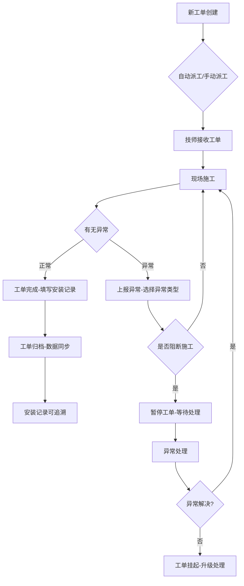
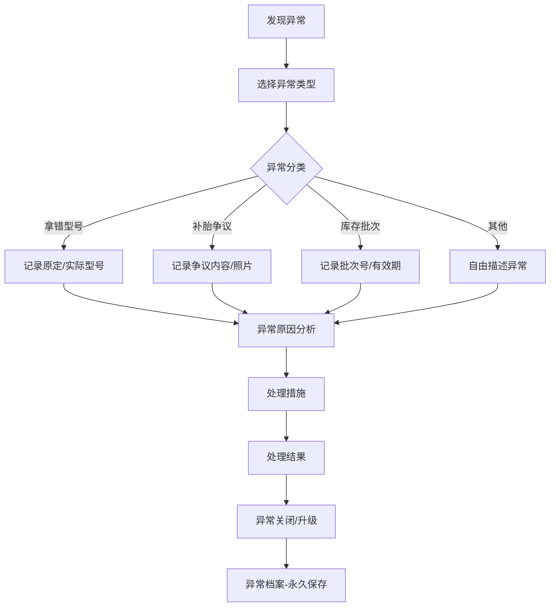

# 轮胎门店-安装工单与技师派工 工作台 PRD

## 1. 产品概述

面向轮胎门店一线的安装工单与技师派工业务工作台，支持工单全生命周期管理、技师派工调度、工单异常追溯与处理。工作台以「待处理事项」为核心视图，一线技师和管理者基于同一份数据协同作业，确保安装工单可追溯、派工可回看、异常可说明。

**核心价值**：
- 真实场景适配：支持旧台账、现场记录、沟通截图等非结构化数据接入
- 双向追溯：安装工单、技师派工、异常说明全程可查
- 一线友好：工作台即战场，支持连续处理不中断

## 2. 核心功能模块

### 2.1 用户角色

| 角色 | 职责范围 | 核心权限 |
|------|----------|----------|
| 技师 | 工单处理、现场记录、异常上报 | 处理本人派工工单、填写安装结果、上报异常 |
| 店长/管理员 | 工单分配、派工调度、异常审核、数据看板 | 全店工单管理、技师派工、异常处理、数据统计 |
| 运营管理 | 跨店数据查看、异常分析、流程优化 | 多店数据汇总、异常趋势分析、流程配置 |

### 2.2 功能模块

1. **工作台首页**：待处理工单列表、风险预警、最近变更、操作入口
2. **安装工单详情**：工单基础信息、车辆信息、轮胎信息、安装记录、异常历史
3. **技师派工管理**：派工单列表、技师状态、派工历史、工作量统计
4. **异常处理中心**：异常工单列表、异常类型分类、处理进度跟踪
5. **数据看板**：工单量统计、技师工作量、异常趋势、库存关联分析

## 3. 核心业务流程

### 3.1 安装工单处理流程

### 3.2 技师派工流程

### 3.3 异常追溯流程

## 4. 用户界面设计

### 4.1 设计风格

**视觉定位**：工业实用主义 - 深色工作台风格，强调信息密度与操作效率

**色彩方案**：
- 主色：`#1a1a2e` (深空蓝黑)
- 次色：`#16213e` (深海蓝)
- 强调色：`#e94560` (警示红)
- 成功色：`#0f3460` (沉稳蓝)
- 风险色：`#f39c12` (待处理黄)
- 文字主色：`#eaeaea`
- 文字次色：`#a0a0a0`

**字体**：
- 标题：思源黑体 Bold / Noto Sans SC Bold
- 正文：思源黑体 Regular / Noto Sans SC Regular
- 数据：JetBrains Mono (数字等宽)

**布局**：
- 左侧固定侧边栏 (240px)：导航菜单 + 技师状态
- 主工作区 (flex)：列表视图 + 详情面板
- 底部状态栏 (40px)：快捷操作 + 通知

**动效**：
- 页面切换：slide 300ms ease-out
- 列表加载：staggered fade-in 100ms
- 状态变更：pulse 高亮 500ms
- 详情展开：height transition 200ms

### 4.2 页面设计详情

#### 4.2.1 工作台首页

| 模块 | UI元素 | 交互行为 |
|------|--------|----------|
| 顶部筛选栏 | 状态标签(全部/待处理/进行中/异常)、时间范围、搜索框 | 点击切换即时过滤 |
| 待处理工单列表 | 卡片式列表：工单号、车型、轮胎型号、紧急程度、技师头像、剩余时间 | 点击展开详情面板 |
| 风险预警区 | 红色边框卡片：异常工单列表、库存不足提醒、派工延迟预警 | 点击跳转异常处理 |
| 最近变更区 | 时间线列表：工单状态变更、操作人、操作时间 | 点击查看历史详情 |
| 快捷操作区 | 固定底部按钮：新建工单、快速派工、导出报表 | 触达核心操作 |

#### 4.2.2 安装工单详情页

| 模块 | UI元素 | 交互行为 |
|------|--------|----------|
| 工单基础信息卡 | 工单号、创建时间、当前状态、紧急程度、来源渠道 | 状态可点击变更 |
| 车辆信息卡 | 车牌号、车型、年款、VIN码、行驶里程 | 字段可编辑 |
| 轮胎信息卡 | 品牌、型号、规格、花纹、数量、单价 | 显示历史记录 |
| 安装记录卡 | 技师、开始时间、结束时间、安装位置、安装效果 | 完成后填写 |
| 异常历史卡 | 时间线展示所有异常记录，包含类型、原因、处理结果 | 点击展开详情 |
| 操作日志卡 | 完整操作轨迹：操作人、操作时间、操作内容、变更前后对比 | 不可编辑，仅查看 |

#### 4.2.3 技师派工管理页

| 模块 | UI元素 | 交互行为 |
|------|--------|----------|
| 技师状态看板 | 头像、姓名、当前状态(空闲/工作中/离线)、今日工单数、当前工单 | 点击查看详情 |
| 派工单列表 | 工单号、车型、轮胎型号、派工时间、技师、状态 | 支持拖拽调整 |
| 派工历史 | 时间范围筛选、操作人、技师、结果统计 | 导出Excel |
| 工作量统计 | 柱状图：每人每日工单量、饼图：工单类型分布 | 悬停显示详情 |

#### 4.2.4 异常处理中心

| 模块 | UI元素 | 交互行为 |
|------|--------|----------|
| 异常分类导航 | 横向标签：全部/型号错误/补胎争议/库存问题/其他 | 点击切换 |
| 异常工单列表 | 卡片：异常类型、异常描述、关联工单、处理状态、责任人 | 点击展开详情 |
| 异常详情面板 | 异常类型、发生时间、责任人、原因分析、处理措施、沟通截图 | 完整记录追溯 |

### 4.3 响应式策略

- **桌面端 (≥1280px)**：完整三栏布局，侧边栏+列表+详情
- **平板端 (768-1279px)**：侧边栏收起为图标，列表+详情两栏
- **移动端 (<768px)**：单栏布局，底部Tab导航，详情以Modal形式

### 4.4 数据展示原则

**样例数据策略 - 非满状态设计**：
- 首页加载：展示混合状态（待处理60%、进行中20%、异常15%、已完成5%）
- 风险项优先：异常和待处理工单置顶显示
- 时间衰减：最近变更突出，历史数据淡化
- 真实场景模拟：
  - 3个待处理工单（其中1个已超时）
  - 2个进行中工单
  - 1个异常工单待审核
  - 5条最近变更记录

## 5. 数据追溯设计

### 5.1 追溯维度

| 追溯对象 | 追溯内容 | 呈现形式 |
|----------|----------|----------|
| 安装工单 | 工单创建→派工→施工→完成全流程 | 时间线 + 操作日志 |
| 技师派工 | 派工决策→技师接单→施工反馈全链路 | 派工单 + 状态变更 |
| 异常说明 | 异常发现→原因分析→处理措施→结果验证 | 异常档案 + 沟通记录 |

### 5.2 数据一致性保障

- 一线技师和管理者查看同一份数据源
- 所有变更实时同步，版本化存储
- 操作日志不可删除，仅新增
- 支持数据导出用于审计

## 6. 页面清单

| 序号 | 页面名称 | 路由 | 核心功能 |
|------|----------|------|----------|
| 1 | 工作台首页 | `/workbench` | 待处理工单、风险预警、最近变更 |
| 2 | 安装工单详情 | `/workbench/order/[id]` | 工单详情、异常历史、操作日志 |
| 3 | 技师派工管理 | `/workbench/dispatch` | 派工列表、技师状态、工作量统计 |
| 4 | 异常处理中心 | `/workbench/exceptions` | 异常工单、分类导航、处理流程 |
| 5 | 数据看板 | `/workbench/dashboard` | 工单统计、趋势分析、导出报表 |
