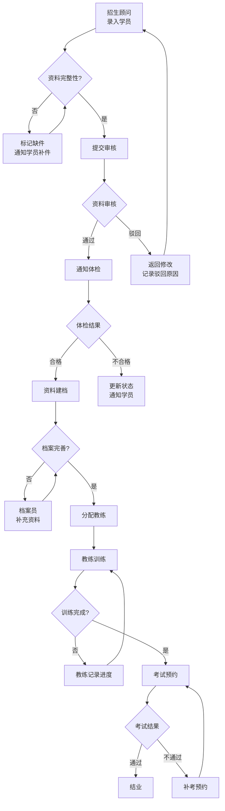
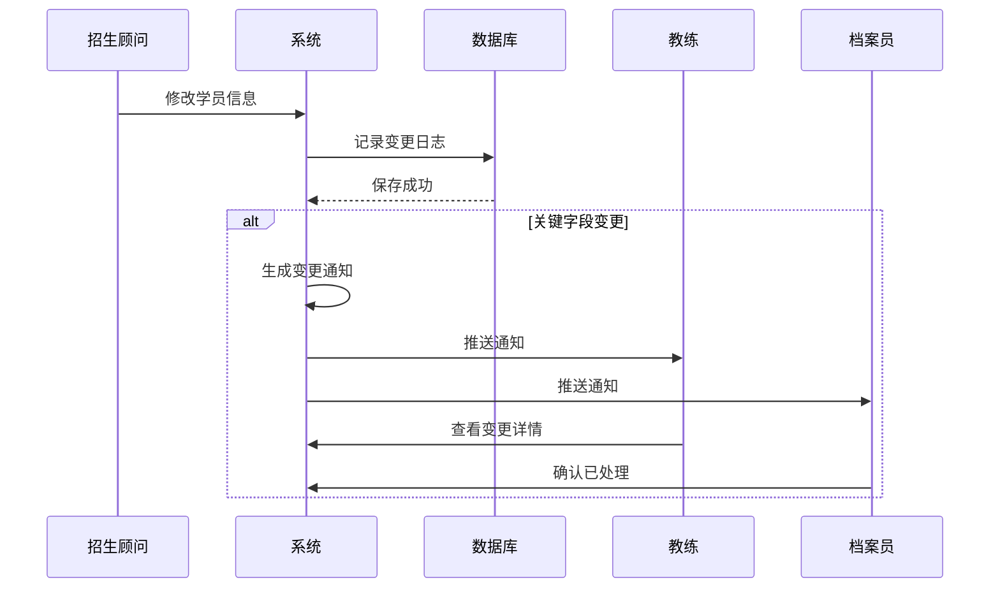
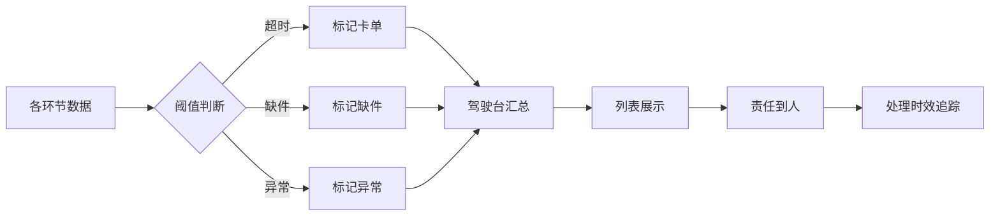
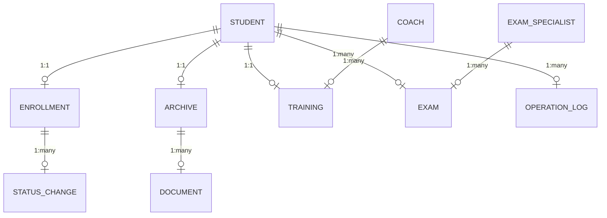

# 驾校运营管理系统 - 学员报名与资料建档模块

## 1. 产品概述

### 1.1 项目背景与问题

当前驾校运营中存在严重的信息孤岛问题：学员档案、教练排班和考试预约看似都有独立记录，但当需要追踪某个学员的完整处理链路时，信息分散且难以串联。核心痛点包括：

- **信息断层**：招生顾问录入学员后，教练无法实时获知新学员动态
- **变更感知滞后**：学员报名信息被修改（如体检不合格、居住证过期），资料建档人员往往事后才发现
- **卡单不透明**：问题单据（如缺件、信息错误）散落在各环节，管理者无法一目了然
- **责任追溯困难**：出现问题时，历史操作记录残缺，难以追溯处理人、处理时间和处理原因

### 1.2 产品定位

面向驾校运营团队的一体化工作台，以学员为中心视角，将招生顾问、教练、考试专员三个核心角色的工作流有机整合。通过实时数据联动和智能预警机制，确保每个环节的信息变更能够即时同步，让"卡住的单子"一目了然。

### 1.3 目标用户

| 角色 | 核心诉求 |
|------|----------|
| 招生顾问 | 快速录入学员信息，实时查看报名状态，追踪缺件跟进 |
| 教练 | 获取分配学员名单，感知学员信息变更，查看训练进度 |
| 考试专员 | 管理考试预约，处理学员考试资格审核，追踪缺考原因 |
| 管理者 | 全局视图查看各环节卡单情况，掌握处理时效，追溯历史操作 |

## 2. 核心功能模块

### 2.1 模块总览

| 模块名称 | 页面路由 | 核心功能 | 面向角色 |
|---------|---------|---------|----------|
| 学员报名 | `/enrollment` | 学员信息录入、编辑、状态追踪 | 招生顾问 |
| 资料建档 | `/archive` | 学员档案管理、变更感知、缺件预警 | 教练、档案员 |
| 教练工作台 | `/coach` | 学员分配、训练进度、变更通知 | 教练 |
| 考试管理 | `/exam` | 考试预约、资格审核、缺考追踪 | 考试专员 |
| 操作历史 | `/history` | 全链路操作记录追溯 | 全体用户 |
| 驾驶台 | `/dashboard` | 全局卡单统计、各环节时效监控 | 管理者 |

### 2.2 学员报名模块（`/enrollment`）

#### 2.2.1 功能详情

**学员信息录入**
- 表单字段：姓名、身份证号、联系电话、居住地址、报名车型（C1/C2）、体检状态、居住证状态
- 支持草稿保存（未提交状态）
- 必填项校验：身份证格式、手机号格式、体检/居住证状态选择
- 提交后自动生成学员编号（格式：YYYYMMDD-序号）

**报名状态管理**
- 状态流转：草稿 → 待资料审核 → 资料审核通过 → 待体检 → 体检合格 → 已建档 → 已分配教练 → 培训中 → 待考试 → 考试通过 → 结业
- 状态变更需记录：操作人、操作时间、变更原因（选填）
- 驳回操作需填写驳回原因，触发对应角色通知

**变更感知机制**
- 学员信息被修改时，自动记录变更日志
- 关键字段变更（体检状态、居住证状态）自动通知档案管理员和教练
- 变更记录可追溯，差异高亮显示

#### 2.2.2 数据展示

**密集表格视图**
| 列名 | 说明 | 可操作 |
|------|------|--------|
| 学员编号 | 系统生成唯一标识 | 点击查看详情 |
| 姓名 | 学员真实姓名 | - |
| 身份证号 | 脱敏显示（中间6位*） | - |
| 报名车型 | C1/C2 | - |
| 报名日期 | yyyy-MM-dd | - |
| 当前状态 | 状态标签（颜色区分） | - |
| 招生顾问 | 处理人姓名 | - |
| 待办事项 | 缺失项数量 | 点击查看详情 |
| 最近操作 | 时间+操作摘要 | - |
| 操作 | 编辑/查看/撤回 | 权限控制 |

**筛选与搜索**
- 按状态筛选（多选）
- 按招生顾问筛选
- 按报名日期范围筛选
- 关键字搜索（姓名、身份证号、学员编号）

**卡单标识**
- 超时未处理（超过设定阈值）行高亮
- 缺件数量气泡提示
- 体检/居住证过期预警标签

### 2.3 资料建档模块（`/archive`）

#### 2.3.1 功能详情

**档案列表管理**
- 展示所有已录入的学员档案
- 状态标识：待完善、已完善、已锁定
- 缺失资料列表展示

**变更感知中心**
- 实时显示学员信息变更通知
- 变更来源：招生顾问修改、考试专员更新
- 变更确认操作（确认已读/已处理）

**历史追溯**
- 档案完整修改历史
- 支持按时间段、操作人筛选
- 修改前后对比展示

**密集表格视图**
| 列名 | 说明 | 可操作 |
|------|------|--------|
| 学员编号 | 关联报名记录 | 点击跳转 |
| 姓名 | - | - |
| 身份证 | 脱敏显示 | - |
| 档案状态 | 待完善/已完善/已锁定 | - |
| 缺件清单 | 缺失项列表 | - |
| 最后更新 | 操作人和时间 | - |
| 变更通知 | 未读数量 | 点击查看 |
| 操作 | 查看详情/锁定档案 | 权限控制 |

### 2.4 教练工作台（`/coach`）

#### 2.4.1 功能详情

**分配学员管理**
- 已分配学员列表
- 学员基本信息展示
- 训练进度状态

**变更通知**
- 学员体检状态变更通知
- 学员居住证状态变更通知
- 信息变更需教练确认

**密集表格视图**
| 列名 | 说明 | 可操作 |
|------|------|--------|
| 学员编号 | - | - |
| 姓名 | - | - |
| 车型 | C1/C2 | - |
| 分配日期 | - | - |
| 训练进度 | 理论/实操阶段 | - |
| 体检状态 | 正常/异常 | 高亮异常 |
| 居住证状态 | 有效/过期/缺失 | 高亮问题 |
| 变更通知 | 未处理数量 | 点击处理 |
| 最近操作 | 时间+摘要 | - |
| 操作 | 查看详情/记录进度 | - |

### 2.5 考试管理模块（`/exam`）

#### 2.5.1 功能详情

**考试预约**
- 学员考试资格审核
- 预约考试时间
- 考场分配

**缺考追踪**
- 缺考原因记录
- 补考安排
- 缺考率统计

**密集表格视图**
| 列名 | 说明 | 可操作 |
|------|------|--------|
| 学员编号 | - | - |
| 姓名 | - | - |
| 考试科目 | 理论/科目二/科目三 | - |
| 预约日期 | - | - |
| 预约状态 | 待审核/已预约/已考试/缺考 | - |
| 考试成绩 | 合格/不合格/缺考 | - |
| 考试专员 | 负责人 | - |
| 备注 | 特殊情况说明 | - |
| 操作 | 审核/预约/录入成绩 | 权限控制 |

### 2.6 操作历史模块（`/history`）

#### 2.6.1 功能详情

**全链路操作追溯**
- 按学员编号查询完整操作链
- 按操作人查询其所有操作
- 按时间段查询操作记录

**变更详情展示**
- 操作类型：新增/修改/删除/状态变更
- 操作人、角色、操作时间
- 变更前后的数据对比
- 变更原因（如果有）

**密集表格视图**
| 列名 | 说明 | 可操作 |
|------|------|--------|
| 操作时间 | yyyy-MM-dd HH:mm | - |
| 学员编号 | 关联学员 | 点击跳转 |
| 学员姓名 | - | - |
| 操作类型 | 新增/修改/删除/状态变更 | 颜色区分 |
| 操作人 | 真实姓名 | - |
| 操作角色 | 招生顾问/教练/考试专员 | - |
| 变更内容 | 摘要描述 | 点击查看详情 |
| 操作详情 | 完整变更对比 | - |

### 2.7 驾驶台（`/dashboard`）

#### 2.7.1 功能详情

**全局统计**
- 各环节处理量统计
- 卡单数量实时监控
- 处理时效分析

**卡单预警**
- 超时未处理列表
- 缺件待补列表
- 即将过期（体检、居住证）

**角色工作负载**
- 各招生顾问待处理数量
- 各教练分配学员数量
- 各考试专员预约数量

## 3. 核心流程

### 3.1 学员报名主链路

### 3.2 变更感知流程

### 3.3 卡单暴露机制

## 4. 数据模型

### 4.1 核心实体关系

### 4.2 主要数据表

#### students（学员主表）
| 字段 | 类型 | 说明 |
|------|------|------|
| id | TEXT | 主键UUID |
| student_no | TEXT | 学员编号（唯一） |
| name | TEXT | 姓名 |
| id_card | TEXT | 身份证号（加密存储） |
| phone | TEXT | 联系电话 |
| address | TEXT | 居住地址 |
| car_type | TEXT | 报名车型（C1/C2） |
| enrollment_date | TEXT | 报名日期 |
| status | TEXT | 当前状态 |
| enrollment_consultant_id | TEXT | 招生顾问ID |
| coach_id | TEXT | 教练ID |
| created_at | TEXT | 创建时间 |
| updated_at | TEXT | 更新时间 |

#### archives（档案表）
| 字段 | 类型 | 说明 |
|------|------|------|
| id | TEXT | 主键UUID |
| student_id | TEXT | 学员ID |
| archive_status | TEXT | 档案状态 |
| document_status | TEXT | 资料状态 |
| missing_documents | TEXT | 缺失资料JSON |
| last_update_by | TEXT | 最后更新人 |
| last_update_at | TEXT | 最后更新时间 |
| locked_at | TEXT | 锁定时间 |
| locked_by | TEXT | 锁定人 |

#### operation_logs（操作日志表）
| 字段 | 类型 | 说明 |
|------|------|------|
| id | TEXT | 主键UUID |
| student_id | TEXT | 学员ID |
| operator_id | TEXT | 操作人ID |
| operator_role | TEXT | 操作人角色 |
| operation_type | TEXT | 操作类型 |
| before_value | TEXT | 变更前值JSON |
| after_value | TEXT | 变更后值JSON |
| change_reason | TEXT | 变更原因 |
| operated_at | TEXT | 操作时间 |

#### trainings（教练分配表）
| 字段 | 类型 | 说明 |
|------|------|------|
| id | TEXT | 主键UUID |
| student_id | TEXT | 学员ID |
| coach_id | TEXT | 教练ID |
| assign_date | TEXT | 分配日期 |
| progress | TEXT | 训练进度 |
| theory_completed | INTEGER | 理论完成 |
| practice_hours | INTEGER | 练车学时 |
| last_progress_update | TEXT | 最后进度更新时间 |

#### exams（考试记录表）
| 字段 | 类型 | 说明 |
|------|------|------|
| id | TEXT | 主键UUID |
| student_id | TEXT | 学员ID |
| exam_subject | TEXT | 考试科目 |
| exam_date | TEXT | 考试日期 |
| exam_status | TEXT | 预约状态 |
| exam_result | TEXT | 考试成绩 |
| exam_venue | TEXT | 考场 |
| specialist_id | TEXT | 考试专员ID |
| absence_reason | TEXT | 缺考原因 |

#### users（用户表）
| 字段 | 类型 | 说明 |
|------|------|------|
| id | TEXT | 主键UUID |
| username | TEXT | 用户名 |
| name | TEXT | 姓名 |
| role | TEXT | 角色 |
| department | TEXT | 部门 |
| phone | TEXT | 联系电话 |
| status | TEXT | 状态 |

## 5. 初始化数据要求

### 5.1 角色与用户

| 用户名 | 姓名 | 角色 | 部门 |
|--------|------|------|------|
| consultant001 | 张三 | 招生顾问 | 招生部 |
| consultant002 | 李四 | 招生顾问 | 招生部 |
| coach001 | 王五 | 教练 | 训练部 |
| coach002 | 赵六 | 教练 | 训练部 |
| specialist001 | 钱七 | 考试专员 | 考试部 |
| admin | 管理员 | 管理员 | 综合部 |

### 5.2 示例学员数据（含历史记录）

**学员1：正常流程**
- 姓名：陈建国
- 状态：培训中（已分配教练，理论完成）
- 历史操作：5条操作记录
- 处理人：张三（招生）、王五（教练）

**学员2：卡单状态**
- 姓名：刘美丽
- 状态：待资料完善（已超时3天）
- 缺件：居住证复印件
- 异常标记：缺件预警
- 处理人：张三（招生）

**学员3：信息变更**
- 姓名：赵小明
- 状态：已建档
- 变更记录：体检状态从"待体检"变更为"合格"（变更人：钱七，变更时间：3天前）
- 通知状态：教练王五未确认

**学员4：考试相关**
- 姓名：孙晓红
- 状态：待考试
- 考试记录：科目二补考1次
- 处理人：钱七（考试）

### 5.3 操作历史示例

| 时间 | 学员 | 操作类型 | 操作人 | 角色 | 变更内容 |
|------|------|---------|--------|------|----------|
| 2024-01-15 09:30 | 陈建国 | 新增 | 张三 | 招生顾问 | 录入学员信息 |
| 2024-01-15 10:15 | 陈建国 | 状态变更 | 张三 | 招生顾问 | 草稿→待资料审核 |
| 2024-01-16 14:20 | 陈建国 | 状态变更 | 张三 | 招生顾问 | 待资料审核→资料审核通过 |
| 2024-01-17 11:00 | 陈建国 | 资料完善 | 档案员 | 档案员 | 补充居住证 |
| 2024-01-18 09:00 | 陈建国 | 分配教练 | 管理员 | 管理员 | 分配教练王五 |
| 2024-01-20 16:30 | 赵小明 | 体检变更 | 钱七 | 考试专员 | 体检状态更新为合格 |
| 2024-01-21 08:45 | 赵小明 | 变更确认 | 王五 | 教练 | 确认体检变更通知 |

## 6. 用户界面设计

### 6.1 设计风格

**视觉风格：专业高效的办公系统**
- 主色调：深蓝色（#1E3A5F）传达专业可靠
- 辅助色：浅灰色背景（#F5F7FA）保证内容清晰
- 强调色：橙色（#F59E0B）用于预警和卡单标识
- 成功色：绿色（#10B981）用于正常状态
- 危险色：红色（#EF4444）用于异常标记
- 字体：思源黑体（正文）+ 思源宋体（标题）营造文化感

**布局风格**
- 左侧导航栏固定宽度（240px）
- 顶部状态栏显示当前用户和通知数量
- 主内容区采用卡片式布局
- 表格采用斑马纹+悬停高亮

### 6.2 状态颜色体系

| 状态类型 | 颜色 | 用途 |
|---------|------|------|
| 正常 | #10B981 | 进度正常 |
| 待处理 | #3B82F6 | 待处理项 |
| 卡单 | #F59E0B | 超时/缺件 |
| 异常 | #EF4444 | 严重问题 |
| 已完成 | #6B7280 | 历史状态 |

### 6.3 响应式策略

- 桌面端优先设计（1200px+）
- 表格支持横向滚动
- 关键信息优先展示
- 操作按钮组固定在表格底部

## 7. 非功能性需求

### 7.1 性能要求

- 页面加载时间 < 2秒
- 表格操作响应 < 500ms
- 数据联动延迟 < 1秒

### 7.2 数据安全

- 身份证号加密存储
- 操作日志不可删除
- 敏感操作需二次确认

### 7.3 可用性

- 支持键盘快捷键操作
- 表单支持自动保存草稿
- 错误信息明确友好
