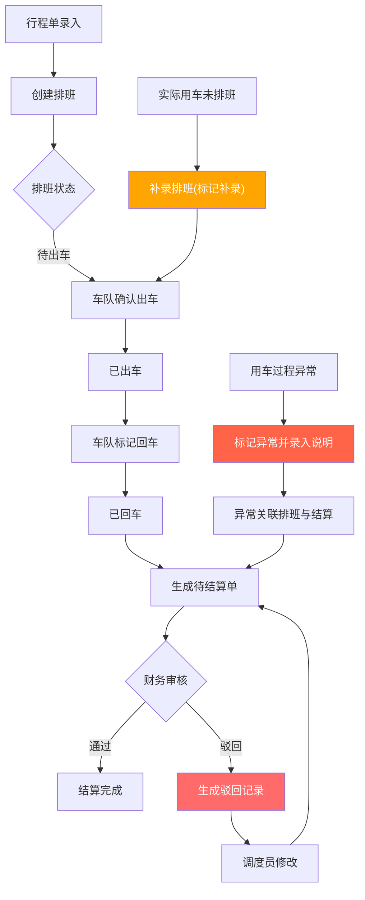

## 1. 产品概述

旅游地接社车辆排班与用车结算系统，面向地接社一线调度与财务结算场景。解决行程单→车辆排班→实际用车→费用结算全链路中，驳回、补录、异常仅停留在口头或群消息而无法追溯的痛点。确保调度操作与结算回看基于同一份数据，所有动作可溯源。

- 目标用户：地接社调度员、车队管理员、财务结算员、运营主管
- 核心价值：排班有据、结算有根、异常可追、角色分明

## 2. 核心功能

### 2.1 用户角色

| 角色 | 进入方式 | 核心权限 |
|------|----------|----------|
| 调度员 | 默认角色 | 创建/编辑排班、提交结算、处理驳回 |
| 车队管理员 | 角色切换 | 确认车辆出车、标记异常 |
| 财务结算员 | 角色切换 | 审核结算单、驳回结算、标记风险 |
| 运营主管 | 角色切换 | 查看全量数据、风险看板、操作日志回溯 |

### 2.2 功能模块

1. **工作台首页**：待办聚合、风险项提醒、最近变更流、快捷入口
2. **车辆排班**：排班日历、新增/编辑排班、排班状态流转（待出车→已出车→已回车→已结算）
3. **用车结算**：结算单列表、结算审核、驳回与补录（实体记录而非提示文案）、结算确认
4. **异常说明**：异常类型标记（延误/换车/空驶/超时等）、异常说明录入、异常关联排班与结算
5. **操作日志**：全量操作流水、按排班/结算单/角色筛选、变更前后对比
6. **角色切换**：顶部角色切换器、切换后权限与视图联动

### 2.3 页面详情

| 页面名称 | 模块名称 | 功能描述 |
|----------|----------|----------|
| 工作台首页 | 待办聚合 | 按角色显示待处理排班数、待审核结算数、待处理异常数，点击直接跳转 |
| 工作台首页 | 风险项 | 结算金额异常、排班冲突、超时未结算等风险卡片，支持标记已读 |
| 工作台首页 | 最近变更 | 最近20条操作变更流，含操作人、时间、动作类型、关联单号 |
| 工作台首页 | 快捷入口 | 新增排班、查看结算、异常录入、操作日志 |
| 车辆排班 | 排班日历 | 日/周视图切换，按车辆颜色区分状态，支持拖拽调整排班 |
| 车辆排班 | 新增排班 | 填写行程单号、车辆、司机、导游、出发时间、预计返回、备注 |
| 车辆排班 | 排班详情 | 状态流转操作（出车/回车/异常标记），关联结算单与异常记录 |
| 车辆排班 | 排班状态流转 | 待出车→已出车→已回车→已结算，每步记录操作人与时间 |
| 用车结算 | 结算单列表 | 按状态筛选（待审核/已通过/已驳回），显示排班关联、金额、异常标记 |
| 用车结算 | 结算审核 | 查看费用明细、异常记录，通过/驳回（驳回需填写原因，生成驳回记录实体） |
| 用车结算 | 驳回处理 | 调度员看到驳回原因，修改后重新提交，驳回→修改→重提交形成完整链路 |
| 用车结算 | 补录 | 未提前排班但实际发生用车，补录排班信息后生成结算单，补录标记与原排班区分 |
| 异常说明 | 异常列表 | 按类型/日期/排班单号筛选，显示异常类型、关联排班、处理状态 |
| 异常说明 | 异常录入 | 选择关联排班、异常类型、填写说明、上传附件（如有） |
| 异常说明 | 异常关联 | 异常记录与排班、结算单双向关联，任一侧可跳转查看 |
| 操作日志 | 日志列表 | 全量操作记录，含操作人、角色、时间、动作、变更前后值 |
| 操作日志 | 日志筛选 | 按排班ID/结算单ID/操作人/时间范围/动作类型筛选 |
| 操作日志 | 变更对比 | 点击日志条目展开变更前后字段对比 |

## 3. 核心流程

### 3.1 排班到结算主链路

调度员根据行程单创建排班→车队管理员确认出车→司机完成用车→车队管理员标记回车→系统自动生成待结算单→财务审核结算→通过则完成，驳回则调度员修改后重提交

### 3.2 驳回与补录流程

驳回：财务在结算审核中驳回并填写原因→驳回记录作为实体存入数据库（非仅提示文案）→调度员在工作台看到驳回待办→修改结算信息→重新提交→驳回历史保留可追溯

补录：调度员发现实际用车未提前排班→补录排班信息（标记为"补录"）→补录排班同样走结算流程→补录标记全程可见

### 3.3 流程图

## 4. 用户界面设计

### 4.1 设计风格

- **主色调**：深青灰(#1a2332)为底，搭配琥珀橙(#e67e22)作为行动色，薄荷绿(#2ecc71)表示通过/正常，珊瑚红(#e74c3c)表示驳回/风险
- **辅助色**：浅灰蓝(#ecf0f5)为内容区背景，纯白卡片浮层
- **按钮风格**：圆角4px，主按钮实色填充，次要按钮线框，危险按钮红色
- **字体**：标题用思源黑体/Noto Sans SC Bold，正文用Noto Sans SC Regular
- **布局**：左侧固定导航栏(64px折叠/220px展开)，顶部角色切换栏，右侧主内容区
- **图标**：线性图标风格，24px，与文字间距8px
- **数据密集场景**：表格行高48px，斑马纹，固定表头，支持排序与筛选

### 4.2 页面设计概览

| 页面名称 | 模块名称 | UI元素 |
|----------|----------|--------|
| 工作台首页 | 待办聚合 | 三列卡片(排班/结算/异常)，数字大号加粗，底部链接跳转 |
| 工作台首页 | 风险项 | 横向滚动风险卡片，红色标签标识严重程度，点击展开详情 |
| 工作台首页 | 最近变更 | 时间线列表，左侧时间轴，右侧操作摘要，hover展开详情 |
| 工作台首页 | 快捷入口 | 四宫格图标按钮，hover微动效 |
| 车辆排班 | 排班日历 | 左侧车辆列，上方时间轴，排班卡片拖拽放置，状态色区分 |
| 车辆排班 | 新增排班 | 右侧抽屉滑出，表单分组(基本信息/车辆信息/费用预估) |
| 车辆排班 | 排班详情 | 全屏模态框，顶部状态步骤条，中部信息分区，底部操作按钮 |
| 用车结算 | 结算单列表 | 表格布局，行内状态标签(色块+文字)，批量操作栏 |
| 用车结算 | 结算审核 | 左右分栏：左侧费用明细+异常记录，右侧审核操作区 |
| 用车结算 | 驳回弹窗 | 模态弹窗，必填驳回原因文本域，关联排班信息只读展示 |
| 异常说明 | 异常列表 | 卡片列表，顶部类型筛选标签组，卡片含排班号/类型/状态 |
| 操作日志 | 日志列表 | 表格布局，操作类型彩色标签，点击行展开变更对比面板 |

### 4.3 响应式

- 桌面优先设计，最小适配1280px宽度
- 排班日历在1280-1440px自动隐藏次要列，1440px以上完整展示
- 表格列支持自定义显示/隐藏
- 触屏设备支持排班卡片长按拖拽

### 4.4 设计调性

- 整体调性：工业实用主义 (Industrial Utilitarian) — 数据密集但层次清晰，操作高效但不冰冷
- 信息密度高但不杂乱，关键数据突出，次要信息折叠
- 状态色彩编码统一贯穿全系统，降低认知负担
- 表格与卡片混排，列表页用表格、详情页用卡片分区
