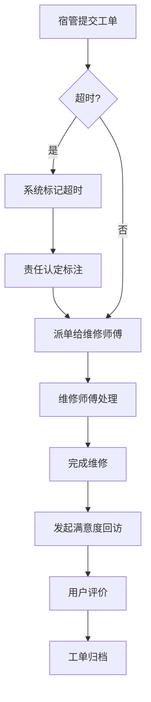

## 1. Product Overview
校园维修工单管理系统，专注于超时工单处理与满意度回访流程优化。帮助宿管、维修师傅、后勤主管高效协作，减少重复沟通，提升服务质量。

## 2. Core Features

### 2.1 User Roles
| Role | Registration Method | Core Permissions |
|------|---------------------|------------------|
| 宿管 | 系统分配账号 | 提交维修工单、确认工单状态 |
| 维修师傅 | 系统分配账号 | 处理工单、更新维修进度 |
| 后勤主管 | 系统分配账号 | 审批工单、查看统计报表 |

### 2.2 Feature Module
1. **工单列表页**: 默认显示今天要办、已拖延、被退回工单，支持筛选和搜索
2. **侧栏详情**: 显示工单详细信息、处理历史、责任标注
3. **超时工单处理**: 超时预警、责任认定、派单操作
4. **满意度回访**: 回访记录、满意度评分、问题反馈
5. **交接留痕**: 记录各角色操作，确保责任清晰

### 2.3 Page Details
| Page Name | Module Name | Feature description |
|-----------|-------------|---------------------|
| 工单列表 | 默认列表 | 同时展示今天要办、已拖延、被退回工单 |
| 工单列表 | 筛选搜索 | 按状态、优先级、部门筛选 |
| 侧栏详情 | 工单信息 | 显示基本信息、责任标注、处理历史 |
| 侧栏详情 | 操作区 | 提交、确认、退回等操作按钮 |
| 满意度回访 | 回访记录 | 查看历史回访记录和评分 |
| 满意度回访 | 发起回访 | 对已完成工单发起满意度调查 |
| 空状态 | 无数据 | 显示友好提示，引导操作 |

## 3. Core Process

## 4. User Interface Design
### 4.1 Design Style
- Primary color: #10B981 (emerald green) - 代表信任与专业
- Secondary color: #F59E0B (amber) - 用于超时警告
- Button style: 圆角矩形，hover状态有阴影变化
- Font: Inter, 中文使用思源黑体
- Layout: 左侧导航 + 右侧内容区的经典后台布局
- Icon style: lucide-react 线性图标

### 4.2 Page Design Overview
| Page Name | Module Name | UI Elements |
|-----------|-------------|-------------|
| 工单列表 | 列表头部 | 标题、筛选器、搜索框 |
| 工单列表 | 列表内容 | 卡片式布局，显示工单状态标签 |
| 侧栏详情 | 信息区 | 工单编号、位置、描述、责任标注 |
| 侧栏详情 | 历史记录 | 时间线展示操作记录 |
| 侧栏详情 | 操作按钮 | 提交、确认、退回按钮 |
| 满意度回访 | 回访列表 | 评分星级、评价内容、时间 |
| 满意度回访 | 发起回访 | 评分选择、评价输入框 |

### 4.3 Responsiveness
- Desktop-first design
- 支持1280px以上屏幕
- 侧栏支持收起/展开

### 4.4 Key UI Features
- 超时工单红色警告标识
- 责任不清提前标注（橙色标签）
- 角色操作留痕（时间线展示）
- 状态标签颜色区分（待处理/处理中/已完成/超时）