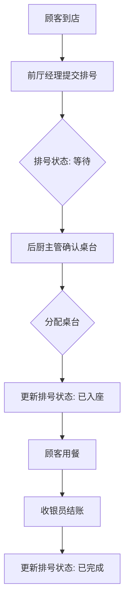

## 1. Product Overview

火锅店后厨等位排号与桌台分配系统，解决等位排号和桌台分配之间的责任争议问题。通过系统留痕记录前厅经理、后厨主管、收银之间的交接顺序，确保责任可追溯。

## 2. Core Features

### 2.1 User Roles
| Role | Registration Method | Core Permissions |
|------|---------------------|------------------|
| 前厅经理 | 账号密码登录 | 提交等位排号、查看排号列表、分配桌台 |
| 后厨主管 | 账号密码登录 | 确认桌台分配、查看分配记录、管理桌台状态 |
| 收银员 | 账号密码登录 | 查看排号状态、处理结账 |
| 管理员 | 账号密码登录 | 管理用户、查看系统日志、配置桌台 |

### 2.2 Feature Module
1. **等位排号管理**: 提交新排号、查看排号列表、修改排号状态
2. **桌台分配管理**: 桌台状态展示、桌台分配、分配记录回看
3. **时间线详情**: 记录操作历史、责任追溯
4. **系统日志**: 所有操作留痕、审计追踪

### 2.3 Page Details
| Page Name | Module Name | Feature description |
|-----------|-------------|---------------------|
| 首页 | 排号列表 | 展示当前等位队列，支持筛选和搜索 |
| 首页 | 桌台状态 | 可视化展示所有桌台的当前状态 |
| 排号详情 | 时间线 | 展示排号从创建到完成的完整操作记录 |
| 桌台管理 | 桌台列表 | 管理桌台信息和状态 |
| 系统日志 | 操作记录 | 展示所有用户的操作历史 |

## 3. Core Process

## 4. User Interface Design

### 4.1 Design Style
- 主色调: 暖橙色(#FF6B35) - 体现火锅热情氛围
- 辅助色: 深棕色(#3D2914) - 木质质感
- 按钮风格: 圆角矩形，悬停有阴影效果
- 字体: 微软雅黑/思源黑体
- 布局: 卡片式布局，清晰的信息层级
- 图标: 简洁现代风格

### 4.2 Page Design Overview
| Page Name | Module Name | UI Elements |
|-----------|-------------|-------------|
| 首页 | 排号列表 | 卡片列表、状态标签、操作按钮 |
| 首页 | 桌台状态 | 网格布局、颜色区分状态、悬停提示 |
| 排号详情 | 时间线 | 垂直时间轴、图标标识操作类型 |
| 桌台管理 | 桌台列表 | 表格展示、批量操作、状态切换 |

### 4.3 Responsiveness
- 桌面端优先，支持移动端自适应
- 桌台状态在移动端切换为列表展示

### 4.4 3D Scene Guidance
- 无3D场景需求
