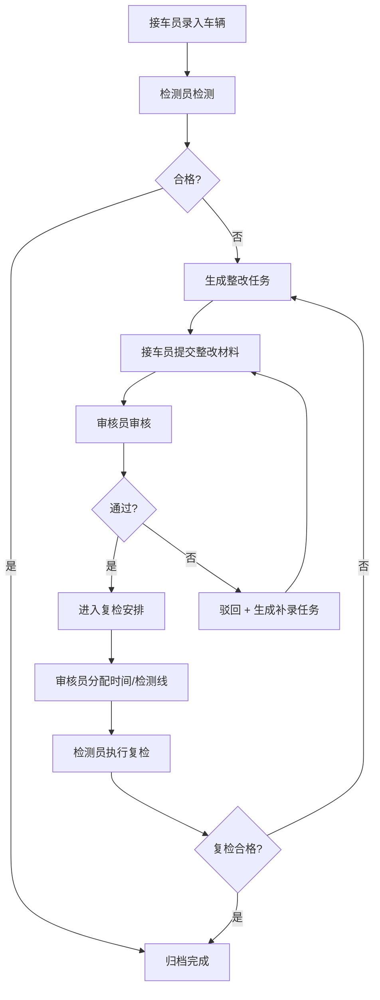

## 1. 产品概述

车辆年检站不合格整改与复检安排桌面应用，服务于年检站接车员、检测员、审核员三类角色。核心解决不合格整改流到复检安排时，驳回与补录缺乏实体化流程、角色间共用大表权责不清、忙时交互轮次过多等问题。目标是减少返工、提升高频录入效率，让所有操作可追溯。

## 2. 核心功能

### 2.1 用户角色

| 角色 | 核心权限 | 典型高频操作 |
|------|----------|--------------|
| 接车员 | 录入车辆信息、提交整改材料、查看复检安排 | 批量录入车辆、登记整改完成 |
| 检测员 | 记录不合格项、确认复检结果、标记异常 | 录入检测数据、批量驳回不合格整改 |
| 审核员 | 审核整改质量、调度复检、处理超期风险 | 安排复检时间、审核通过/驳回、处理异常 |

### 2.2 功能模块

1. **首页仪表盘**：待处理任务卡、风险项提醒、最近变更时间线、快捷入口
2. **不合格整改**：整改列表（按角色过滤）、批量录入、整改处理动作、驳回/补录流程
3. **复检安排**：复检调度列表、历史回看、异常提示、批量安排
4. **详情页**：车辆完整档案、历史操作时间线、流转记录、附件回看

### 2.3 页面详情

| 页面名称 | 模块名称 | 功能描述 |
|----------|----------|----------|
| 首页仪表盘 | 待处理任务 | 按角色显示当前用户待办，支持一键进入处理 |
| 首页仪表盘 | 风险项 | 超期未整改、超期未复检、多次驳回等高风险条目高亮 |
| 首页仪表盘 | 最近变更 | 今日操作流水，可点击跳转详情 |
| 首页仪表盘 | 角色切换 | 模拟多角色视角切换（演示用） |
| 不合格整改 | 整改列表 | 支持按状态/检测项/时间筛选，高信息密度表格 |
| 不合格整改 | 批量录入 | 粘贴 Excel 行快速生成多条整改记录 |
| 不合格整改 | 整改处理 | 标记整改完成、上传整改凭证、一键提交复检 |
| 不合格整改 | 驳回/补录 | 驳回必须填写原因并流转至补录，补录后自动回到处理流 |
| 复检安排 | 复检列表 | 待安排/已安排/已完成/异常 四 Tab |
| 复检安排 | 历史回看 | 按车牌号/流水号检索全量历史复检记录 |
| 复检安排 | 异常提示 | 复检冲突、设备占用、车主爽约等异常标红并附处理建议 |
| 复检安排 | 批量调度 | 多选批量分配检测线与时间 |
| 详情页 | 车辆档案 | 基础信息 + 历次检测摘要 |
| 详情页 | 历史时间线 | 从接车到当前的完整操作链，含操作人、时间、内容 |
| 详情页 | 附件区 | 现场照片、沟通截图、整改凭证等可预览 |

## 3. 核心流程

接车员录入车辆 → 检测员检测并标记不合格项 → 接车员提交整改材料 → 审核员审核（通过则进入复检安排 / 驳回则退回补录） → 审核员安排复检时间与检测线 → 检测员执行复检 → 结果归档。任何驳回操作均生成实体化的补录任务，而非仅提示文案。

## 4. 界面设计

### 4.1 设计风格
- **主色**：深工业灰 `#1e2330` 为底，警示橙 `#ff7a45` 标记不合格/驳回，安全绿 `#52c41a` 标记通过，信息蓝 `#1890ff` 标记安排中
- **按钮**：方角 2px 圆角，实心按钮 + 细描边幽灵按钮，高频操作配键盘快捷键提示
- **字体**：正文使用 JetBrains Mono（等宽）提升数据录入可读性，标题使用 思源黑体 Bold
- **布局**：左侧导航 + 顶部筛选条 + 主体数据区，卡片少、表格多，信息密度高
- **图标**：Lucide 线性图标，统一 16px 尺寸

### 4.2 页面设计概览

| 页面名称 | 模块 | UI 要点 |
|----------|------|---------|
| 首页 | 待处理/风险项/最近变更 | 三栏不等宽布局，风险项使用橙红渐变警示条，最近变更为时间线 |
| 不合格整改 | 列表+批量录入 | 顶部固定筛选+批量操作栏，表格斑马纹，选中行高亮描边 |
| 复检安排 | 四 Tab + 调度面板 | 列表与日历双视图切换，异常行整行红底白字 |
| 详情页 | 时间线+档案 | 左侧时间线垂直排布，右侧信息面板可折叠 |

### 4.3 响应式
桌面优先，最小宽度 1280px，Neutralino 容器默认 1440×900。表格支持横向滚动。
