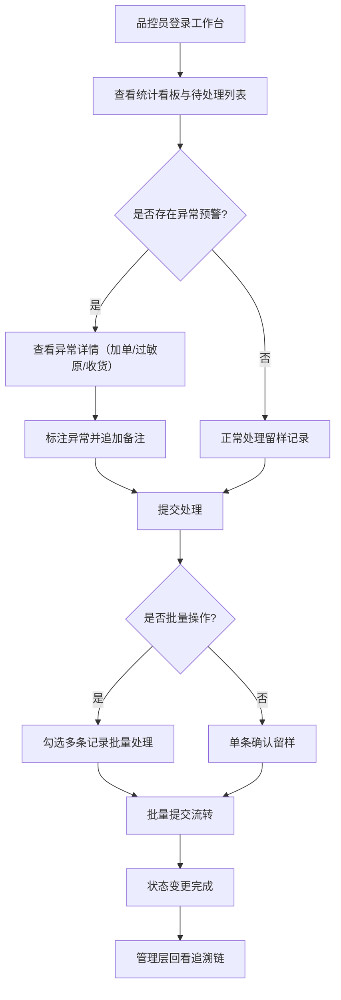

## 1. 产品概述

中央厨房留样记录与批次追溯工作台——面向中央厨房一线品控和管理层，解决留样记录分散、批次追溯靠人工拼凑上下文、异常情况（临时加单、过敏原漏标、门店收货不清）无法主动预警的问题。同一份数据支撑一线处理和管理回看，留样记录、批次追溯链和异常说明全程可追溯。

- 目标用户：中央厨房品控员、生产主管、门店收货员
- 核心价值：用系统数据替代人工拼上下文，让留样、追溯、异常处理在同一工作台闭环

## 2. 核心功能

### 2.1 用户角色

| 角色 | 进入方式 | 核心权限 |
|------|----------|----------|
| 品控员 | 工号登录 | 留样记录处理、异常标注、批量操作 |
| 生产主管 | 工号登录 | 批次追溯回看、异常审核、数据导出 |
| 门店收货员 | 工号登录 | 收货确认、收货异常上报 |

### 2.2 功能模块

1. **工作台主页**：留样记录列表、状态筛选、异常预警标记、批量操作栏、统计看板
2. **留样详情抽屉**：单条留样完整信息、批次追溯链、历史备注时间线、处理操作
3. **批次追溯视图**：从原料→加工→出餐→门店的全链路可视化、异常节点高亮
4. **异常处理面板**：临时加单标记、过敏原标识漏写预警、门店收货不清提醒

### 2.3 页面详情

| 页面名称 | 模块名称 | 功能描述 |
|----------|----------|----------|
| 工作台主页 | 统计看板 | 待处理/进行中/已完成/异常数量统计卡片 |
| 工作台主页 | 筛选栏 | 日期、状态、门店、异常类型多维度筛选 |
| 工作台主页 | 留样记录列表 | 表格展示留样记录，支持排序、行内状态标签、异常角标 |
| 工作台主页 | 批量操作栏 | 勾选多条后批量确认留样、批量标注异常、批量流转 |
| 留样详情抽屉 | 基本信息 | 留样编号、产品名称、生产批次、留样时间、留样克数 |
| 留样详情抽屉 | 批次追溯链 | 时间轴展示从原料采购→生产加工→留样→出餐→门店全链路 |
| 留样详情抽屉 | 历史备注 | 按时间排列的备注/操作记录，含操作人和时间戳 |
| 留样详情抽屉 | 处理操作 | 确认留样、标注异常、提交流转、追加备注 |
| 异常预警面板 | 临时加单标记 | 在列表中用醒目标签标出临时加单的记录 |
| 异常预警面板 | 过敏原漏标预警 | 自动检测过敏原字段为空的产品并高亮提醒 |
| 异常预警面板 | 收货不清提醒 | 门店未确认收货的记录突出显示 |

## 3. 核心流程

品控员打开工作台→查看待处理留样记录→点击进入详情→查看批次追溯链→确认留样或标注异常→提交处理→记录状态变更→管理层回看完整追溯链

## 4. 用户界面设计

### 4.1 设计风格

- 主色调：深石板蓝 (#1e293b) 作为背景基调，传达工业管控的专业感
- 强调色：琥珀色 (#f59e0b) 用于异常预警，翠绿色 (#10b981) 用于完成状态
- 按钮风格：圆角微弧 (rounded-lg)，主要操作实色填充，次要操作描边
- 字体：使用 DM Sans 作为界面字体，JetBrains Mono 用于编号和数据
- 布局风格：左固定侧栏 + 右侧工作区，表格为主、卡片统计为辅
- 图标风格：Lucide 线性图标，统一 18px 尺寸

### 4.2 页面设计概览

| 页面名称 | 模块名称 | UI元素 |
|----------|----------|--------|
| 工作台主页 | 统计看板 | 4张统计卡片，深色底+数字大号+趋势箭头 |
| 工作台主页 | 筛选栏 | 水平排列的下拉选择+日期区间+搜索框 |
| 工作台主页 | 留样记录列表 | 条纹表格，行悬停高亮，异常行左侧琥珀色边条 |
| 工作台主页 | 批量操作栏 | 浮动底部工具条，勾选后滑入显示 |
| 留样详情抽屉 | 抽屉面板 | 右侧滑入宽面板，顶部状态徽标+标签页切换 |
| 留样详情抽屉 | 追溯链时间轴 | 垂直时间轴，节点含图标+状态色，异常节点脉冲动画 |
| 留样详情抽屉 | 历史备注 | 聊天气泡式备注条目，左侧头像缩写+右侧内容 |

### 4.3 响应式

- 桌面优先设计，最小宽度 1280px
- 列表区域水平滚动避免压缩列宽
- 详情抽屉在窄屏下全屏覆盖

### 4.4 动效

- 统计卡片入场：交错淡入 (stagger fade-in)
- 异常行脉冲：左侧边条呼吸动画
- 抽屉滑入：transform translateX 过渡
- 批量操作栏：从底部滑入
- 追溯链节点：依次展开动画
