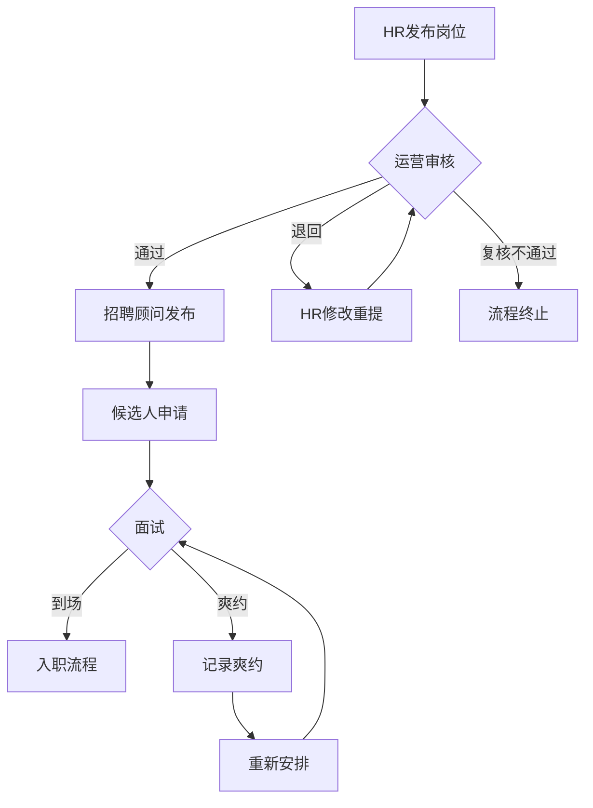
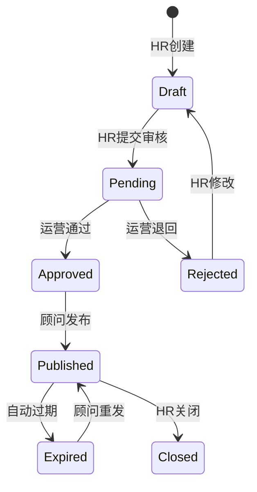

# 蓝领招聘平台-岗位审核与发布管理系统

## 1. Product Overview

本系统旨在解决蓝领招聘业务中的核心痛点：面试爽约、岗位信息过期、返费条件争议。通过运营、招聘顾问、企业HR三方接力协作模式，实现岗位从审核到发布的全流程管理，确保信息准确、流程可控、责任清晰。

## 2. Core Features

### 2.1 User Roles

| Role | Registration Method | Core Permissions |
|------|---------------------|------------------|
| 运营 | 后台分配账号 | 审核岗位信息、处理异常、数据重置 |
| 招聘顾问 | 后台分配账号 | 跟进岗位发布、管理面试名单、处理候选人反馈 |
| 企业HR | 后台分配账号 | 发布岗位、确认入职回执、处理返费争议 |

### 2.2 Feature Module

1. **登录页面**: 角色选择登录
2. **岗位审核页面**: 待审核列表、审核操作、状态流转
3. **发布管理页面**: 已发布岗位回看、状态监控、过期提醒
4. **面试管理页面**: 面试名单管理、爽约记录、跟进状态
5. **数据重置页面**: 测试数据重置功能

### 2.3 Page Details

| Page Name | Module Name | Feature description |
|-----------|-------------|---------------------|
| 登录页面 | 角色选择 | 支持运营、招聘顾问、企业HR三种角色登录 |
| 岗位审核 | 待审核列表 | 展示待审核岗位，支持筛选、搜索 |
| 岗位审核 | 审核操作 | 通过、退回、复核功能 |
| 发布管理 | 岗位列表 | 展示所有岗位状态、过期预警 |
| 发布管理 | 状态监控 | 岗位状态流转可视化 |
| 面试管理 | 面试名单 | 管理面试安排、记录爽约情况 |
| 数据重置 | 重置功能 | 一键重置测试数据 |

## 3. Core Process

### 3.1 正常业务流程
企业HR发布岗位 → 运营审核通过 → 招聘顾问发布 → 候选人申请 → 面试安排 → 入职回执 → 返费结算

### 3.2 异常处理流程
企业HR发布岗位 → 运营审核退回 → HR修改后重新提交 → 或运营复核不通过 → 终止流程

## 4. User Interface Design

### 4.1 Design Style
- Primary color: #2563eb (蓝色系，体现专业可靠)
- Secondary color: #16a34a (绿色系，用于成功状态)
- Warning color: #f59e0b (橙色系，用于预警)
- Error color: #dc2626 (红色系，用于错误状态)
- Button style: rounded-lg, shadow-sm
- Font: Inter, 中文使用思源黑体
- Layout: 侧边栏导航 + 主内容区

### 4.2 Page Design Overview

| Page Name | Module Name | UI Elements |
|-----------|-------------|-------------|
| 登录页面 | 角色选择 | 三个角色卡片、登录表单、Logo |
| 岗位审核 | 列表区域 | 表格展示、筛选器、分页 |
| 岗位审核 | 操作区 | 通过/退回按钮、备注输入框 |
| 发布管理 | 状态看板 | 卡片式布局、状态标签、过期标识 |
| 面试管理 | 名单列表 | 时间线展示、爽约标记 |
| 数据重置 | 操作区 | 确认弹窗、重置按钮 |

### 4.3 Responsiveness
- Desktop-first design
- 侧边栏在移动端折叠为抽屉菜单
- 表格在移动端转为卡片列表

### 4.4 状态流转图

## 5. Demo Scenarios

### 5.1 正常流程演示
1. 企业HR登录 → 发布新岗位 → 提交审核
2. 运营登录 → 审核通过该岗位
3. 招聘顾问登录 → 发布岗位
4. 查看岗位状态为已发布

### 5.2 异常流程演示
1. 企业HR登录 → 发布新岗位 → 提交审核
2. 运营登录 → 退回该岗位（填写退回原因）
3. HR查看退回原因 → 修改岗位信息 → 重新提交
4. 运营复核不通过 → 流程终止