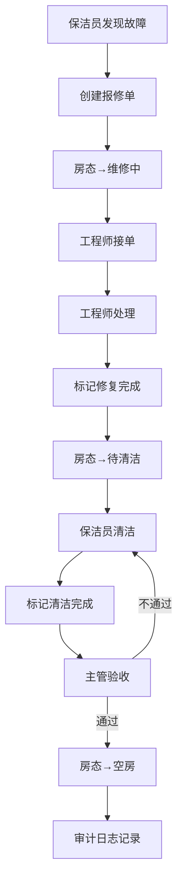

## 1. 产品概述

酒店客房部内部系统，解决工程报修与房态恢复之间责任不清的核心痛点。房态板、布草记录和维修单不应只记录结果，还要记录"为什么"——每次状态变更都必须有操作人、原因和时间戳，做到审计可回溯。

- 目标用户：客房主管、保洁员、工程师三类角色，各看各的操作面板
- 核心价值：谁在等处理、哪里卡住、最近谁改过——一打开系统就能看到优先级

## 2. 核心功能

### 2.1 用户角色

| 角色 | 登录方式 | 核心权限 |
|------|----------|----------|
| 客房主管 | 账号密码登录 | 查看全部房态、审批房态恢复、指派维修、查看审计日志 |
| 保洁员 | 账号密码登录 | 提交工程报修、标记清洁完成、查看自己负责的房间 |
| 工程师 | 账号密码登录 | 接单/处理/完成维修、查看待处理维修单、标记修复完成 |

### 2.2 功能模块

1. **工作台首页**：优先级看板——待处理报修、卡住房态、最近操作动态
2. **房态看板页**：全部房间状态总览，按楼层/状态筛选，点击进入房间详情
3. **工程报修页**：报修单列表（按角色过滤）、创建报修、处理报修、报修详情与历史
4. **房态恢复页**：恢复流程列表、发起恢复申请、主管审批、恢复详情与历史
5. **审计日志页**：全部操作记录，按时间/操作人/类型筛选（仅主管可见）

### 2.3 页面详情

| 页面名称 | 模块名称 | 功能描述 |
|----------|----------|----------|
| 工作台首页 | 待处理告警 | 按紧急度展示待处理报修单数量、卡住超时的房态恢复 |
| 工作台首页 | 房态瓶颈 | 显示超过预设时长未恢复的房间，标注卡在哪个环节 |
| 工作台首页 | 最近动态 | 最近20条操作记录，含操作人、操作类型、时间 |
| 房态看板 | 楼层筛选 | 按楼层筛选房间，不同状态不同颜色标记 |
| 房态看板 | 房间卡片 | 显示房号、当前状态、当前负责人、最近变更时间 |
| 房态看板 | 状态筛选 | 按空房/住客/清洁中/维修中/待检筛选 |
| 工程报修 | 报修单列表 | 保洁员看自己提交的，工程师看待处理和自己的，主管看全部 |
| 工程报修 | 创建报修 | 保洁员填写：房号、故障类型、描述、紧急度、图片 |
| 工程报修 | 处理报修 | 工程师接单→处理中→完成，每步填写备注和原因 |
| 工程报修 | 报修详情 | 报修全生命周期时间线，含每次状态变更的原因和操作人 |
| 房态恢复 | 恢复列表 | 显示所有恢复流程，按状态筛选（待清洁/清洁完成待检/已恢复） |
| 房态恢复 | 发起恢复 | 保洁员标记清洁完成，触发恢复流程 |
| 房态恢复 | 主管审批 | 主管检查后确认恢复，可退回要求重新清洁 |
| 房态恢复 | 恢复详情 | 完整恢复时间线，含每步操作人、原因、时长 |
| 审计日志 | 日志列表 | 全部操作记录，按时间倒序，含操作人、类型、详情、IP |
| 审计日志 | 筛选器 | 按操作人、操作类型、时间范围筛选 |

## 3. 核心流程

### 3.1 工程报修流程
保洁员发现房间故障 → 创建报修单（房态自动变为"维修中"）→ 工程师接单处理 → 工程师标记修复完成 → 房态变为"待清洁" → 进入房态恢复流程

### 3.2 房态恢复流程
房间需要恢复可用状态 → 保洁员标记清洁完成 → 客房主管检查验收 → 验收通过则房态恢复为"空房" / 验收不通过退回重做 → 全程记录审计日志

## 4. 用户界面设计

### 4.1 设计风格
- 主色调：深灰底(#1a1a2e) + 暖橙强调色(#e8723a) + 冷蓝信息色(#3a86c8)
- 按钮风格：圆角8px，填充式主按钮+描边式次按钮
- 字体：标题用Noto Sans SC Bold，正文用Noto Sans SC Regular
- 布局：左侧导航栏 + 右侧内容区，卡片式布局
- 状态颜色：空房=绿、住客=蓝、清洁中=黄、维修中=红、待检=橙

### 4.2 页面设计概述

| 页面名称 | 模块名称 | UI元素 |
|----------|----------|--------|
| 工作台首页 | 待处理告警 | 红色/橙色警示卡片，数字突出，悬停显示详情 |
| 工作台首页 | 房态瓶颈 | 时间线式展示卡住环节，红色脉冲动画 |
| 工作台首页 | 最近动态 | 列表式，操作人头像+操作描述+时间戳 |
| 房态看板 | 楼层视图 | 网格卡片，每房一张，颜色编码状态 |
| 工程报修 | 报修列表 | 表格+状态标签，按角色自动过滤 |
| 工程报修 | 报修详情 | 垂直时间线，每节点含操作人+原因+时间 |
| 房态恢复 | 恢复列表 | 卡片列表，进度条显示当前阶段 |
| 房态恢复 | 恢复详情 | 步骤条+时间线，可展开每个步骤的详情 |
| 审计日志 | 日志列表 | 紧凑表格，操作类型用颜色标签区分 |

### 4.3 响应式
桌面优先设计，左侧固定导航栏（可折叠），右侧内容区自适应宽度。最小支持1280px宽度。

### 4.4 3D场景
不适用
