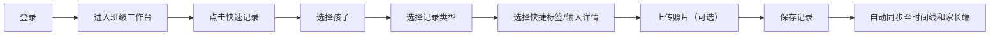
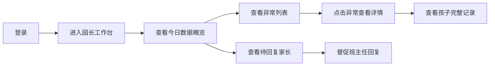
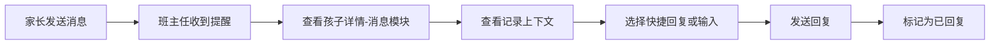

## 1. 产品概述

托育中心日常观察记录工作台，解决老师拍照繁琐、信息无结构、家长沟通效率低的痛点。班主任可快速记录孩子每日观察，园长可监控班级异常和家长沟通情况，实现保育工作数字化、结构化。

## 2. 核心功能

### 2.1 用户角色

| 角色 | 登录方式 | 核心权限 |
|------|---------|----------|
| 班主任 | 账号密码登录 | 查看班级孩子列表、快速记录观察、查看孩子详情、回复家长消息、上传照片 |
| 园长 | 账号密码登录 | 查看所有班级概况、异常预警、待回复家长统计、查看孩子详情 |

### 2.2 功能模块

1. **登录页**：角色选择、账号密码登录
2. **班主任工作台**：班级孩子列表、快速记录入口、待办提醒
3. **孩子详情页**：时间线记录、照片展示、饮食睡眠、健康提醒、家长消息
4. **园长工作台**：班级概况、异常监控面板、待回复家长列表
5. **快速记录弹窗**：入园观察、喂养、午睡、情绪、健康状况快捷录入

### 2.3 页面详情

| 页面名称 | 模块名称 | 功能描述 |
|---------|---------|----------|
| 登录页 | 角色选择 | 班主任/园长角色切换，账号密码输入 |
| 登录页 | 登录验证 | 本地mock验证，自动跳转对应工作台 |
| 班主任工作台 | 班级头部 | 班级名称、日期、在园人数统计 |
| 班主任工作台 | 孩子列表 | 卡片式展示，显示头像、姓名、年龄、今日状态标签 |
| 班主任工作台 | 快速记录悬浮按钮 | 一键打开快速记录弹窗 |
| 班主任工作台 | 待办提醒栏 | 显示待回复家长、需关注孩子数量 |
| 孩子详情页 | 基本信息卡片 | 头像、姓名、年龄、家长联系方式、过敏史 |
| 孩子详情页 | 时间线模块 | 按时间顺序展示今日所有记录，支持按类型筛选 |
| 孩子详情页 | 照片墙模块 | 今日照片占位展示，支持上传 |
| 孩子详情页 | 饮食睡眠模块 | 图表化展示今日饮食量、午睡时长 |
| 孩子详情页 | 健康提醒模块 | 过敏提醒、用药提醒、健康异常标记 |
| 孩子详情页 | 家长消息模块 | 消息列表、快捷回复、输入框 |
| 园长工作台 | 数据概览 | 总在园人数、今日异常数、待回复数 |
| 园长工作台 | 班级列表 | 各班级状态、异常标记 |
| 园长工作台 | 异常监控 | 按类型筛选异常（哭闹、受伤、过敏等） |
| 园长工作台 | 待回复家长 | 按紧急程度排序的家长消息列表 |
| 快速记录弹窗 | 类型选择 | 入园/喂养/午睡/情绪/健康/其他 |
| 快速记录弹窗 | 快捷标签 | 预设常用标签一键选择 |
| 快速记录弹窗 | 详情输入 | 文字描述、照片上传、严重程度 |

## 3. 核心流程

### 3.1 班主任记录流程

### 3.2 园长监控流程

### 3.3 家长沟通流程

## 4. 用户界面设计

### 4.1 设计风格

- **主色调**：温暖柔和的暖橙色 `#FF8A3D`，代表关怀与活力
- **辅助色**：薄荷绿 `#4ECDC4`（正常/健康）、珊瑚红 `#FF6B6B`（异常/警告）、天空蓝 `#45B7D1`（信息）
- **中性色**：米白背景 `#FFF9F2`、深灰文字 `#2D3436`、浅灰边框 `#E8E8E8`
- **按钮风格**：圆润大按钮，圆角 16px，带轻微阴影，点击有微缩反馈
- **字体**：标题使用圆润的 `Noto Sans SC` 加粗，正文使用清晰易读的常规字重
- **布局风格**：卡片式布局，圆角 20px，柔和阴影，充足留白
- **图标风格**：线性图标搭配彩色背景圆，友好可爱

### 4.2 页面设计概览

| 页面名称 | 模块名称 | UI元素 |
|---------|---------|--------|
| 登录页 | 登录卡片 | 圆角大卡片，橙色渐变背景，可爱托育插画，大输入框 |
| 班主任工作台 | 孩子列表 | 横向滚动卡片，头像+状态标签，悬停上浮效果 |
| 班主任工作台 | 快速记录按钮 | 右下角悬浮圆形按钮，橙色渐变，带+号动画 |
| 孩子详情页 | 时间线 | 左侧彩色时间轴，右侧卡片记录，照片缩略图 |
| 孩子详情页 | 饮食睡眠 | 环形进度图，彩色条形图，数据可视化 |
| 孩子详情页 | 家长消息 | 气泡式对话，快捷回复按钮组 |
| 园长工作台 | 数据概览 | 三个大数字卡片，彩色图标，数值动画 |
| 园长工作台 | 异常列表 | 带紧急程度标签的列表，红色高亮高优先级 |
| 快速记录弹窗 | 类型选择 | 大图标网格，选中态高亮，标签自动填充 |

### 4.3 响应式设计

- **设计方式**：桌面优先，移动端自适应
- **断点**：1200px（桌面）、768px（平板）、480px（手机）
- **平板优化**：侧边栏收起为图标，卡片网格变为2列
- **手机优化**：单列布局，底部导航栏，大点击区域（最小44px），适合手指触控
- **触控优化**：所有可点击元素不小于 44x44px，滑动交互流畅

### 4.4 动画与交互

- **页面加载**：元素依次淡入上滑，stagger 延迟 80ms
- **卡片悬停**：轻微上浮（-4px）+ 阴影加深
- **按钮点击**：缩放 0.96 + 颜色加深
- **时间线展开**：高度平滑过渡，内容渐显
- **记录保存**：成功打勾动画 + 轻量toast提示
- **异常闪烁**：高优先级异常项轻微呼吸灯效果

## 5. 模拟场景

### 5.1 新生哭闹场景
- 孩子：小宝（2岁，入园第3天）
- 记录：入园时哭闹 20 分钟，需要老师抱哄，早餐只吃了一半，上午情绪逐渐好转
- 状态标签：😢 情绪不安

### 5.2 午睡不足场景
- 孩子：妞妞（3岁）
- 记录：午睡只睡了 30 分钟，翻来覆去，下午有点烦躁
- 状态标签：😴 睡眠不足

### 5.3 过敏餐场景
- 孩子：浩浩（4岁，鸡蛋过敏）
- 记录：午餐特意准备了无蛋餐，食用良好，无过敏反应
- 状态标签：🥚 过敏注意

### 5.4 轻微擦伤场景
- 孩子：壮壮（3.5岁）
- 记录：下午户外活动时膝盖轻微擦伤，已用碘伏消毒，贴了卡通创可贴
- 状态标签：🩹 轻微受伤

### 5.5 家长连续追问场景
- 家长：小宝妈妈，连续发送 3 条消息询问孩子哭闹情况和饮食情况
- 待办：标记为高优先级待回复，显示消息数量气泡
