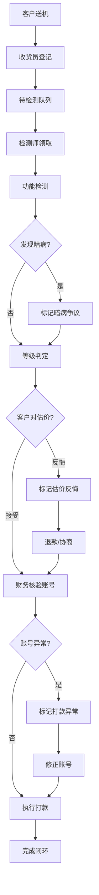

## 1. 产品概述

数码回收店后台管理系统——聚焦设备检测与等级判定主链路，解决旧台账混乱、估价反悔、暗病争议、打款账号错误等经营痛点，实现收货→检测→等级判定→打款的全流程闭环。

- 面向中小型数码回收门店的内部管理系统，解决多角色共用一张大表导致的权责不清、数据丢失和争议追溯困难
- 核心价值：设备检测标准化、等级判定可回溯、风险提前标记、角色权限隔离

## 2. 核心功能

### 2.1 用户角色

| 角色 | 进入方式 | 核心权限 |
|------|----------|----------|
| 收货员 | 默认角色 | 设备登记、基础估价、批量收货、标记外观问题 |
| 检测师 | 默认角色 | 设备检测、暗病记录、等级判定、检测报告提交 |
| 财务 | 默认角色 | 打款审核、账号核验、结算确认、退款处理 |
| 店长 | 默认角色 | 全部权限、风险标记管理、复盘统计、争议仲裁 |

### 2.2 功能模块

1. **收货员工作台**：待收货列表、批量收货、快速登记、外观拍照记录、预估报价
2. **检测师工作台**：待检测队列、检测表单填写、暗病标记、等级判定、检测历史
3. **财务工作台**：待打款列表、账号核验、批量打款、退款处理、结算对账
4. **设备详情页**：设备全生命周期、操作历史时间线、风险标记、争议记录、备注回看
5. **风险标记面板**：估价反悔预警、暗病争议追踪、打款账号异常、复盘提醒

### 2.3 页面详情

| 页面名称 | 模块名称 | 功能描述 |
|----------|----------|----------|
| 收货员工作台 | 待收货列表 | 展示待登记设备，支持批量勾选、快速登记，显示客户信息和预估价 |
| 收货员工作台 | 快速登记 | 设备型号、外观评分、客户报价、收货备注，提交后流转至检测师 |
| 收货员工作台 | 批量操作 | 批量确认收货、批量打印标签、批量修改预估价 |
| 检测师工作台 | 待检测队列 | 按优先级排列的待检设备，显示收货备注和外观评分 |
| 检测师工作台 | 检测表单 | 功能检测项（屏幕、电池、主板、摄像头等）、暗病标记、等级判定依据 |
| 检测师工作台 | 等级判定 | A/B/C/D/废机五级判定，支持等级调整并记录原因 |
| 检测师工作台 | 检测历史 | 已完成检测的设备列表，支持按等级/日期筛选 |
| 财务工作台 | 待打款列表 | 检测完成且确认价格的设备，显示等级和最终估价 |
| 财务工作台 | 账号核验 | 客户收款账号展示，支持标记账号异常，二次确认打款 |
| 财务工作台 | 批量打款 | 批量确认打款，自动标记打款状态，异常拦截 |
| 财务工作台 | 退款处理 | 估价反悔退款申请，关联争议记录 |
| 设备详情页 | 基本信息卡 | 设备型号、IMEI、收货时间、当前状态、风险标记 |
| 设备详情页 | 操作时间线 | 从收货到打款的全流程操作记录，每步可展开查看详情 |
| 设备详情页 | 检测报告 | 检测师填写的完整检测表单，含暗病记录和等级依据 |
| 设备详情页 | 历史备注 | 所有人添加的备注记录，按时间倒序展示 |
| 风险标记面板 | 估价反悔 | 客户对估价不满意要求退回的设备标记，红色预警 |
| 风险标记面板 | 暗病争议 | 检测结果与客户描述不符引发的争议，橙色预警 |
| 风险标记面板 | 打款异常 | 收款账号错误或打款失败的记录，红色预警 |
| 风险标记面板 | 复盘提醒 | 需要复盘的高风险设备，黄色提醒 |

## 3. 核心流程

设备从客户交付到最终结算的完整流转链路：

1. 客户送来设备 → 收货员登记外观和预估价 → 设备进入待检测状态
2. 检测师领取设备 → 逐项检测功能 → 标记暗病 → 判定等级 → 提交检测报告
3. 系统根据等级生成最终估价 → 客户确认或反悔（触发风险标记）
4. 财务核验账号 → 执行打款 → 完成闭环

## 4. 用户界面设计

### 4.1 设计风格

- **主色调**：深灰 #1a1a2e 为底，搭配工业橙 #e94560 作为风险强调色，科技蓝 #0f3460 作为信息色
- **辅助色**：等级色彩体系 — A级绿 #27ae60 / B级蓝 #2980b9 / C级黄 #f39c12 / D级橙 #e67e22 / 废机红 #c0392b
- **按钮风格**：圆角矩形（8px），填充按钮为主，危险操作使用红色描边
- **字体**：标题使用 Noto Sans SC Bold，正文使用 Noto Sans SC Regular，数据/金额使用 JetBrains Mono
- **布局风格**：左侧固定导航 + 右侧内容区，卡片式布局，表格行可展开
- **图标风格**：线性图标，2px 描边，搭配状态色圆点

### 4.2 页面设计概览

| 页面名称 | 模块名称 | UI 元素 |
|----------|----------|----------|
| 收货员工作台 | 顶部统计栏 | 四色统计卡片：今日收货/待检测/已完成/异常标记 |
| 收货员工作台 | 设备列表 | 表格行：设备图+型号+客户+预估价+状态标签+操作按钮 |
| 收货员工作台 | 批量操作栏 | 底部浮动工具栏，选中设备数+批量确认/打印/改价按钮 |
| 收货员工作台 | 登记弹窗 | 分步表单：基础信息→外观评分→预估价→备注 |
| 检测师工作台 | 检测队列 | 左侧列表+右侧检测面板双栏布局 |
| 检测师工作台 | 检测表单 | 可折叠检测项分组，每项✓/✗/跳过，带备注输入 |
| 检测师工作台 | 等级判定 | 大号等级选择卡片，判定依据文本框，提交确认 |
| 财务工作台 | 打款列表 | 表格+金额汇总，异常账号行高亮红色背景 |
| 财务工作台 | 批量打款 | 底部汇总栏：选中金额+打款按钮+异常拦截提示 |
| 设备详情页 | 基本信息卡 | 左侧设备图+型号+IMEI，右侧状态+风险标签 |
| 设备详情页 | 时间线 | 竖向时间轴，每个节点：时间+角色+动作+展开详情 |
| 风险标记面板 | 风险列表 | 四分类 Tab，每条：设备信息+风险类型标签+处理状态+操作 |

### 4.3 响应式

- 桌面优先设计，最小宽度 1280px
- 检测师工作台的双栏布局在窄屏下切换为 Tab 切换
- 表格列在窄屏下隐藏低优先级字段

### 4.4 3D 场景

不适用
