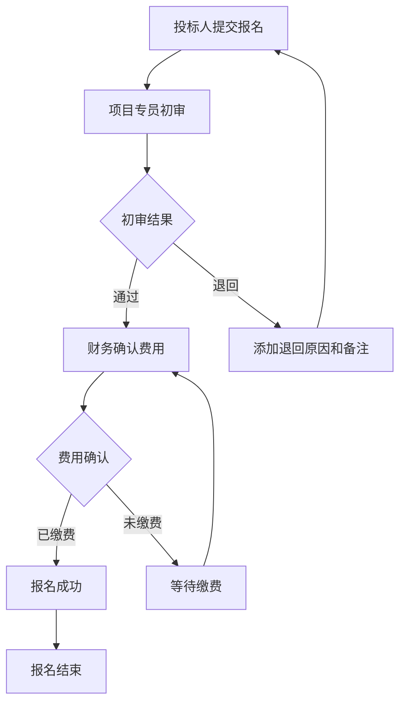
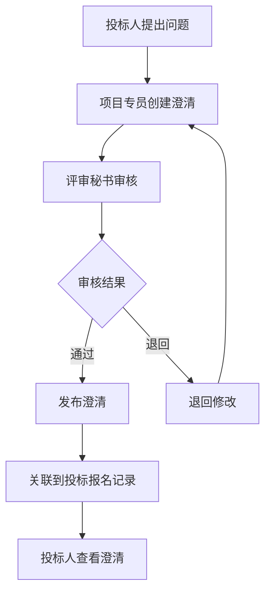
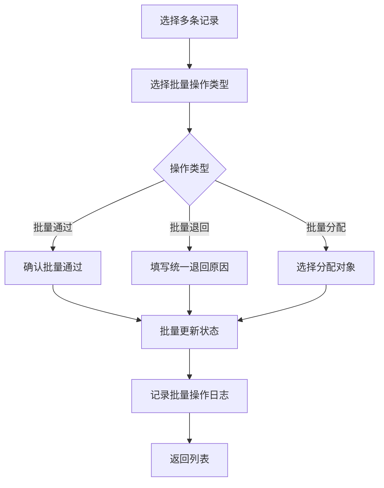

# 招标代理公司 - 投标报名与答疑澄清管理系统 PRD

## 1. 产品概述

本系统旨在解决招标代理公司在投标报名和答疑澄清环节中责任不清、扯皮推诿的问题。通过将投标报名、答疑澄清、退回原因和补充备注整合在同一条记录中，并完整记录每次状态变化、责任人、时间点和备注，确保业务流程透明可追溯。

**核心价值**：
- 明确责任边界：项目专员、评审秘书、财务各自看到自己的待办，责任清晰
- 完整追溯链路：所有操作留痕，状态变化、责任人、时间点、备注全部写入数据库
- 高效协同：支持批量处理、角色切换、答疑澄清回看，提升工作效率

## 2. 核心功能

### 2.1 用户角色

| 角色 | 主要职责 | 核心权限 |
|------|---------|---------|
| 项目专员 | 处理投标报名、发起答疑澄清 | 查看/处理投标报名、创建答疑澄清、查看历史记录 |
| 评审秘书 | 审核答疑澄清、退回补充材料 | 审核答疑澄清、退回报名、添加备注 |
| 财务 | 确认报名费用、完成报名流程 | 确认费用、查看财务相关记录、导出报表 |
| 管理员 | 系统管理、角色分配 | 用户管理、角色分配、系统配置、数据导出 |

### 2.2 功能模块

1. **工作台页面**：待办事项、快捷操作、数据统计
2. **投标报名管理**：报名列表、批量处理、详情查看
3. **答疑澄清管理**：澄清列表、创建澄清、回看历史
4. **操作记录追溯**：完整操作日志、状态变更历史、责任人追踪

### 2.3 页面详情

| 页面名称 | 模块名称 | 功能描述 |
|---------|---------|---------|
| 工作台 | 待办事项卡片 | 按角色显示待处理任务数量，点击跳转对应列表 |
| 工作台 | 快捷操作区 | 批量处理入口、角色切换、数据导出 |
| 工作台 | 数据统计图表 | 本周/本月报名数量、处理时效、退回率等 |
| 投标报名列表 | 筛选搜索区 | 按状态、时间、项目名称、投标人筛选 |
| 投标报名列表 | 报名记录表格 | 显示项目名称、投标人、状态、当前处理人、时间 |
| 投标报名列表 | 批量操作栏 | 批量审核通过、批量退回、批量分配 |
| 投标报名详情 | 基本信息区 | 项目信息、投标人信息、报名时间 |
| 投标报名详情 | 状态流转时间线 | 可视化展示状态变化、责任人、时间、备注 |
| 投标报名详情 | 答疑澄清关联 | 显示关联的答疑澄清记录 |
| 投标报名详情 | 操作按钮区 | 根据角色和状态显示可用操作 |
| 答疑澄清列表 | 筛选搜索区 | 按状态、时间、项目名称筛选 |
| 答疑澄清列表 | 澄清记录表格 | 显示项目名称、澄清内容、状态、处理人 |
| 答疑澄清详情 | 澄清内容区 | 问题内容、澄清回复、附件 |
| 答疑澄清详情 | 历史回看区 | 显示所有历史版本、修改记录 |
| 答疑澄清详情 | 操作按钮区 | 提交审核、退回修改、确认发布 |
| 操作记录追溯 | 全局搜索 | 按项目、投标人、操作人搜索 |
| 操作记录追溯 | 时间线视图 | 可视化展示完整操作链路 |
| 操作记录追溯 | 详情面板 | 显示单条记录的完整信息 |

## 3. 核心流程

### 3.1 投标报名处理流程

### 3.2 答疑澄清处理流程

### 3.3 批量处理流程

## 4. 用户界面设计

### 4.1 设计风格

**整体风格**：专业、清晰、高效的企业级管理系统

**色彩方案**：
- 主色调：深蓝色系（#1E40AF, #3B82F6）- 体现专业、稳重
- 辅助色：灰色系（#64748B, #94A3B8）- 用于次要信息
- 状态色：
  - 成功：#10B981（绿色）
  - 警告：#F59E0B（橙色）
  - 错误：#EF4444（红色）
  - 信息：#3B82F6（蓝色）

**字体**：
- 标题：Source Sans Pro（专业、清晰）
- 正文：Inter（易读、现代）
- 代码/数据：JetBrains Mono（等宽、清晰）

**按钮样式**：
- 主要按钮：圆角 8px、阴影、hover 时轻微上移
- 次要按钮：边框样式、无背景色
- 危险操作：红色背景、需二次确认

**布局风格**：
- 左侧固定导航栏（200px）
- 顶部面包屑 + 用户信息栏
- 内容区域卡片式布局
- 表格采用斑马纹、hover 高亮

**图标风格**：
- 使用 Heroicons（outline 风格）
- 统一大小 20px
- 配合文字使用

### 4.2 页面设计概览

| 页面名称 | 模块名称 | UI 元素 |
|---------|---------|---------|
| 工作台 | 待办事项卡片 | 卡片式布局、数字大号显示、图标辅助、hover 阴影效果 |
| 工作台 | 快捷操作区 | 按钮组、图标 + 文字、主要操作蓝色、次要操作灰色 |
| 工作台 | 数据统计图表 | 柱状图、折线图、数据卡片、周/月切换按钮 |
| 投标报名列表 | 筛选搜索区 | 下拉选择器、日期范围选择器、搜索框、重置按钮 |
| 投标报名列表 | 报名记录表格 | 表格、复选框、状态标签、操作按钮、分页器 |
| 投标报名列表 | 批量操作栏 | 固定底部栏、操作按钮、已选数量显示 |
| 投标报名详情 | 基本信息区 | 信息卡片、标签 + 值布局、图标辅助 |
| 投标报名详情 | 状态流转时间线 | 垂直时间线、节点圆点、连线、时间/人/备注标签 |
| 投标报名详情 | 答疑澄清关联 | 卡片列表、点击跳转、状态标签 |
| 投标报名详情 | 操作按钮区 | 固定底部栏、主要/次要按钮、表单弹窗 |
| 答疑澄清列表 | 筛选搜索区 | 同投标报名列表 |
| 答疑澄清列表 | 澄清记录表格 | 表格、状态标签、操作按钮、分页器 |
| 答疑澄清详情 | 澄清内容区 | 富文本展示区、附件列表、下载按钮 |
| 答疑澄清详情 | 历史回看区 | 版本列表、对比视图、修改内容高亮 |
| 答疑澄清详情 | 操作按钮区 | 同投标报名详情 |
| 操作记录追溯 | 全局搜索 | 大搜索框、搜索建议、历史搜索 |
| 操作记录追溯 | 时间线视图 | 可缩放时间线、节点点击展开、筛选器 |
| 操作记录追溯 | 详情面板 | 侧边抽屉、完整信息展示、关联记录跳转 |

### 4.3 响应式设计

- **桌面优先**：主要在桌面端使用，最小支持 1280px 宽度
- **移动端适配**：关键操作支持移动端查看，表格改为卡片列表
- **触摸优化**：按钮最小点击区域 44px，表格行高适中

### 4.4 交互细节

**状态变化动画**：
- 状态标签颜色渐变过渡
- 新记录添加时的淡入动画
- 删除记录时的淡出动画

**批量操作交互**：
- 全选/反选功能
- 已选记录数量实时显示
- 批量操作确认弹窗
- 操作进度提示

**角色切换交互**：
- 顶部用户菜单中切换
- 切换后自动刷新待办列表
- 切换提示动画

**答疑澄清回看**：
- 版本对比视图
- 修改内容高亮显示
- 时间线导航

## 5. 数据模型核心要点

### 5.1 核心实体

1. **投标报名记录（BidRegistration）**
   - 包含项目信息、投标人信息、状态
   - 关联所有答疑澄清记录
   - 记录创建时间、更新时间

2. **答疑澄清记录（Clarification）**
   - 包含问题内容、澄清回复
   - 关联到投标报名记录
   - 记录版本历史

3. **操作日志（OperationLog）**
   - 记录所有状态变化
   - 包含操作人、操作时间、操作类型
   - 包含备注信息

4. **退回原因（RejectionReason）**
   - 关联到投标报名记录
   - 包含退回原因、补充备注
   - 记录退回人和时间

### 5.2 关键设计原则

- **所有状态变化写入数据库**：不只在页面上显示，而是持久化存储
- **完整追溯链路**：每条记录都有完整的操作历史
- **责任明确**：每个操作都记录操作人和操作时间
- **备注必填**：关键操作要求填写备注，确保信息完整

## 6. 非功能性需求

### 6.1 性能要求

- 页面加载时间 < 2 秒
- 批量操作支持至少 100 条记录
- 列表查询响应时间 < 500ms

### 6.2 安全要求

- 角色权限控制
- 操作日志不可篡改
- 敏感数据加密存储

### 6.3 可用性要求

- 界面简洁直观，学习成本低
- 关键操作有确认提示
- 错误提示清晰明确